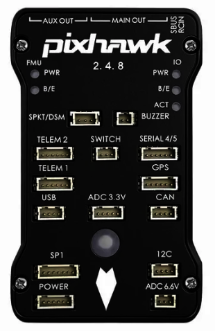
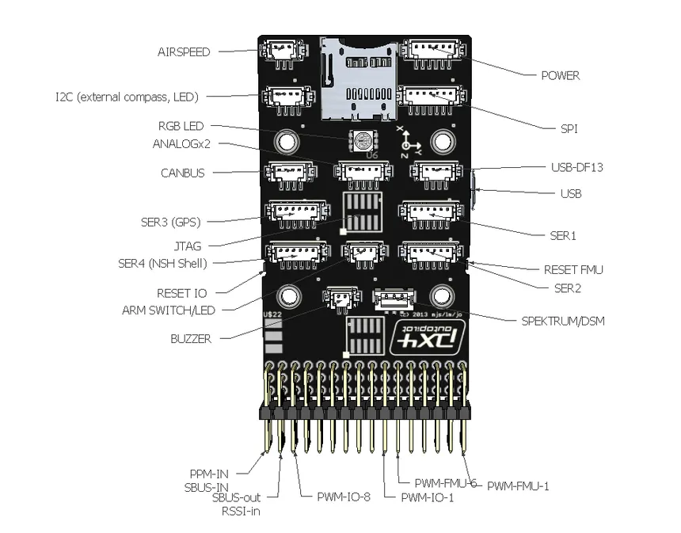
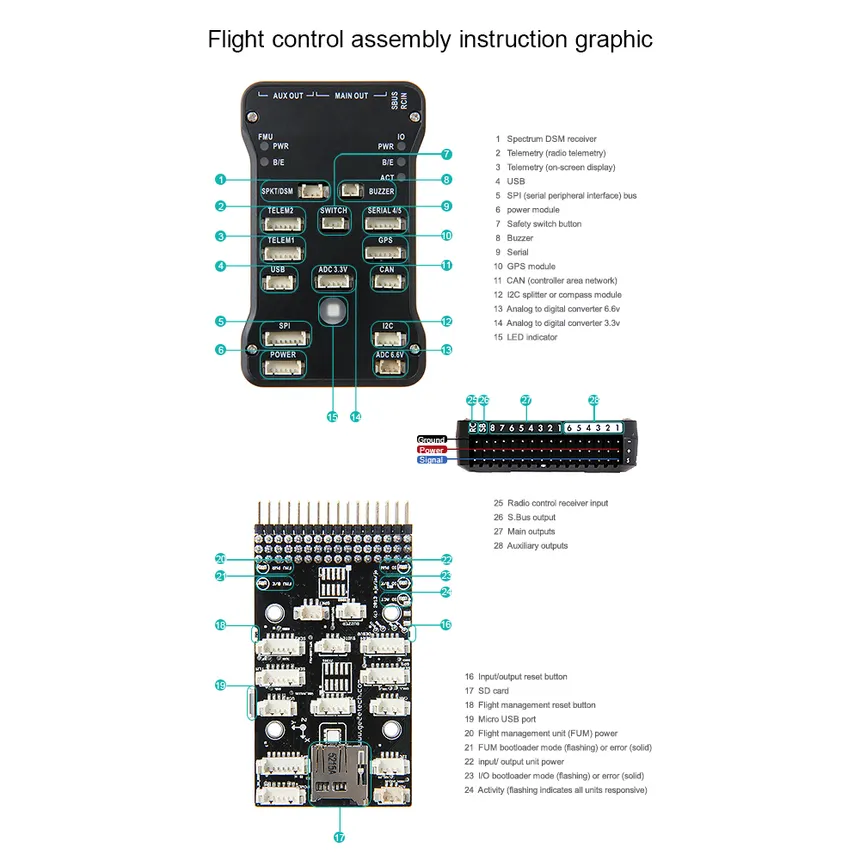
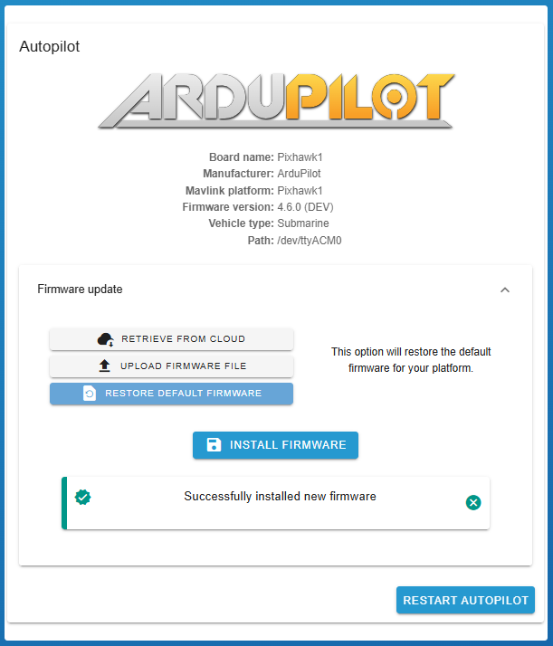
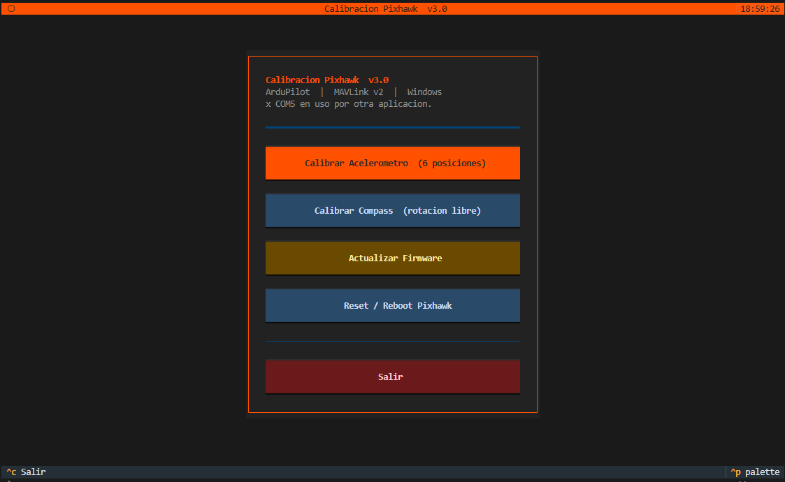
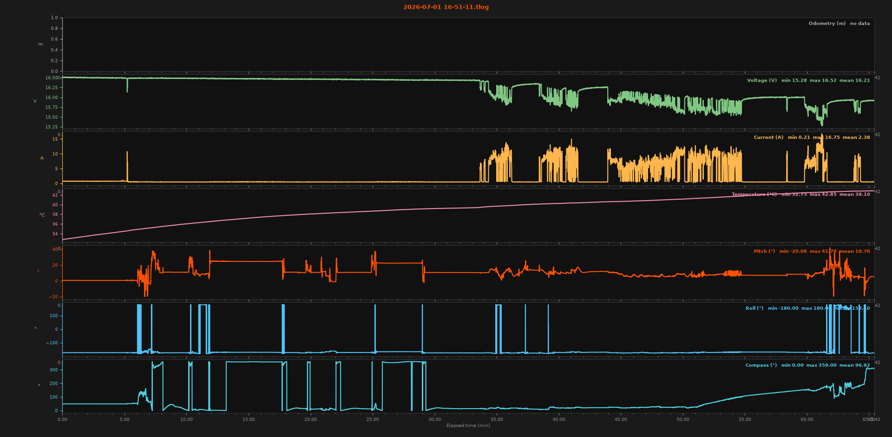

<p align="center"></p>
<h1 align="center"> Pixhawk Setting </h1> 
<h4 align="right">Jul 26</h4>

<p>
  
  
  
</p>

<br>

# Table of contents
- [Table of contents](#table-of-contents)
- [Calibration \&  Upgrade Pixhawk](#calibration---upgrade-pixhawk)
  - [From BlueOS:](#from-blueos)
  - [From QGroundControl:](#from-qgroundcontrol)
  - [From App Python Calibracion Pixhawk](#from-app-python-calibracion-pixhawk)
- [Lectura de IMU (Picth-Roll-Yaw) / Voltaje / corriente desde Windows](#lectura-de-imu-picth-roll-yaw--voltaje--corriente-desde-windows)
- [Uso](#uso)
- [Lectura de Pixhawk  desde Raspberry pi 4](#lectura-de-pixhawk--desde-raspberry-pi-4)
- [Lectura de Telemetria (file.tlog) provenientes de QGroundControl](#lectura-de-telemetria-filetlog-provenientes-de-qgroundcontrol)

<br>

Configuración de pixhawk Auto-Piloto. Calibration | Upgrade Pixhawk | Lectura de IMU (Picth-Roll-Yaw) / Voltaje / corriente desde Windows / RPi4. versión actual ```Pixhawk FMU 2.4.8```

<p align="center"></p>

<p align="center"></p>

<br>

# Calibration &  Upgrade Pixhawk

## From BlueOS:
Actualizar Firmware desde BlueOS Browser localmente IP http://192.168.2.2/vehicle/autopilot
 
> :memo: **Note:** Para que tome la configuración hay que reiniciarlo (Software||Alimentación)

<br>

## From QGroundControl:
Actualizar Firmware | Calibrar Acelerometro | Calibrar Compass

* Qgroundcontrol/Vehicle Configuraction/Power:
	* Habilitar Battery Monitor para poder medir voltaje y Corriente 
* Qgroundcontrol/Vehicle Configuraction/Sensors:
	* Calibrar Accelerometers (importante)
	* Calibrar Compass (importante)
  
> :memo: **Note:** Para que tome la configuración hay que reiniciarlo (Software||Alimentación)
  
<p align="center"></p>


<br>

## From App Python Calibracion Pixhawk
Actualizar Firmware | Calibrar Acelerometro | Calibrar Compass

<p align="center"></p>

> :memo: **Note:** Para que tome la configuración hay que reiniciarlo (Software||Alimentación)

```bash
# Instalar dependencia
py -3.13 -m pip install pymavlink pyserial textual

# Ejecutar (auto-detecta el puerto)
python pixhawk_calibrate.py
```


**pixhawk_calibrate.py**
```Python
#!/usr/bin/env python3
"""
pixhawk_calibrate.py  v3.0
===========================
Calibracion y actualizacion de firmware para Pixhawk/ArduPilot
TUI con Textual -- Windows 10/11

Dependencias:
    pip install pymavlink pyserial textual

Uso:
    python pixhawk_calibrate.py
    python pixhawk_calibrate.py --port COM3
    python pixhawk_calibrate.py --port COM3 --baud 57600

Ctrl+C : cierra la aplicacion limpiamente.
"""

import argparse
import ctypes
import os
import subprocess
import sys
import tempfile
import threading
import time
import urllib.request
from typing import Optional

# ── Windows-only ──────────────────────────────────────────────────────────────
if sys.platform != "win32":
    print("\n[ERROR] Este script solo corre en Windows.")
    print("  Para Linux/Raspberry Pi use el script _rpi.py\n")
    sys.exit(1)

# Activar ANSI en consola Windows (necesario para Textual)
try:
    k32 = ctypes.windll.kernel32
    for handle in (-10, -11, -12):
        k32.SetConsoleMode(k32.GetStdHandle(handle), 7)
except Exception:
    pass

# ── Verificar dependencias ────────────────────────────────────────────────────
def _check_dep(import_name: str, pkg: str):
    try:
        __import__(import_name)
    except ImportError:
        print(f"\n[ERROR] Falta '{pkg}':\n        pip install {pkg}\n")
        sys.exit(1)

_check_dep("textual",   "textual")
_check_dep("pymavlink", "pymavlink")
_check_dep("serial",    "pyserial")

from textual.app import App, ComposeResult                     # noqa: E402
from textual.screen import Screen                              # noqa: E402
from textual.widgets import (                                  # noqa: E402
    Header, Footer, Button, Static, Label,
    RichLog, ProgressBar, Rule, Select,
)
from textual.containers import Vertical, Horizontal, Center, VerticalScroll  # noqa: E402
from textual import on                                         # noqa: E402
from pymavlink import mavutil                                  # noqa: E402


# ── Constantes MAVLink ────────────────────────────────────────────────────────
MAV_CMD_PREFLIGHT_CALIBRATION          = 241
MAV_CMD_ACCELCAL_VEHICLE_POS           = 42429
MAV_CMD_DO_START_MAG_CAL               = 42424
MAV_CMD_DO_CANCEL_MAG_CAL              = 42426
MAV_CMD_REQUEST_AUTOPILOT_CAPABILITIES = 520
MAV_CMD_PREFLIGHT_REBOOT_SHUTDOWN      = 246
MAV_RESULT_ACCEPTED                    = 0

FW_BASE      = "https://firmware.ardupilot.org"
UPLOADER_URL = ("https://raw.githubusercontent.com/ArduPilot/ardupilot/"
                "master/Tools/scripts/uploader.py")

VEHICLE_OPTIONS = [
    ("Copter (multirrotor / helicoptero)", "Copter"),
    ("Plane (ala fija)",                   "Plane"),
    ("Rover (terrestre)",                  "Rover"),
    ("Sub (submarino)",                    "Sub"),
    ("AntennaTracker",                     "AntennaTracker"),
]
BOARD_OPTIONS = [
    ("fmuv3 -- Pixhawk 2.4.8 / Pixhawk 1 v3", "fmuv3"),
    ("fmuv2 -- Pixhawk 1 v2 (original 3DR)",   "fmuv2"),
    ("Pixhawk4",                                "Pixhawk4"),
    ("CubeBlack",                               "CubeBlack"),
    ("CubeOrange",                              "CubeOrange"),
    ("MatekH743",                               "MatekH743"),
]

# ── Posiciones acelerometro ───────────────────────────────────────────────────
ACCEL_POSITIONS = [
    {
        "id": 0, "name": "NIVEL (cara arriba)", "short": "NIVEL",
        "instruction": "Coloque el Pixhawk PLANO con la cara superior hacia arriba.",
        "diagram": (
            "       /\\ NARIZ\n"
            "  +----+----+\n"
            "  | /= [O] =\\ |  <- cara ARRIBA\n"
            "  +----+----+\n"
            "  apoya plano sobre superficie"
        ),
    },
    {
        "id": 1, "name": "IZQUIERDA ABAJO", "short": "IZQ ABAJO",
        "instruction": "Gire 90 grados: lado IZQUIERDO hacia el suelo, nariz al frente.",
        "diagram": (
            "       /\\ NARIZ\n"
            "  +=========+\n"
            "  | [O]      |  lado IZQ al PISO\n"
            "  +=========+\n"
            "  IZQ abajo     DER arriba"
        ),
    },
    {
        "id": 2, "name": "DERECHA ABAJO", "short": "DER ABAJO",
        "instruction": "Gire 90 grados: lado DERECHO hacia el suelo, nariz al frente.",
        "diagram": (
            "       /\\ NARIZ\n"
            "  +=========+\n"
            "  |      [O] |  lado DER al PISO\n"
            "  +=========+\n"
            "  IZQ arriba    DER abajo"
        ),
    },
    {
        "id": 3, "name": "NARIZ ABAJO", "short": "NARIZ abajo",
        "instruction": "Incline hacia adelante: NARIZ apunta al suelo, cola arriba.",
        "diagram": (
            "  COLA arriba\n"
            "  +=========+\n"
            "  |   [O]    |\n"
            "  +=========+\n"
            "  NARIZ abajo"
        ),
    },
    {
        "id": 4, "name": "NARIZ ARRIBA", "short": "NARIZ arriba",
        "instruction": "Incline hacia atras: NARIZ apunta al cielo, cola al suelo.",
        "diagram": (
            "  NARIZ arriba\n"
            "  +=========+\n"
            "  |   [O]    |\n"
            "  +=========+\n"
            "  COLA abajo"
        ),
    },
    {
        "id": 5, "name": "BOCA ABAJO", "short": "INVERTIDO",
        "instruction": "Voltee 180 grados: cara superior mirando al suelo.",
        "diagram": (
            "       /\\ NARIZ\n"
            "  +----+----+\n"
            "  | \\= [O] =/ |  <- cara ABAJO\n"
            "  +----+----+\n"
            "  boca abajo (invertido)"
        ),
    },
]

COMPASS_DIAGRAM = (
    "  Rote el Pixhawk en TODAS las orientaciones:\n"
    "  +==============+\n"
    "  |  +--------+  |   Yaw  : giro horizontal\n"
    "  |  |  [O]   |  |   Pitch: nariz arriba/abajo\n"
    "  |  +--------+  |   Roll : costado izq/der\n"
    "  +==============+\n"
    "  Haga 2-3 rotaciones lentas en cada eje."
)

# ── Deteccion de puerto COM ───────────────────────────────────────────────────
KNOWN_VID_PID = {
    (0x26AC, None), (0x0483, 0x5740), (0x0483, 0x374B),
    (0x27AC, None), (0x1209, 0x5741), (0x0403, 0x6001),
    (0x0403, 0x6015), (0x10C4, 0xEA60), (0x1A86, 0x7523),
    (0x1A86, 0x55D4), (0x2341, None),
}
KNOWN_KEYWORDS = [
    "pixhawk", "ardupilot", "px4", "cube", "holybro",
    "mro", "fmuv", "ftdi", "ch340", "cp210", "stm32",
]

def detect_port() -> Optional[str]:
    try:
        import serial.tools.list_ports as lp
    except ImportError:
        return None
    best_score, best_port = -1, None
    for p in lp.comports():
        if not p.device.upper().startswith("COM"):
            continue
        score = 0
        combined = f"{p.description or ''} {p.manufacturer or ''} {p.product or ''}".lower()
        for kw in KNOWN_KEYWORDS:
            if kw in combined:
                score += 10
                break
        if p.vid is not None:
            for kvid, kpid in KNOWN_VID_PID:
                if p.vid == kvid and (kpid is None or p.pid == kpid):
                    score += 20
                    break
        try:
            score += max(0, 5 - int(p.device[3:]) // 4)
        except ValueError:
            pass
        if score > best_score:
            best_score, best_port = score, p.device
    return best_port


def _release_com_port(port: str) -> list:
    """Cierra procesos Windows conocidos que bloquean puertos COM."""
    blockers = ["MissionPlanner.exe", "QGroundControl.exe",
                "mavproxy.exe", "ArduPilot.exe"]
    killed = []
    try:
        result = subprocess.run(["tasklist", "/FO", "CSV", "/NH"],
                                capture_output=True, text=True, timeout=5)
        for line in result.stdout.splitlines():
            name = line.split(",")[0].strip('"')
            if any(b.lower() == name.lower() for b in blockers):
                subprocess.run(["taskkill", "/F", "/IM", name],
                               capture_output=True, timeout=5)
                killed.append(name)
    except Exception:
        pass
    return killed


# ── CSS ───────────────────────────────────────────────────────────────────────
APP_CSS = """
Screen { background: #1a1a1a; }
Header { background: #FF5100; color: white; height: 1; }
Footer { height: 1; }

/* Menu */
#menu_wrap { align: center middle; height: 100%; }
.menu_box {
    width: 60; height: auto;
    border: solid #FF5100;
    padding: 1 3; background: #222222;
}
.menu_title { text-align: center; color: #FF5100; text-style: bold; }
.menu_sub   { text-align: center; color: #555555; }
.menu_conn  { text-align: center; color: #888888; margin-bottom: 1; }

/* Botones */
Button           { width: 100%; margin-top: 1; }
Button.primary   { background: #FF5100; color: white; }
Button.secondary { background: #2a4a6a; color: #ccddee; }
Button.confirm   { background: #1a6a2a; color: white; }
Button.danger    { background: #6a1a1a; color: #ffcccc; }
Button.warning   { background: #6a4a00; color: #ffeeaa; }
/* En la barra de botones, dividir ancho equitativamente */
.btn_bar Button  { width: 1fr; margin-top: 0; }

/* Cal screens -- VerticalScroll debe ser 1fr para que btn_bar quede visible */
AccelCalScreen VerticalScroll,
CompassCalScreen VerticalScroll,
FirmwareScreen VerticalScroll { height: 1fr; }
.cal_scroll { padding: 0 1; }
.cal_title { color: #FF5100; text-style: bold; }
.pos_label { color: #FF5100; text-style: bold; text-align: right; }

.diagram_box {
    border: solid #444444; background: #111111;
    padding: 0 1; height: 7;
}
.instruction_box {
    border: solid #333333; background: #1a1a1a;
    padding: 0 1; height: 4; color: #dddddd;
}
RichLog {
    height: 5; border: solid #2a2a2a; background: #111111;
}
ProgressBar { margin: 0; }
.btn_bar { height: 3; dock: bottom; }

/* Firmware */
.fw_info {
    border: solid #444444; background: #111111;
    padding: 0 1; height: 5;
}
.sel_row { height: 3; margin-bottom: 1; }
Select { width: 1fr; }
"""


class CalScroll(VerticalScroll):
    """VerticalScroll con height:1fr forzado para que los botones siempre sean visibles."""
    DEFAULT_CSS = "CalScroll { height: 1fr; padding: 0 1; }"


# ─────────────────────────────────────────────────────────────────────────────
# Menu Principal
# ─────────────────────────────────────────────────────────────────────────────
class MainMenuScreen(Screen):
    BINDINGS = [
        ("escape", "app.exit", "Salir"),
        ("ctrl+c", "app.exit", "Salir"),
    ]

    def compose(self) -> ComposeResult:
        yield Header(show_clock=True)
        with Center(id="menu_wrap"):
            with Vertical(classes="menu_box"):
                yield Label("Calibracion Pixhawk  v3.0", classes="menu_title")
                yield Label("ArduPilot  |  MAVLink v2  |  Windows", classes="menu_sub")
                yield Label("Buscando Pixhawk...", id="conn_label", classes="menu_conn")
                yield Rule(line_style="heavy")
                yield Button("  Calibrar Acelerometro  (6 posiciones)", id="btn_accel",   classes="primary")
                yield Button("  Calibrar Compass  (rotacion libre)",    id="btn_compass", classes="secondary")
                yield Button("  Actualizar Firmware",                   id="btn_fw",      classes="warning")
                yield Button("  Reset / Reboot Pixhawk",                id="btn_reset",   classes="secondary")
                yield Rule()
                yield Button("  Salir  [Esc]",                          id="btn_exit",    classes="danger")
        yield Footer()

    def set_conn_label(self, text: str):
        try:
            self.query_one("#conn_label", Label).update(text)
        except Exception:
            pass

    def _need_conn(self) -> bool:
        if self.app.mavconn is None:
            self.app.notify("Pixhawk no conectado. Verifique el cable USB.", severity="error")
            return False
        return True

    @on(Button.Pressed, "#btn_accel")
    def go_accel(self):
        if self._need_conn():
            self.app.push_screen(AccelCalScreen())

    @on(Button.Pressed, "#btn_compass")
    def go_compass(self):
        if self._need_conn():
            self.app.push_screen(CompassCalScreen())

    @on(Button.Pressed, "#btn_fw")
    def go_firmware(self):
        self.app.push_screen(FirmwareScreen())

    @on(Button.Pressed, "#btn_reset")
    def do_reset(self):
        if self._need_conn():
            self.app.reboot_pixhawk()

    @on(Button.Pressed, "#btn_exit")
    def do_exit(self):
        self.app.exit()


# ─────────────────────────────────────────────────────────────────────────────
# Calibracion Acelerometro
# ─────────────────────────────────────────────────────────────────────────────
class AccelCalScreen(Screen):
    BINDINGS = [
        ("escape", "cancel_or_back", "Cancelar"),
        ("ctrl+c", "app.exit",       "Salir"),
        ("enter",  "confirm_pos",    "Confirmar"),
    ]
    _cal_active = False

    def compose(self) -> ComposeResult:
        yield Header(show_clock=True)
        with CalScroll():
            with Horizontal():
                yield Label("CALIBRACION ACELEROMETRO -- 6 POSICIONES", classes="cal_title")
                yield Label("Posicion: --", id="pos_label", classes="pos_label")
            yield Static(id="diagram", classes="diagram_box")
            yield Static(
                "Presione [INICIAR] para comenzar.",
                id="instruction", classes="instruction_box",
            )
            yield Label("Progreso:")
            yield ProgressBar(total=6, show_eta=False, id="accel_bar")
            yield RichLog(id="accel_log", highlight=True, markup=True)
        with Horizontal(classes="btn_bar"):
            yield Button("INICIAR",           id="btn_start",   classes="primary")
            yield Button("CONFIRMAR [Enter]", id="btn_confirm", classes="confirm",  disabled=True)
            yield Button("CANCELAR  [Esc]",   id="btn_cancel",  classes="danger")
        yield Footer()

    def on_mount(self):
        self._confirm_evt = threading.Event()
        self._cancel_evt  = threading.Event()
        self.query_one("#diagram", Static).update("Esperando inicio...")


    # ── helpers UI (llamados siempre desde hilo principal) ─────
    def _log(self, msg: str, style: str = ""):
        ts = time.strftime("%H:%M:%S")
        self.query_one("#accel_log", RichLog).write(
            f"[{ts}] [{style}]{msg}[/{style}]" if style else f"[{ts}] {msg}"
        )

    def _ui_diagram(self, idx: Optional[int]):
        self.query_one("#diagram", Static).update(
            ACCEL_POSITIONS[idx]["diagram"] if idx is not None else "Esperando inicio..."
        )

    def _ui_instruction(self, text: str):
        self.query_one("#instruction", Static).update(text)

    def _ui_pos_label(self, text: str):
        self.query_one("#pos_label", Label).update(text)

    def _ui_confirm_btn(self, enabled: bool):
        self.query_one("#btn_confirm", Button).disabled = not enabled

    def _ui_start_btn(self, enabled: bool):
        self.query_one("#btn_start", Button).disabled = not enabled

    def _ui_advance_bar(self):
        self.query_one("#accel_bar", ProgressBar).advance(1)

    def _ui_reset_bar(self):
        self.query_one("#accel_bar", ProgressBar).update(progress=0)

    # ── acciones ───────────────────────────────────────────────
    @on(Button.Pressed, "#btn_start")
    def start_cal(self):
        self._cal_active = True
        self._cancel_evt.clear()
        self._confirm_evt.clear()
        threading.Thread(target=self._run_accel_cal, daemon=True).start()

    @on(Button.Pressed, "#btn_confirm")
    def btn_confirm(self):
        self._confirm_evt.set()

    @on(Button.Pressed, "#btn_cancel")
    def btn_cancel(self):
        self._do_cancel()

    def action_cancel_or_back(self):
        self._do_cancel()

    def action_confirm_pos(self):
        if not self.query_one("#btn_confirm", Button).disabled:
            self._confirm_evt.set()

    def _do_cancel(self):
        if self._cal_active:
            self._cancel_evt.set()
            self._confirm_evt.set()   # desbloquea .wait() si el hilo espera
        else:
            self.app.pop_screen()

    # ── logica MAVLink en hilo separado ────────────────────────
    def _run_accel_cal(self):
        conn = self.app.mavconn
        self.app.call_from_thread(self._ui_start_btn, False)
        self.app.call_from_thread(self._log, "Iniciando calibracion de acelerometro...")

        conn.mav.command_long_send(
            conn.target_system, conn.target_component,
            MAV_CMD_PREFLIGHT_CALIBRATION, 0,
            1, 0, 0, 0, 0, 0, 0,
        )
        ack = conn.recv_match(type="COMMAND_ACK", blocking=True, timeout=6)
        if ack is None or ack.result != MAV_RESULT_ACCEPTED:
            self.app.call_from_thread(self._log,
                f"Rechazado (result={ack.result if ack else 'TIMEOUT'}). Armado?", "bold red")
            self.app.call_from_thread(self._finish_accel, False)
            return

        self.app.call_from_thread(self._log, "Calibracion aceptada.", "green")

        for idx, pos in enumerate(ACCEL_POSITIONS):
            if self._cancel_evt.is_set():
                break

            self.app.call_from_thread(self._ui_diagram,      idx)
            self.app.call_from_thread(self._ui_instruction,  pos["instruction"])
            self.app.call_from_thread(self._ui_pos_label,    f"Pos {idx+1}/6  {pos['name']}")
            self.app.call_from_thread(self._log,             f">> Posicion {idx+1}/6: {pos['name']}")
            self.app.call_from_thread(self._ui_confirm_btn,  True)

            self._confirm_evt.clear()
            self._confirm_evt.wait()          # espera Enter/boton o cancelacion
            self.app.call_from_thread(self._ui_confirm_btn, False)

            if self._cancel_evt.is_set():
                break

            self.app.call_from_thread(self._log, f"Capturando {pos['short']}...", "yellow")
            conn.mav.command_long_send(
                conn.target_system, conn.target_component,
                MAV_CMD_ACCELCAL_VEHICLE_POS, 0,
                float(pos["id"]), 0, 0, 0, 0, 0, 0,
            )

            deadline = time.time() + 15
            while time.time() < deadline and not self._cancel_evt.is_set():
                msg = conn.recv_match(type=["STATUSTEXT"], blocking=True, timeout=0.3)
                if msg:
                    text = msg.text.strip()
                    self.app.call_from_thread(self._log, f"  {text}", "cyan")
                    tl = text.lower()
                    if any(kw in tl for kw in ["place", "level", "left", "right", "nose", "back", "done"]):
                        break
                    if "fail" in tl or "error" in tl:
                        self._cancel_evt.set()
                        break

            if not self._cancel_evt.is_set():
                self.app.call_from_thread(self._ui_advance_bar)
                self.app.call_from_thread(self._log, f"  [ok] {pos['short']} capturado.", "green")

        if self._cancel_evt.is_set():
            conn.mav.command_long_send(
                conn.target_system, conn.target_component,
                MAV_CMD_PREFLIGHT_CALIBRATION, 0, 0, 0, 0, 0, 0, 0, 0,
            )
            self.app.call_from_thread(self._log, "Cancelado.", "yellow")
            self.app.call_from_thread(self._finish_accel, False)
            return

        self.app.call_from_thread(self._ui_instruction, "Procesando datos -- espere...")
        success = False
        deadline = time.time() + 25
        while time.time() < deadline:
            msg = conn.recv_match(type="STATUSTEXT", blocking=True, timeout=0.3)
            if msg:
                text = msg.text.strip()
                self.app.call_from_thread(self._log, f"  {text}", "cyan")
                if "success" in text.lower() or "complete" in text.lower():
                    success = True
                    break
                if "fail" in text.lower():
                    break

        self.app.call_from_thread(self._finish_accel, success)

    def _finish_accel(self, success: bool):
        self._cal_active = False
        self._ui_start_btn(True)
        self._ui_confirm_btn(False)
        if success:
            self._ui_pos_label("[ok] COMPLETADO -- reiniciando...")
            self._log("Calibracion OK. Enviando reboot...", "green")
            self.app.reboot_pixhawk()
            self._ui_instruction("[ok] Acelerometro calibrado. Pixhawk reiniciado. [CANCELAR] para volver.")
            self._ui_pos_label("[ok] COMPLETADO")
        else:
            self._ui_instruction("[x] Cancelado o fallido. [INICIAR] para reintentar.")
            self._ui_pos_label("[x] CANCELADO")
            self._ui_reset_bar()
            self._ui_diagram(None)


# ─────────────────────────────────────────────────────────────────────────────
# Calibracion Compass
# ─────────────────────────────────────────────────────────────────────────────
class CompassCalScreen(Screen):
    BINDINGS = [
        ("escape", "cancel_or_back", "Cancelar"),
        ("ctrl+c", "app.exit",       "Salir"),
    ]
    _cal_active = False

    def compose(self) -> ComposeResult:
        yield Header(show_clock=True)
        with CalScroll():
            yield Label("CALIBRACION DE COMPASS -- ROTACION LIBRE", classes="cal_title")
            yield Static(COMPASS_DIAGRAM, id="compass_diagram", classes="diagram_box")
            yield Static(
                "Presione [INICIAR] para comenzar.\n"
                "Rote el Pixhawk en todas las orientaciones.",
                id="compass_instr", classes="instruction_box",
            )
            yield Label("Progreso:")
            yield ProgressBar(total=100, show_eta=False, id="compass_bar")
            yield RichLog(id="compass_log", highlight=True, markup=True)
        with Horizontal(classes="btn_bar"):
            yield Button("INICIAR",         id="btn_cmp_start",  classes="primary")
            yield Button("CANCELAR  [Esc]", id="btn_cmp_cancel", classes="danger")
        yield Footer()

    def on_mount(self):
        self._cancel_evt = threading.Event()


    def _log(self, msg: str, style: str = ""):
        ts = time.strftime("%H:%M:%S")
        self.query_one("#compass_log", RichLog).write(
            f"[{ts}] [{style}]{msg}[/{style}]" if style else f"[{ts}] {msg}"
        )

    def _ui_instr(self, text: str):
        self.query_one("#compass_instr", Static).update(text)

    def _ui_progress(self, pct: int):
        self.query_one("#compass_bar", ProgressBar).update(progress=pct)

    def _ui_start_btn(self, enabled: bool):
        self.query_one("#btn_cmp_start", Button).disabled = not enabled

    @on(Button.Pressed, "#btn_cmp_start")
    def start_compass(self):
        self._cal_active = True
        self._cancel_evt.clear()
        self._ui_progress(0)
        threading.Thread(target=self._run_compass_cal, daemon=True).start()

    @on(Button.Pressed, "#btn_cmp_cancel")
    def cancel_btn(self):
        self._do_cancel()

    def action_cancel_or_back(self):
        self._do_cancel()

    def _do_cancel(self):
        if self._cal_active:
            self._cancel_evt.set()
        else:
            self.app.pop_screen()

    def _run_compass_cal(self):
        conn = self.app.mavconn
        self.app.call_from_thread(self._ui_start_btn, False)
        self.app.call_from_thread(self._log, "Enviando comando calibracion compass...")

        conn.mav.command_long_send(
            conn.target_system, conn.target_component,
            MAV_CMD_DO_START_MAG_CAL, 0,
            0, 1, 1, 0, 0, 0, 0,
        )
        ack = conn.recv_match(type="COMMAND_ACK", blocking=True, timeout=5)
        accepted = ack is not None and ack.result == MAV_RESULT_ACCEPTED

        if not accepted:
            self.app.call_from_thread(self._log,
                f"DO_START_MAG_CAL result={ack.result if ack else 'TIMEOUT'}, probando PREFLIGHT...",
                "yellow")
            conn.mav.command_long_send(
                conn.target_system, conn.target_component,
                MAV_CMD_PREFLIGHT_CALIBRATION, 0,
                0, 1, 0, 0, 0, 0, 0,
            )
            ack2 = conn.recv_match(type="COMMAND_ACK", blocking=True, timeout=5)
            accepted = ack2 is not None and ack2.result == MAV_RESULT_ACCEPTED
            if not accepted:
                self.app.call_from_thread(self._log, "No se pudo iniciar. Verifique conexion.", "bold red")
                self.app.call_from_thread(self._finish_compass, False, 0.0)
                return

        self.app.call_from_thread(self._log, "Calibracion iniciada.", "green")
        self.app.call_from_thread(self._ui_instr,
            "GIRANDO -- Rote en todas las orientaciones:\n"
            "  Yaw: rotaciones horizontales | Pitch: nariz up/down | Roll: costados")

        last_pct = -1
        deadline = time.time() + 180
        while time.time() < deadline and not self._cancel_evt.is_set():
            msg = conn.recv_match(
                type=["MAG_CAL_PROGRESS", "MAG_CAL_REPORT", "STATUSTEXT"],
                blocking=True, timeout=0.4,
            )
            if msg is None:
                continue
            mt = msg.get_type()
            if mt == "MAG_CAL_PROGRESS":
                pct = int(getattr(msg, "completion_pct", 0))
                if pct != last_pct:
                    last_pct = pct
                    self.app.call_from_thread(self._ui_progress, pct)
                    self.app.call_from_thread(self._log, f"Compass: {pct}%")
            elif mt == "MAG_CAL_REPORT":
                success = getattr(msg, "cal_status", 1) == 0
                fitness = float(getattr(msg, "fitness", 0.0))
                self.app.call_from_thread(self._finish_compass, success, fitness)
                return
            elif mt == "STATUSTEXT":
                self.app.call_from_thread(self._log, f"  {msg.text.strip()}", "cyan")

        if self._cancel_evt.is_set():
            conn.mav.command_long_send(
                conn.target_system, conn.target_component,
                MAV_CMD_DO_CANCEL_MAG_CAL, 0, 0, 0, 0, 0, 0, 0, 0,
            )
            self.app.call_from_thread(self._log, "Cancelado.", "yellow")
        else:
            self.app.call_from_thread(self._log, "Timeout (3 min). No completado.", "bold red")

        self.app.call_from_thread(self._finish_compass, False, 0.0)

    def _finish_compass(self, success: bool, fitness: float):
        self._cal_active = False
        self._ui_start_btn(True)
        if success:
            self._ui_progress(100)
            self._log("Calibracion OK. Enviando reboot...", "green")
            self.app.reboot_pixhawk()
            self._ui_instr(
                f"[ok] Compass calibrado. Fitness: {fitness:.4f} (menor = mejor)\n"
                "Pixhawk reiniciado. [CANCELAR] para volver."
            )
            self.app.notify(f"Compass calibrado. Fitness={fitness:.4f}", severity="information")
        else:
            self._ui_instr("[x] Cancelado o fallido. [INICIAR] para reintentar.")


# ─────────────────────────────────────────────────────────────────────────────
# Actualizacion Firmware
# ─────────────────────────────────────────────────────────────────────────────
class FirmwareScreen(Screen):
    BINDINGS = [
        ("escape", "go_back", "Volver"),
        ("ctrl+c", "app.exit", "Salir"),
    ]
    _busy = False

    def compose(self) -> ComposeResult:
        yield Header(show_clock=True)
        with CalScroll():
            yield Label("ACTUALIZACION DE FIRMWARE ARDUPILOT", classes="cal_title")
            yield Static("Version actual: --\nBoard: --",
                         id="fw_current", classes="fw_info")
            with Horizontal(classes="sel_row"):
                yield Select(
                    [(lbl, val) for lbl, val in VEHICLE_OPTIONS],
                    prompt="Vehiculo", id="sel_vehicle", value="Copter",
                )
                yield Select(
                    [(lbl, val) for lbl, val in BOARD_OPTIONS],
                    prompt="Board", id="sel_board", value="fmuv3",
                )
            yield Static("Ultima version: --", id="fw_latest", classes="fw_info")
            yield ProgressBar(total=100, show_eta=False, id="fw_bar")
            yield RichLog(id="fw_log", highlight=True, markup=True)
        with Horizontal(classes="btn_bar"):
            yield Button("VERIFICAR VERSION",    id="btn_fw_check", classes="secondary")
            yield Button("DESCARGAR Y FLASHEAR", id="btn_fw_flash", classes="primary", disabled=True)
            yield Button("VOLVER  [Esc]",        id="btn_fw_back",  classes="danger")
        yield Footer()

    def on_mount(self):

        if self.app.mavconn is not None:
            threading.Thread(target=self._detect_version, daemon=True).start()

    def _log(self, msg: str, style: str = ""):
        ts = time.strftime("%H:%M:%S")
        self.query_one("#fw_log", RichLog).write(
            f"[{ts}] [{style}]{msg}[/{style}]" if style else f"[{ts}] {msg}"
        )

    def _ui_current(self, text: str):
        self.query_one("#fw_current", Static).update(text)

    def _ui_latest(self, text: str):
        self.query_one("#fw_latest", Static).update(text)

    def _ui_progress(self, pct: int):
        self.query_one("#fw_bar", ProgressBar).update(progress=pct)

    def _ui_flash_btn(self, enabled: bool):
        self.query_one("#btn_fw_flash", Button).disabled = not enabled

    def _ui_check_btn(self, enabled: bool):
        self.query_one("#btn_fw_check", Button).disabled = not enabled

    def _detect_version(self):
        conn = self.app.mavconn
        self.app.call_from_thread(self._log, "Leyendo version firmware actual...")
        conn.mav.command_long_send(
            conn.target_system, conn.target_component,
            MAV_CMD_REQUEST_AUTOPILOT_CAPABILITIES, 0,
            1, 0, 0, 0, 0, 0, 0,
        )
        msg = conn.recv_match(type="AUTOPILOT_VERSION", blocking=True, timeout=5)
        if msg:
            v = msg.flight_sw_version
            major, minor, patch = (v >> 24) & 0xFF, (v >> 16) & 0xFF, (v >> 8) & 0xFF
            vt = {0: "dev", 64: "alpha", 128: "beta", 192: "rc", 255: "stable"}.get(v & 0xFF, "?")
            gh = bytes(msg.flight_custom_version[:8]).hex()
            self.app.call_from_thread(self._ui_current,
                f"Version actual:  v{major}.{minor}.{patch} ({vt})\n"
                f"Board version:   {msg.board_version}   Git: {gh}")
            self.app.call_from_thread(self._log, f"Firmware: v{major}.{minor}.{patch}", "cyan")
        else:
            self.app.call_from_thread(self._ui_current, "No se pudo leer la version.")

    @on(Button.Pressed, "#btn_fw_check")
    def check_latest(self):
        if self._busy:
            return
        self._busy = True
        self._ui_flash_btn(False)
        threading.Thread(target=self._do_check, daemon=True).start()

    def _do_check(self):
        vehicle = self.query_one("#sel_vehicle", Select).value or "Copter"
        board   = self.query_one("#sel_board",   Select).value or "fmuv3"
        url_ver = f"{FW_BASE}/{vehicle}/stable/{board}/git-version.txt"
        url_apj = f"{FW_BASE}/{vehicle}/stable/{board}/ardupilot.apj"

        self.app.call_from_thread(self._log, f"Consultando {vehicle}/{board}...")
        try:
            with urllib.request.urlopen(url_ver, timeout=10) as r:
                ver_text = r.read().decode("utf-8", errors="replace").strip()
        except Exception as e:
            self.app.call_from_thread(self._log, f"Error: {e}", "bold red")
            self._busy = False
            return

        self.app.call_from_thread(self._ui_latest,
            f"Ultima version ({vehicle}/{board}):\n  {ver_text}\n  URL: {url_apj}")
        self.app.call_from_thread(self._log, f"Disponible: {ver_text}", "green")
        self.app.call_from_thread(self._ui_flash_btn, True)
        self._busy = False

    @on(Button.Pressed, "#btn_fw_flash")
    def flash_fw(self):
        if self._busy:
            return
        self._busy = True
        self._ui_flash_btn(False)
        self._ui_check_btn(False)
        threading.Thread(target=self._do_flash, daemon=True).start()

    def _do_flash(self):
        vehicle = self.query_one("#sel_vehicle", Select).value or "Copter"
        board   = self.query_one("#sel_board",   Select).value or "fmuv3"
        port    = self.app._port or self.app._detected_port
        url_apj = f"{FW_BASE}/{vehicle}/stable/{board}/ardupilot.apj"
        fw_path = os.path.join(tempfile.gettempdir(), "ardupilot_update.apj")
        up_path = os.path.join(tempfile.gettempdir(), "uploader.py")

        self.app.call_from_thread(self._log, "Descargando uploader.py...")
        self.app.call_from_thread(self._ui_progress, 5)
        try:
            urllib.request.urlretrieve(UPLOADER_URL, up_path)
        except Exception as e:
            self.app.call_from_thread(self._log, f"Error: {e}", "bold red")
            self.app.call_from_thread(self._finish_flash, False)
            return

        self.app.call_from_thread(self._log, f"Descargando firmware {vehicle}/{board}...")
        try:
            def _hook(count, bsz, total):
                if total > 0:
                    self.app.call_from_thread(self._ui_progress,
                        min(60, 20 + int(40 * count * bsz / total)))
            urllib.request.urlretrieve(url_apj, fw_path, reporthook=_hook)
            self.app.call_from_thread(self._log,
                f"Firmware descargado ({os.path.getsize(fw_path)//1024} KB).", "green")
        except Exception as e:
            self.app.call_from_thread(self._log, f"Error: {e}", "bold red")
            self.app.call_from_thread(self._finish_flash, False)
            return

        # Liberar puerto
        self.app.call_from_thread(self._log, "Cerrando conexion MAVLink...")
        if self.app.mavconn:
            try:
                self.app.mavconn.close()
            except Exception:
                pass
            self.app.mavconn = None
        time.sleep(1)

        killed = _release_com_port(port)
        if killed:
            self.app.call_from_thread(self._log,
                f"Procesos cerrados: {', '.join(killed)}", "yellow")

        self.app.call_from_thread(self._ui_progress, 65)
        self.app.call_from_thread(self._log, f"Flasheando {port}... (no desconecte el USB)", "yellow")

        try:
            proc = subprocess.Popen(
                [sys.executable, up_path, "--port", port, fw_path],
                stdout=subprocess.PIPE, stderr=subprocess.STDOUT,
                text=True, bufsize=1,
            )
            for line in iter(proc.stdout.readline, ""):
                line = line.strip()
                if line:
                    self.app.call_from_thread(self._log, line, "cyan")
            proc.wait(timeout=120)
            self.app.call_from_thread(self._ui_progress, 100)
            self.app.call_from_thread(self._finish_flash, proc.returncode == 0)
        except subprocess.TimeoutExpired:
            proc.kill()
            self.app.call_from_thread(self._log, "Timeout (2 min).", "bold red")
            self.app.call_from_thread(self._finish_flash, False)
        except Exception as e:
            self.app.call_from_thread(self._log, f"Error: {e}", "bold red")
            self.app.call_from_thread(self._finish_flash, False)

    def _finish_flash(self, success: bool):
        self._busy = False
        self._ui_check_btn(True)
        if success:
            self.app.call_from_thread(self._log, "[ok] Firmware actualizado.", "bold green")
            self.app.reboot_pixhawk()
            self.app.notify("Firmware actualizado. Pixhawk reiniciando...", severity="information")
        else:
            self.app.call_from_thread(self._log, "[x] Flasheo fallido.", "bold red")
            self.app.call_from_thread(self._ui_flash_btn, True)

    @on(Button.Pressed, "#btn_fw_back")
    def go_back_btn(self):
        if not self._busy:
            self.app.pop_screen()

    def action_go_back(self):
        if not self._busy:
            self.app.pop_screen()


# ─────────────────────────────────────────────────────────────────────────────
# App Principal
# ─────────────────────────────────────────────────────────────────────────────
class PixhawkCalApp(App):
    TITLE = "Calibracion Pixhawk  v3.0"
    CSS   = APP_CSS
    BINDINGS = [("ctrl+c", "app.exit", "Salir")]

    def __init__(self, port: Optional[str], baud: int):
        super().__init__()
        self._port          = port
        self._baud          = baud
        self._detected_port: Optional[str] = None
        self.mavconn: Optional[mavutil.mavfile] = None

    def on_mount(self):
        self.push_screen(MainMenuScreen())
        threading.Thread(target=self._connect_mavlink, daemon=True).start()

    def reboot_pixhawk(self):
        """Envia MAV_CMD_PREFLIGHT_REBOOT_SHUTDOWN para reiniciar el Pixhawk."""
        conn = self.mavconn
        if conn is None:
            return
        try:
            conn.mav.command_long_send(
                conn.target_system, conn.target_component,
                MAV_CMD_PREFLIGHT_REBOOT_SHUTDOWN,
                0,
                1,   # param1=1 reboot autopilot
                0, 0, 0, 0, 0, 0,
            )
            self.notify("Pixhawk reiniciando...", severity="information")
        except Exception as exc:
            self.notify(f"Error al reiniciar: {exc}", severity="warning")

    def on_exit(self):
        """Limpieza al cerrar: terminar conexion MAVLink."""
        if self.mavconn:
            try:
                self.mavconn.close()
            except Exception:
                pass

    def _connect_mavlink(self):
        def _lbl(text: str):
            if isinstance(self.screen, MainMenuScreen):
                self.screen.set_conn_label(text)

        self.app.call_from_thread(_lbl, "Buscando Pixhawk en puertos COM...")

        port = self._port or detect_port()
        self._detected_port = port

        if port is None:
            self.app.call_from_thread(_lbl, "x No se encontro puerto COM con Pixhawk.")
            self.app.call_from_thread(self.notify,
                "No se encontro Pixhawk.\n"
                "Verifique el cable USB y los drivers en Administrador de dispositivos.",
                title="Sin dispositivo", severity="error")
            return

        self.app.call_from_thread(_lbl, f"Conectando a {port} @ {self._baud} baud...")
        try:
            conn = mavutil.mavlink_connection(
                port, baud=self._baud,
                autoreconnect=True,
                source_system=255, source_component=190,
            )
            hb = conn.wait_heartbeat(timeout=15)
            if hb is None:
                self.app.call_from_thread(_lbl, f"x Sin heartbeat en {port}. Baud incorrecto?")
                return

            conn.mav.request_data_stream_send(
                conn.target_system, conn.target_component,
                mavutil.mavlink.MAV_DATA_STREAM_ALL, 4, 1,
            )
            self.mavconn = conn
            self._detected_port = port
            self.app.call_from_thread(_lbl,
                f"[ok] {port}  SysID:{conn.target_system}  AP:{hb.autopilot}")
            self.app.call_from_thread(self.notify,
                f"Pixhawk conectado en {port}",
                title="Conectado", severity="information")

        except PermissionError:
            self.app.call_from_thread(_lbl, f"x {port} en uso por otra aplicacion.")
            self.app.call_from_thread(self.notify,
                f"{port} esta bloqueado.\n"
                "Cierre Mission Planner, QGroundControl, MAVProxy o Arduino IDE.",
                title="Puerto ocupado", severity="error")
        except Exception as exc:
            msg = str(exc)
            if "access is denied" in msg.lower() or "acceso denegado" in msg.lower():
                self.app.call_from_thread(_lbl, f"x {port}: acceso denegado.")
                self.app.call_from_thread(self.notify,
                    f"Acceso denegado a {port}.\n"
                    "Cierre cualquier app que use el puerto COM.",
                    title="Acceso denegado", severity="error")
            elif "could not open" in msg.lower() or "no such file" in msg.lower():
                self.app.call_from_thread(_lbl, f"x {port} no encontrado.")
                self.app.call_from_thread(self.notify,
                    f"Puerto {port} no existe.\n"
                    "Verifique Administrador de dispositivos.",
                    title="Puerto no encontrado", severity="error")
            else:
                self.app.call_from_thread(_lbl, f"x Error: {exc}")
                self.app.call_from_thread(self.notify,
                    str(exc), title="Error de conexion", severity="error")


# ─────────────────────────────────────────────────────────────────────────────
# Test de botones (headless)
# ─────────────────────────────────────────────────────────────────────────────
async def _run_button_tests():
    """Prueba todos los botones usando el piloto de Textual (sin hardware)."""
    import unittest.mock as mock

    # Mock de mavutil para no necesitar puerto real
    mock_conn = mock.MagicMock()
    mock_conn.target_system = 1
    mock_conn.target_component = 0
    mock_conn.mav = mock.MagicMock()
    mock_hb = mock.MagicMock()
    mock_hb.autopilot = 3
    mock_conn.wait_heartbeat.return_value = mock_hb

    app = PixhawkCalApp(port="COM_TEST", baud=115200)
    app.mavconn = mock_conn   # inyectar conexion mock

    results = {}

    P = 1.0   # pausa entre acciones (pop_screen necesita tick de event loop)

    async with app.run_test(headless=True, size=(120, 40)) as pilot:
        await pilot.pause(P)

        # 1. Boton Acelerometro -> AccelCalScreen
        try:
            await pilot.click("#btn_accel")
            await pilot.pause(P)
            results["btn_accel -> AccelCalScreen"] = isinstance(app.screen, AccelCalScreen)
        except Exception as e:
            results["btn_accel -> AccelCalScreen"] = f"ERROR: {e}"

        # 2. Boton CANCELAR -> vuelve al menu
        try:
            await pilot.click("#btn_cancel")
            await pilot.pause(P)
            results["btn_cancel -> MainMenuScreen"] = isinstance(app.screen, MainMenuScreen)
        except Exception as e:
            results["btn_cancel -> MainMenuScreen"] = f"ERROR: {e}"

        # 3. Boton Compass -> CompassCalScreen
        try:
            await pilot.click("#btn_compass")
            await pilot.pause(P)
            results["btn_compass -> CompassCalScreen"] = isinstance(app.screen, CompassCalScreen)
        except Exception as e:
            results["btn_compass -> CompassCalScreen"] = f"ERROR: {e}"

        # 4. ESC en CompassCalScreen -> vuelve al menu
        try:
            await pilot.press("escape")
            await pilot.pause(P)
            results["ESC compass -> MainMenuScreen"] = isinstance(app.screen, MainMenuScreen)
        except Exception as e:
            results["ESC compass -> MainMenuScreen"] = f"ERROR: {e}"

        # 5. Boton Firmware -> FirmwareScreen
        try:
            await pilot.click("#btn_fw")
            await pilot.pause(P)
            results["btn_fw -> FirmwareScreen"] = isinstance(app.screen, FirmwareScreen)
        except Exception as e:
            results["btn_fw -> FirmwareScreen"] = f"ERROR: {e}"

        # 6. ESC en FirmwareScreen -> vuelve al menu
        try:
            await pilot.press("escape")
            await pilot.pause(P)
            results["ESC firmware -> MainMenuScreen"] = isinstance(app.screen, MainMenuScreen)
        except Exception as e:
            results["ESC firmware -> MainMenuScreen"] = f"ERROR: {e}"

        # 7. Boton RESET -> llama reboot_pixhawk (verifica que no lanza excepcion y manda el comando)
        try:
            cmd_calls_before = mock_conn.mav.command_long_send.call_count
            await pilot.click("#btn_reset")
            await pilot.pause(P)
            called = mock_conn.mav.command_long_send.call_count > cmd_calls_before
            # Verificar que el argumento del ultimo comando fue MAV_CMD_PREFLIGHT_REBOOT_SHUTDOWN (246)
            if called:
                last_call_args = mock_conn.mav.command_long_send.call_args[0]
                cmd_id = last_call_args[2]
                results["btn_reset -> MAV_CMD_PREFLIGHT_REBOOT_SHUTDOWN"] = (
                    cmd_id == MAV_CMD_PREFLIGHT_REBOOT_SHUTDOWN
                )
            else:
                results["btn_reset -> MAV_CMD_PREFLIGHT_REBOOT_SHUTDOWN"] = "NO SE LLAMO command_long_send"
        except Exception as e:
            results["btn_reset -> MAV_CMD_PREFLIGHT_REBOOT_SHUTDOWN"] = f"ERROR: {e}"

        # 8. Boton SALIR cierra la app
        try:
            await pilot.click("#btn_exit")
            await pilot.pause(P)
            results["btn_exit -> app cerrada"] = "OK"
        except Exception as e:
            results["btn_exit -> app cerrada"] = f"ERROR: {e}"

    return results


# ─────────────────────────────────────────────────────────────────────────────
# Entry point
# ─────────────────────────────────────────────────────────────────────────────
def main():
    parser = argparse.ArgumentParser(
        description="Calibracion y actualizacion de firmware Pixhawk -- Windows"
    )
    parser.add_argument("--port", "-p", default=None,
                        help="Puerto COM (ej: COM3, COM7). Omitir para auto-detectar.")
    parser.add_argument("--baud", "-b", type=int, default=115200,
                        help="Baud rate (default: 115200)")
    parser.add_argument("--test-buttons", action="store_true",
                        help="Ejecutar prueba automatica de botones (headless)")
    args = parser.parse_args()

    if args.test_buttons:
        import asyncio
        print("Ejecutando prueba de botones...")
        results = asyncio.run(_run_button_tests())
        print("\n=== RESULTADO PRUEBA DE BOTONES ===")
        all_ok = True
        for test, result in results.items():
            ok = result is True or result == "OK"
            status = "[OK]" if ok else "[FALLO]"
            print(f"  {status}  {test}: {result}")
            if not ok:
                all_ok = False
        print(f"\n{'Todos los botones OK' if all_ok else 'HAY FALLOS -- revisar arriba'}")
        return

    PixhawkCalApp(port=args.port, baud=args.baud).run()


if __name__ == "__main__":
    main()


```

<br>


# Lectura de IMU (Picth-Roll-Yaw) / Voltaje / corriente desde Windows

```bash
# Instalar dependencia
pip install pymavlink pyserial

# Ejecutar (auto-detecta el puerto)
python pixhawk_monitor_win.py   # para Windows
python pixhawk_monitor_rpi.py   # para Raspberry
```

# Uso

* Para medir voltaje y corriente se necesita una tierra en comun
* Para medir el horizonte solo se usa el Pich y Roll


**pixhawk_monitor_win.py**
```Python
#!/usr/bin/env python3
"""
pixhawk_monitor.py  v2.0
========================
Monitor de telemetría Pixhawk via MAVLink/USB

Captura y muestra en loop infinito:
  • Giroscopio : Pitch / Roll / Yaw  (grados)
  • Compass    : Heading (N/E/S/W + grados)
  • Voltaje    : Voltios
  • Corriente  : Amperes

Dependencias:
    pip install pymavlink pyserial

Uso:
    python pixhawk_monitor.py                      # auto-detecta puerto


Install:
    pip install pymavlink pyserial
"""

import argparse
import glob
import math
import os
import sys
import time

# ──────────────────────────────────────────────
# Verificar dependencias antes de continuar
# ──────────────────────────────────────────────
def check_dependencies():
    missing = []
    try:
        from pymavlink import mavutil  # noqa: F401
    except ImportError:
        missing.append("pymavlink")
    try:
        import serial  # noqa: F401
    except ImportError:
        missing.append("pyserial")

    if missing:
        print("\n[ERROR] Faltan dependencias:")
        for pkg in missing:
            print(f"        pip install {pkg}")
        print("\nInstale todo de una vez:")
        print("        pip install pymavlink pyserial\n")
        sys.exit(1)

check_dependencies()
from pymavlink import mavutil  # noqa: E402

# ──────────────────────────────────────────────
# Colores ANSI (Windows 10+ los soporta)
# ──────────────────────────────────────────────
def _enable_windows_ansi():
    """Activa secuencias ANSI en la consola de Windows."""
    if sys.platform.startswith("win"):
        try:
            import ctypes
            kernel32 = ctypes.windll.kernel32
            # ENABLE_VIRTUAL_TERMINAL_PROCESSING = 0x0004
            kernel32.SetConsoleMode(kernel32.GetStdHandle(-11), 7)
        except Exception:
            pass

_enable_windows_ansi()

USE_COLOR = True  # Windows 10+ soporta ANSI en cmd/PowerShell/Terminal
C_RESET  = "\033[0m"
C_BOLD   = "\033[1m"
C_ORANGE = "\033[38;2;255;81;0m"    # #FF5100 Maquintel
C_GRAY   = "\033[38;2;180;180;180m"
C_CYAN   = "\033[96m"
C_GREEN  = "\033[92m"
C_YELLOW = "\033[93m"
C_RED    = "\033[91m"
C_WHITE  = "\033[97m"
C_BLUE   = "\033[94m"

# ──────────────────────────────────────────────
# Helpers
# ──────────────────────────────────────────────

def clear_screen():
    os.system("cls" if os.name == "nt" else "clear")


def heading_to_cardinal(deg: float) -> str:
    """Convierte grados a punto cardinal (8 rumbos)."""
    deg = deg % 360
    idx = int((deg + 22.5) / 45) % 8
    return ["N", "NE", "E", "SE", "S", "SW", "W", "NW"][idx]


def rad_to_deg(rad: float) -> float:
    return math.degrees(rad)


# ──────────────────────────────────────────────
# Detección automática de puerto (Windows mejorado)
# ──────────────────────────────────────────────

# VIDs/PIDs conocidos de controladores Pixhawk/ArduPilot
KNOWN_VID_PID = {
    (0x26AC, None),   # 3DR / ArduPilot genérico
    (0x0483, 0x5740), # STM32 Virtual COM (Pixhawk 4, Cube, etc.)
    (0x0483, 0x374B), # STM32 STLink
    (0x27AC, None),   # Holybro
    (0x1209, 0x5741), # mRo
    (0x0403, 0x6001), # FTDI FT232 (cables telemetría)
    (0x0403, 0x6015), # FTDI FT230X
    (0x10C4, 0xEA60), # Silicon Labs CP210x
    (0x1A86, 0x7523), # CH340 (clones)
    (0x1A86, 0x55D4), # CH9102
    (0x2341, None),   # Arduino (a veces usado como bridge)
}

KNOWN_KEYWORDS = [
    "pixhawk", "ardupilot", "px4", "cube", "holybro",
    "mro", "fmuv", "autopilot", "mavlink",
    "ftdi", "ft232", "ft230",
    "ch340", "ch9102",
    "cp210", "silicon labs",
    "stm32", "virtual com",
]

BAUD_RATES = [115200, 57600, 921600, 460800]  # más comunes primero


def scan_serial_ports() -> list[dict]:
    """
    Escanea todos los puertos serie disponibles y devuelve lista ordenada
    por probabilidad de ser un Pixhawk.
    """
    try:
        import serial.tools.list_ports as lp
    except ImportError:
        return []

    results = []
    for p in lp.comports():
        score    = 0
        desc     = (p.description or "").lower()
        mfr      = (p.manufacturer or "").lower()
        prod     = (p.product or "").lower()
        combined = f"{desc} {mfr} {prod}"

        # Puntaje por keyword en descripción
        for kw in KNOWN_KEYWORDS:
            if kw in combined:
                score += 10
                break

        # Puntaje por VID/PID conocido
        vid = p.vid
        pid = p.pid
        if vid is not None:
            for (kvid, kpid) in KNOWN_VID_PID:
                if vid == kvid and (kpid is None or pid == kpid):
                    score += 20
                    break

        # Puntaje base por ser un puerto COM numerado (Windows)
        if sys.platform.startswith("win") and p.device.upper().startswith("COM"):
            try:
                num = int(p.device[3:])
                if 3 <= num <= 30:
                    score += 1
            except ValueError:
                pass

        results.append({
            "device":      p.device,
            "description": p.description or "Sin descripción",
            "vid":         f"0x{vid:04X}" if vid else "—",
            "pid":         f"0x{pid:04X}" if pid else "—",
            "score":       score,
        })

    # Ordenar: primero los de mayor puntaje, luego por nombre de puerto
    results.sort(key=lambda x: (-x["score"], x["device"]))
    return results


def show_port_menu(ports: list[dict]) -> str:
    """Muestra menú interactivo para seleccionar puerto si hay varios."""
    print(f"\n{C_ORANGE}{C_BOLD}  Puertos serie detectados:{C_RESET}")
    print(f"  {'#':<4} {'Puerto':<10} {'Descripción':<40} {'VID':<8} {'PID':<8} Score")
    print(f"  {'─'*4} {'─'*10} {'─'*40} {'─'*8} {'─'*8} {'─'*5}")

    for i, p in enumerate(ports):
        marker = f"{C_GREEN}★{C_RESET}" if p["score"] >= 10 else " "
        print(
            f"  {marker}{i+1:<3} {C_WHITE}{p['device']:<10}{C_RESET} "
            f"{p['description']:<40} {p['vid']:<8} {p['pid']:<8} {p['score']}"
        )

    print(f"\n  {C_GREEN}★{C_RESET} = probable Pixhawk/autopiloto")

    if ports[0]["score"] >= 10:
        # Hay un candidato claro — usar automáticamente con cuenta regresiva
        best = ports[0]
        print(
            f"\n{C_ORANGE}[AUTO]{C_RESET} Seleccionando {C_WHITE}{best['device']}{C_RESET} "
            f"({best['description']}) en 3 segundos..."
        )
        print(f"       Presione {C_YELLOW}Enter{C_RESET} para confirmar o ingrese otro número: ", end="", flush=True)

        import select
        msvcrt = None
        if sys.platform.startswith("win"):
            try:
                import msvcrt as _msvcrt
                msvcrt = _msvcrt
            except ImportError:
                pass

        chosen = None
        deadline = time.time() + 3.0

        if sys.platform.startswith("win"):
            while time.time() < deadline:
                if msvcrt.kbhit():
                    key = msvcrt.getwchar()
                    if key in ("\r", "\n"):
                        chosen = best["device"]
                        break
                    elif key.isdigit():
                        num = int(key)
                        if 1 <= num <= len(ports):
                            chosen = ports[num - 1]["device"]
                            break
                time.sleep(0.05)
        else:
            r, _, _ = select.select([sys.stdin], [], [], 3.0)
            if r:
                line = sys.stdin.readline().strip()
                if line.isdigit() and 1 <= int(line) <= len(ports):
                    chosen = ports[int(line) - 1]["device"]

        if chosen is None:
            chosen = best["device"]
        print(f"\n  → Usando: {C_WHITE}{chosen}{C_RESET}")
        return chosen

    else:
        # Ningún candidato claro — pedir selección manual
        while True:
            try:
                raw = input(f"\n  Ingrese número de puerto [1-{len(ports)}]: ").strip()
                num = int(raw)
                if 1 <= num <= len(ports):
                    return ports[num - 1]["device"]
            except (ValueError, KeyboardInterrupt):
                pass
            print(f"  {C_RED}Número inválido, intente nuevamente.{C_RESET}")


def detect_port_auto() -> tuple[str, int]:
    """
    Devuelve (puerto, baud) detectados automáticamente.
    Si no encuentra nada, muestra error y sale.
    """
    ports = scan_serial_ports()

    if not ports:
        print(f"\n{C_RED}[ERROR]{C_RESET} No se encontró ningún puerto serie en el sistema.")
        print("\n  Verifique que el Pixhawk esté conectado por USB y que el")
        print("  driver esté instalado (STM32 VCP, CP210x, CH340, o FTDI).\n")
        sys.exit(1)

    if len(ports) == 1:
        port = ports[0]["device"]
        print(
            f"\n{C_ORANGE}[AUTO]{C_RESET} Un solo puerto encontrado: "
            f"{C_WHITE}{port}{C_RESET} ({ports[0]['description']})"
        )
    else:
        port = show_port_menu(ports)

    return port, BAUD_RATES[0]  # intentar 115200 primero


# ──────────────────────────────────────────────
# Visualización en pantalla
# ──────────────────────────────────────────────

def print_header():
    w = 62
    print(f"{C_ORANGE}{C_BOLD}{'═' * w}{C_RESET}")
    print(f"{C_ORANGE}{C_BOLD}   Monitor Pixhawk  v2.0  (MAVLink){C_RESET}")
    print(f"{C_GRAY}   RUT 76.196.131-4 | Robótica e Inspección Industrial{C_RESET}")
    print(f"{C_ORANGE}{C_BOLD}{'═' * w}{C_RESET}")


def print_data(state: dict, port: str, baud: int, loop: int, fps: float):
    print_header()
    print(
        f"{C_GRAY}   Puerto: {C_WHITE}{port}{C_GRAY}  |  "
        f"Baud: {C_WHITE}{baud}{C_GRAY}  |  "
        f"#{loop}  |  {fps:.1f} Hz{C_RESET}"
    )
    print(f"{C_ORANGE}{'─' * 62}{C_RESET}")

    # ── Giroscopio / Actitud ─────────────────────────────────────
    pitch = state.get("pitch")
    roll  = state.get("roll")
    yaw   = state.get("yaw")

    print(f"{C_CYAN}{C_BOLD}   🔄  GIROSCOPIO / ACTITUD{C_RESET}")
    if pitch is not None:
        def angle_bar(val, rng=180):
            half   = 18
            norm   = max(-1.0, min(1.0, val / rng))
            pos    = int(norm * half) + half
            bar    = [" "] * (half * 2 + 1)
            bar[half] = "│"
            bar[max(0, min(len(bar)-1, pos))] = "●"
            return "".join(bar)

        def deg_color(v):
            return C_GREEN if abs(v) < 5 else (C_YELLOW if abs(v) < 20 else C_RED)

        print(f"   Pitch : {deg_color(pitch)}{pitch:+8.2f}°{C_RESET}  [{angle_bar(pitch)}]")
        print(f"   Roll  : {deg_color(roll)}{roll:+8.2f}°{C_RESET}  [{angle_bar(roll)}]")
        print(f"   Yaw   : {C_WHITE}{yaw:+8.2f}°{C_RESET}  [{angle_bar(yaw, 180)}]")
    else:
        print(f"   {C_YELLOW}Esperando mensaje ATTITUDE...{C_RESET}")

    print(f"{C_ORANGE}{'─' * 62}{C_RESET}")

    # ── Compass / Heading ────────────────────────────────────────
    hdg  = state.get("heading")
    card = heading_to_cardinal(hdg) if hdg is not None else "—"

    print(f"{C_GREEN}{C_BOLD}   🧭  COMPASS / RUMBO{C_RESET}")
    if hdg is not None:
        bar_len = 36
        bar_pos = int((hdg / 360) * bar_len) % bar_len
        bar     = list("·" * bar_len)
        bar[bar_pos] = "▲"
        bar_str = "".join(bar)
        print(f"   Heading : {C_WHITE}{hdg:6.1f}°  {C_GREEN}{C_BOLD}{card:<3}{C_RESET}")
        print(f"   N{C_GREEN}[{bar_str}]{C_RESET}  S")
        print(f"   {C_GRAY}  0°          90° E    180°       270° W   360°{C_RESET}")
    else:
        print(f"   {C_YELLOW}Esperando mensaje VFR_HUD...{C_RESET}")

    print(f"{C_ORANGE}{'─' * 62}{C_RESET}")

    # ── Batería ──────────────────────────────────────────────────
    volts = state.get("voltage")
    amps  = state.get("current")
    pct   = state.get("battery_pct", -1)

    print(f"{C_YELLOW}{C_BOLD}   🔋  BATERÍA{C_RESET}")
    if volts is not None:
        v_bar_len = 24
        # Rango típico LiPo 3S–6S: 9.0 V vacía → 25.2 V llena
        v_norm   = max(0.0, min(1.0, (volts - 9.0) / (25.2 - 9.0)))
        v_filled = int(v_norm * v_bar_len)
        v_color  = C_GREEN if v_norm > 0.5 else (C_YELLOW if v_norm > 0.25 else C_RED)
        v_bar    = v_color + "█" * v_filled + C_GRAY + "░" * (v_bar_len - v_filled) + C_RESET
        pct_str  = f"  ({pct}%)" if pct >= 0 else ""

        print(f"   Voltaje  : {C_WHITE}{volts:6.3f} V{C_RESET}{pct_str}")
        print(f"   [{v_bar}] {C_GRAY}9V──────────────────────25V{C_RESET}")
        if amps is not None:
            watt = volts * amps
            print(f"   Corriente: {C_WHITE}{amps:6.2f} A{C_RESET}   "
                  f"Potencia: {C_WHITE}{watt:6.1f} W{C_RESET}")
        else:
            print(f"   Corriente: {C_YELLOW}sin datos{C_RESET}")
    else:
        print(f"   {C_YELLOW}Esperando SYS_STATUS / BATTERY_STATUS...{C_RESET}")

    print(f"{C_ORANGE}{'═' * 62}{C_RESET}")
    ts = time.strftime("%Y-%m-%d  %H:%M:%S")
    print(f"{C_GRAY}   {ts}   {C_YELLOW}[Ctrl+C para salir]{C_RESET}")


# ──────────────────────────────────────────────
# Conexión MAVLink
# ──────────────────────────────────────────────

def connect(port: str, baud: int) -> mavutil.mavfile:
    print(f"\n{C_ORANGE}[MAQUINTEL]{C_RESET} Conectando a {C_WHITE}{port}{C_RESET} @ {C_WHITE}{baud}{C_RESET} baud...")

    conn = mavutil.mavlink_connection(
        port,
        baud=baud,
        autoreconnect=True,
        source_system=255,    # GCS system id
        source_component=190,
    )

    print(f"{C_GRAY}   Esperando heartbeat del autopiloto...{C_RESET}", end="", flush=True)
    hb = conn.wait_heartbeat(timeout=15)
    if hb is None:
        print(f" {C_RED}TIMEOUT{C_RESET}")
        print(f"\n{C_RED}[ERROR]{C_RESET} No se recibió heartbeat.")
        print("   Verifique conexión USB y que el Pixhawk esté encendido.")
        sys.exit(1)

    sys_id  = conn.target_system
    comp_id = conn.target_component
    ap_type = hb.autopilot
    print(f" {C_GREEN}OK{C_RESET}  SysID:{sys_id}  CompID:{comp_id}  AP:{ap_type}")

    # Solicitar streams MAVLink (ArduPilot + PX4)
    conn.mav.request_data_stream_send(
        sys_id, comp_id,
        mavutil.mavlink.MAV_DATA_STREAM_ALL, 10, 1
    )
    for msg_id in [
        mavutil.mavlink.MAVLINK_MSG_ID_ATTITUDE,        # 30
        mavutil.mavlink.MAVLINK_MSG_ID_VFR_HUD,         # 74
        mavutil.mavlink.MAVLINK_MSG_ID_SYS_STATUS,      # 1
        mavutil.mavlink.MAVLINK_MSG_ID_BATTERY_STATUS,  # 147
    ]:
        try:
            conn.mav.command_long_send(
                sys_id, comp_id,
                mavutil.mavlink.MAV_CMD_SET_MESSAGE_INTERVAL,
                0, msg_id, 100_000, 0, 0, 0, 0, 0  # 100 ms = 10 Hz
            )
        except Exception:
            pass

    time.sleep(0.5)
    return conn


# ──────────────────────────────────────────────
# Loop principal
# ──────────────────────────────────────────────

def run(conn: mavutil.mavfile, port: str, baud: int):
    state = {
        "pitch":       None,
        "roll":        None,
        "yaw":         None,
        "heading":     None,
        "voltage":     None,
        "current":     None,
        "battery_pct": -1,
    }

    loop       = 0
    last_print = 0.0
    last_loop  = time.monotonic()
    fps_smooth = 0.0
    REFRESH    = 1.0 / 8  # 8 refresco/s

    print(f"\n{C_GREEN}   Recibiendo datos — Ctrl+C para salir{C_RESET}\n")
    time.sleep(0.3)

    while True:
        msg = conn.recv_match(
            type=["ATTITUDE", "VFR_HUD", "SYS_STATUS", "BATTERY_STATUS"],
            blocking=True,
            timeout=0.05,
        )

        if msg is not None:
            mt = msg.get_type()

            if mt == "ATTITUDE":
                state["pitch"] = rad_to_deg(msg.pitch)
                state["roll"]  = rad_to_deg(msg.roll)
                state["yaw"]   = rad_to_deg(msg.yaw)

            elif mt == "VFR_HUD":
                state["heading"] = float(msg.heading)

            elif mt == "SYS_STATUS":
                v = msg.voltage_battery
                i = msg.current_battery
                r = msg.battery_remaining
                if v > 0:
                    state["voltage"]  = v / 1000.0
                if i >= 0:
                    state["current"]  = i / 100.0
                if r >= 0:
                    state["battery_pct"] = r

            elif mt == "BATTERY_STATUS":
                voltages = [v for v in msg.voltages if v != 65535]
                if voltages:
                    state["voltage"] = sum(voltages) / 1000.0
                if msg.current_battery != -1:
                    state["current"] = msg.current_battery / 100.0
                if msg.battery_remaining != -1:
                    state["battery_pct"] = msg.battery_remaining

        now = time.monotonic()
        if now - last_print >= REFRESH:
            dt         = now - last_loop
            fps_smooth = 0.8 * fps_smooth + 0.2 * (1.0 / dt if dt > 0 else 0)
            last_loop  = now
            last_print = now
            loop      += 1
            clear_screen()
            print_data(state, port, baud, loop, fps_smooth)


# ──────────────────────────────────────────────
# Entry point
# ──────────────────────────────────────────────

def main():
    parser = argparse.ArgumentParser(
        description="Maquintel SpA — Monitor Pixhawk (giroscopio, compass, batería)"
    )
    parser.add_argument(
        "--port", "-p",
        help="Puerto serie (ej: COM3, /dev/ttyACM0). Omitir para auto-detectar.",
        default=None,
    )
    parser.add_argument(
        "--baud", "-b",
        type=int,
        default=None,
        help="Baud rate (default: 115200). ArduPilot USB suele ser 115200.",
    )
    args = parser.parse_args()

    # ── Resolución de puerto ─────────────────────────────────────
    if args.port:
        port = args.port
        baud = args.baud or 115200
    else:
        port, baud = detect_port_auto()
        if args.baud:
            baud = args.baud

    # ── Conexión y loop ──────────────────────────────────────────
    try:
        conn = connect(port, baud)
        run(conn, port, baud)
    except KeyboardInterrupt:
        print(f"\n\n{C_ORANGE}[MAQUINTEL]{C_RESET} Monitor detenido. ¡Hasta pronto!\n")
        sys.exit(0)
    except Exception as exc:
        print(f"\n{C_RED}[ERROR]{C_RESET} {exc}")
        print("\n  Verifique:")
        print("  1. El Pixhawk está conectado por USB")
        print("  2. Ningún otro programa usa el puerto (Mission Planner, QGC, etc.)")
        print("  3. El driver USB está instalado:")
        print("     STM32 VCP  → https://www.st.com/en/development-tools/stsw-stm32102.html")
        print("     CP210x     → https://www.silabs.com/developers/usb-to-uart-bridge-vcp-drivers")
        print("     CH340      → buscar 'CH340 driver Windows'")
        sys.exit(1)


if __name__ == "__main__":
    main()

```

<br>


# Lectura de Pixhawk  desde Raspberry pi 4


```bash
# Instalar dependencia
pip install pymavlink pyserial

# Ejecutar (auto-detecta el puerto)
python pixhawk_monitor_win.py   # para Windows
python pixhawk_monitor_rpi.py   # para Raspberry
```


**pixhawk_monitor_rpi.py**

```Python
#!/home/maquintel/venv/bin/python3
"""
pixhawk_monitor_rpi.py  v1.0
=============================
Monitor de telemetría Pixhawk via MAVLink/USB — Raspberry Pi 4

Captura y muestra en loop infinito:
  • Giroscopio : Pitch / Roll / Yaw  (grados)
  • Compass    : Heading (N/E/S/W + grados)
  • Voltaje    : Voltios
  • Corriente  : Amperes

Dependencias:
    pip install pymavlink pyserial

Uso:
    # Instalar dependencias
    pip3 install pymavlink pyserial

    # Dar permisos al puerto (solo primera vez)
    sudo usermod -aG dialout $USER
    # (cerrar sesión y volver a entrar)

    # Ejecutar
    python3 pixhawk_monitor_rpi.py

    # O especificando puerto
    python3 pixhawk_monitor_rpi.py --port /dev/ttyACM0
    python3 pixhawk_monitor_rpi.py                   # auto-detecta puerto
    python3 pixhawk_monitor_rpi.py --port /dev/ttyACM0
    python3 pixhawk_monitor_rpi.py --port /dev/ttyUSB0 --baud 57600
"""

import argparse
import math
import os
import select
import sys
import time


# ──────────────────────────────────────────────
# Verificar dependencias antes de continuar
# ──────────────────────────────────────────────
def check_dependencies():
    missing = []
    try:
        from pymavlink import mavutil  # noqa: F401
    except ImportError:
        missing.append("pymavlink")
    try:
        import serial  # noqa: F401
    except ImportError:
        missing.append("pyserial")

    if missing:
        print("\n[ERROR] Faltan dependencias:")
        for pkg in missing:
            print(f"        pip install {pkg}")
        print("\nInstale todo de una vez:")
        print("        pip install pymavlink pyserial\n")
        sys.exit(1)


check_dependencies()
from pymavlink import mavutil  # noqa: E402


# ──────────────────────────────────────────────
# Colores ANSI
# ──────────────────────────────────────────────
C_RESET  = "\033[0m"
C_BOLD   = "\033[1m"
C_ORANGE = "\033[38;2;255;81;0m"    # #FF5100 Maquintel
C_GRAY   = "\033[38;2;180;180;180m"
C_CYAN   = "\033[96m"
C_GREEN  = "\033[92m"
C_YELLOW = "\033[93m"
C_RED    = "\033[91m"
C_WHITE  = "\033[97m"
C_BLUE   = "\033[94m"


# ──────────────────────────────────────────────
# Helpers
# ──────────────────────────────────────────────

def clear_screen():
    os.system("clear")


def heading_to_cardinal(deg: float) -> str:
    deg = deg % 360
    idx = int((deg + 22.5) / 45) % 8
    return ["N", "NE", "E", "SE", "S", "SW", "W", "NW"][idx]


def rad_to_deg(rad: float) -> float:
    return math.degrees(rad)


# ──────────────────────────────────────────────
# Detección automática de puerto (Linux / RPi)
# ──────────────────────────────────────────────

KNOWN_VID_PID = {
    (0x26AC, None),   # 3DR / ArduPilot genérico
    (0x0483, 0x5740), # STM32 Virtual COM (Pixhawk 4, Cube, etc.)
    (0x0483, 0x374B), # STM32 STLink
    (0x27AC, None),   # Holybro
    (0x1209, 0x5741), # mRo
    (0x0403, 0x6001), # FTDI FT232 (cables telemetría)
    (0x0403, 0x6015), # FTDI FT230X
    (0x10C4, 0xEA60), # Silicon Labs CP210x
    (0x1A86, 0x7523), # CH340 (clones)
    (0x1A86, 0x55D4), # CH9102
    (0x2341, None),   # Arduino (a veces usado como bridge)
}

KNOWN_KEYWORDS = [
    "pixhawk", "ardupilot", "px4", "cube", "holybro",
    "mro", "fmuv", "autopilot", "mavlink",
    "ftdi", "ft232", "ft230",
    "ch340", "ch9102",
    "cp210", "silicon labs",
    "stm32", "virtual com",
]

# En RPi los puertos más comunes para Pixhawk
RPI_PORT_PRIORITY = [
    "/dev/ttyACM0",   # USB CDC (Pixhawk conectado por USB)
    "/dev/ttyACM1",
    "/dev/ttyUSB0",   # FTDI / CP210x / CH340
    "/dev/ttyUSB1",
    "/dev/serial0",   # UART GPIO (TX/RX en pines 8/10)
    "/dev/ttyAMA0",   # UART primario RPi (si serial0 no aplica)
]

BAUD_RATES = [115200, 57600, 921600, 460800]


def scan_serial_ports() -> list[dict]:
    try:
        import serial.tools.list_ports as lp
    except ImportError:
        return []

    results = []
    for p in lp.comports():
        score    = 0
        desc     = (p.description or "").lower()
        mfr      = (p.manufacturer or "").lower()
        prod     = (p.product or "").lower()
        combined = f"{desc} {mfr} {prod}"

        for kw in KNOWN_KEYWORDS:
            if kw in combined:
                score += 10
                break

        vid = p.vid
        pid = p.pid
        if vid is not None:
            for (kvid, kpid) in KNOWN_VID_PID:
                if vid == kvid and (kpid is None or pid == kpid):
                    score += 20
                    break

        # Puntaje por posición en lista de prioridad RPi
        try:
            idx = RPI_PORT_PRIORITY.index(p.device)
            score += max(0, 8 - idx)  # ACM0 = +8, ACM1 = +7, etc.
        except ValueError:
            pass

        results.append({
            "device":      p.device,
            "description": p.description or "Sin descripción",
            "vid":         f"0x{vid:04X}" if vid else "—",
            "pid":         f"0x{pid:04X}" if pid else "—",
            "score":       score,
        })

    results.sort(key=lambda x: (-x["score"], x["device"]))
    return results


def show_port_menu(ports: list[dict]) -> str:
    print(f"\n{C_ORANGE}{C_BOLD}  Puertos serie detectados:{C_RESET}")
    print(f"  {'#':<4} {'Puerto':<18} {'Descripción':<35} {'VID':<8} {'PID':<8} Score")
    print(f"  {'─'*4} {'─'*18} {'─'*35} {'─'*8} {'─'*8} {'─'*5}")

    for i, p in enumerate(ports):
        marker = f"{C_GREEN}★{C_RESET}" if p["score"] >= 10 else " "
        print(
            f"  {marker}{i+1:<3} {C_WHITE}{p['device']:<18}{C_RESET} "
            f"{p['description']:<35} {p['vid']:<8} {p['pid']:<8} {p['score']}"
        )

    print(f"\n  {C_GREEN}★{C_RESET} = probable Pixhawk/autopiloto")

    if ports[0]["score"] >= 10:
        best = ports[0]
        print(
            f"\n{C_ORANGE}[AUTO]{C_RESET} Seleccionando {C_WHITE}{best['device']}{C_RESET} "
            f"({best['description']}) en 3 segundos..."
        )
        print(
            f"       Presione {C_YELLOW}Enter{C_RESET} para confirmar "
            f"o ingrese otro número: ",
            end="", flush=True,
        )

        chosen = None
        r, _, _ = select.select([sys.stdin], [], [], 3.0)
        if r:
            line = sys.stdin.readline().strip()
            if line.isdigit() and 1 <= int(line) <= len(ports):
                chosen = ports[int(line) - 1]["device"]
            elif line == "":
                chosen = best["device"]

        if chosen is None:
            chosen = best["device"]
        print(f"\n  → Usando: {C_WHITE}{chosen}{C_RESET}")
        return chosen

    else:
        while True:
            try:
                raw = input(f"\n  Ingrese número de puerto [1-{len(ports)}]: ").strip()
                num = int(raw)
                if 1 <= num <= len(ports):
                    return ports[num - 1]["device"]
            except (ValueError, KeyboardInterrupt):
                pass
            print(f"  {C_RED}Número inválido, intente nuevamente.{C_RESET}")


def detect_port_auto() -> tuple[str, int]:
    ports = scan_serial_ports()

    if not ports:
        print(f"\n{C_RED}[ERROR]{C_RESET} No se encontró ningún puerto serie.")
        print("\n  Verifique que el Pixhawk esté conectado y que su usuario")
        print("  tenga permisos sobre el puerto:")
        print(f"      {C_YELLOW}sudo usermod -aG dialout $USER{C_RESET}  (luego cerrar sesión)")
        print(f"      {C_YELLOW}ls -l /dev/ttyACM* /dev/ttyUSB*{C_RESET}\n")
        sys.exit(1)

    if len(ports) == 1:
        port = ports[0]["device"]
        print(
            f"\n{C_ORANGE}[AUTO]{C_RESET} Un solo puerto encontrado: "
            f"{C_WHITE}{port}{C_RESET} ({ports[0]['description']})"
        )
    else:
        port = show_port_menu(ports)

    return port, BAUD_RATES[0]


# ──────────────────────────────────────────────
# Visualización en pantalla
# ──────────────────────────────────────────────

def print_header():
    w = 62
    print(f"{C_ORANGE}{C_BOLD}{'═' * w}{C_RESET}")
    print(f"{C_ORANGE}{C_BOLD}   Monitor Pixhawk  v1.0  (RPi 4){C_RESET}")
    print(f"{C_GRAY}   RUT 76.196.131-4 | Robótica e Inspección Industrial{C_RESET}")
    print(f"{C_ORANGE}{C_BOLD}{'═' * w}{C_RESET}")


def print_data(state: dict, port: str, baud: int, loop: int, fps: float):
    print_header()
    print(
        f"{C_GRAY}   Puerto: {C_WHITE}{port}{C_GRAY}  |  "
        f"Baud: {C_WHITE}{baud}{C_GRAY}  |  "
        f"#{loop}  |  {fps:.1f} Hz{C_RESET}"
    )
    print(f"{C_ORANGE}{'─' * 62}{C_RESET}")

    # ── Giroscopio / Actitud ─────────────────────────────────────
    pitch = state.get("pitch")
    roll  = state.get("roll")
    yaw   = state.get("yaw")

    print(f"{C_CYAN}{C_BOLD}   GIROSCOPIO / ACTITUD{C_RESET}")
    if pitch is not None:
        def angle_bar(val, rng=180):
            half = 18
            norm = max(-1.0, min(1.0, val / rng))
            pos  = int(norm * half) + half
            bar  = [" "] * (half * 2 + 1)
            bar[half] = "│"
            bar[max(0, min(len(bar) - 1, pos))] = "●"
            return "".join(bar)

        def deg_color(v):
            return C_GREEN if abs(v) < 5 else (C_YELLOW if abs(v) < 20 else C_RED)

        print(f"   Pitch : {deg_color(pitch)}{pitch:+8.2f}°{C_RESET}  [{angle_bar(pitch)}]")
        print(f"   Roll  : {deg_color(roll)}{roll:+8.2f}°{C_RESET}  [{angle_bar(roll)}]")
        print(f"   Yaw   : {C_WHITE}{yaw:+8.2f}°{C_RESET}  [{angle_bar(yaw, 180)}]")
    else:
        print(f"   {C_YELLOW}Esperando mensaje ATTITUDE...{C_RESET}")

    print(f"{C_ORANGE}{'─' * 62}{C_RESET}")

    # ── Compass / Heading ────────────────────────────────────────
    hdg  = state.get("heading")
    card = heading_to_cardinal(hdg) if hdg is not None else "—"

    print(f"{C_GREEN}{C_BOLD}   COMPASS / RUMBO{C_RESET}")
    if hdg is not None:
        bar_len = 36
        bar_pos = int((hdg / 360) * bar_len) % bar_len
        bar     = list("·" * bar_len)
        bar[bar_pos] = "▲"
        bar_str = "".join(bar)
        print(f"   Heading : {C_WHITE}{hdg:6.1f}°  {C_GREEN}{C_BOLD}{card:<3}{C_RESET}")
        print(f"   N{C_GREEN}[{bar_str}]{C_RESET}  S")
        print(f"   {C_GRAY}  0°          90° E    180°       270° W   360°{C_RESET}")
    else:
        print(f"   {C_YELLOW}Esperando mensaje VFR_HUD...{C_RESET}")

    print(f"{C_ORANGE}{'─' * 62}{C_RESET}")

    # ── Batería ──────────────────────────────────────────────────
    volts = state.get("voltage")
    amps  = state.get("current")
    pct   = state.get("battery_pct", -1)

    print(f"{C_YELLOW}{C_BOLD}   BATERIA{C_RESET}")
    if volts is not None:
        v_bar_len = 24
        v_norm    = max(0.0, min(1.0, (volts - 9.0) / (25.2 - 9.0)))
        v_filled  = int(v_norm * v_bar_len)
        v_color   = C_GREEN if v_norm > 0.5 else (C_YELLOW if v_norm > 0.25 else C_RED)
        v_bar     = v_color + "█" * v_filled + C_GRAY + "░" * (v_bar_len - v_filled) + C_RESET
        pct_str   = f"  ({pct}%)" if pct >= 0 else ""

        print(f"   Voltaje  : {C_WHITE}{volts:6.3f} V{C_RESET}{pct_str}")
        print(f"   [{v_bar}] {C_GRAY}9V──────────────────────25V{C_RESET}")
        if amps is not None:
            watt = volts * amps
            print(f"   Corriente: {C_WHITE}{amps:6.2f} A{C_RESET}   "
                  f"Potencia: {C_WHITE}{watt:6.1f} W{C_RESET}")
        else:
            print(f"   Corriente: {C_YELLOW}sin datos{C_RESET}")
    else:
        print(f"   {C_YELLOW}Esperando SYS_STATUS / BATTERY_STATUS...{C_RESET}")

    print(f"{C_ORANGE}{'═' * 62}{C_RESET}")
    ts = time.strftime("%Y-%m-%d  %H:%M:%S")
    print(f"{C_GRAY}   {ts}   {C_YELLOW}[Ctrl+C para salir]{C_RESET}")


# ──────────────────────────────────────────────
# Conexión MAVLink
# ──────────────────────────────────────────────

def connect(port: str, baud: int) -> mavutil.mavfile:
    print(f"\n{C_ORANGE}[MAQUINTEL]{C_RESET} Conectando a {C_WHITE}{port}{C_RESET} @ {C_WHITE}{baud}{C_RESET} baud...")

    conn = mavutil.mavlink_connection(
        port,
        baud=baud,
        autoreconnect=True,
        source_system=255,
        source_component=190,
    )

    print(f"{C_GRAY}   Esperando heartbeat del autopiloto...{C_RESET}", end="", flush=True)
    hb = conn.wait_heartbeat(timeout=15)
    if hb is None:
        print(f" {C_RED}TIMEOUT{C_RESET}")
        print(f"\n{C_RED}[ERROR]{C_RESET} No se recibió heartbeat.")
        print("   Verifique conexión USB y que el Pixhawk esté encendido.")
        sys.exit(1)

    sys_id  = conn.target_system
    comp_id = conn.target_component
    ap_type = hb.autopilot
    print(f" {C_GREEN}OK{C_RESET}  SysID:{sys_id}  CompID:{comp_id}  AP:{ap_type}")

    conn.mav.request_data_stream_send(
        sys_id, comp_id,
        mavutil.mavlink.MAV_DATA_STREAM_ALL, 10, 1
    )
    for msg_id in [
        mavutil.mavlink.MAVLINK_MSG_ID_ATTITUDE,
        mavutil.mavlink.MAVLINK_MSG_ID_VFR_HUD,
        mavutil.mavlink.MAVLINK_MSG_ID_SYS_STATUS,
        mavutil.mavlink.MAVLINK_MSG_ID_BATTERY_STATUS,
    ]:
        try:
            conn.mav.command_long_send(
                sys_id, comp_id,
                mavutil.mavlink.MAV_CMD_SET_MESSAGE_INTERVAL,
                0, msg_id, 100_000, 0, 0, 0, 0, 0
            )
        except Exception:
            pass

    time.sleep(0.5)
    return conn


# ──────────────────────────────────────────────
# Loop principal
# ──────────────────────────────────────────────

def run(conn: mavutil.mavfile, port: str, baud: int):
    state = {
        "pitch":       None,
        "roll":        None,
        "yaw":         None,
        "heading":     None,
        "voltage":     None,
        "current":     None,
        "battery_pct": -1,
    }

    loop       = 0
    last_print = 0.0
    last_loop  = time.monotonic()
    fps_smooth = 0.0
    REFRESH    = 1.0 / 8

    print(f"\n{C_GREEN}   Recibiendo datos — Ctrl+C para salir{C_RESET}\n")
    time.sleep(0.3)

    while True:
        msg = conn.recv_match(
            type=["ATTITUDE", "VFR_HUD", "SYS_STATUS", "BATTERY_STATUS"],
            blocking=True,
            timeout=0.05,
        )

        if msg is not None:
            mt = msg.get_type()

            if mt == "ATTITUDE":
                state["pitch"] = rad_to_deg(msg.pitch)
                state["roll"]  = rad_to_deg(msg.roll)
                state["yaw"]   = rad_to_deg(msg.yaw)

            elif mt == "VFR_HUD":
                state["heading"] = float(msg.heading)

            elif mt == "SYS_STATUS":
                v = msg.voltage_battery
                i = msg.current_battery
                r = msg.battery_remaining
                if v > 0:
                    state["voltage"] = v / 1000.0
                if i >= 0:
                    state["current"] = i / 100.0
                if r >= 0:
                    state["battery_pct"] = r

            elif mt == "BATTERY_STATUS":
                voltages = [v for v in msg.voltages if v != 65535]
                if voltages:
                    state["voltage"] = sum(voltages) / 1000.0
                if msg.current_battery != -1:
                    state["current"] = msg.current_battery / 100.0
                if msg.battery_remaining != -1:
                    state["battery_pct"] = msg.battery_remaining

        now = time.monotonic()
        if now - last_print >= REFRESH:
            dt         = now - last_loop
            fps_smooth = 0.8 * fps_smooth + 0.2 * (1.0 / dt if dt > 0 else 0)
            last_loop  = now
            last_print = now
            loop      += 1
            clear_screen()
            print_data(state, port, baud, loop, fps_smooth)


# ──────────────────────────────────────────────
# Entry point
# ──────────────────────────────────────────────

def main():
    parser = argparse.ArgumentParser(
        description="Maquintel SpA — Monitor Pixhawk para Raspberry Pi 4"
    )
    parser.add_argument(
        "--port", "-p",
        help="Puerto serie (ej: /dev/ttyACM0, /dev/ttyUSB0). Omitir para auto-detectar.",
        default=None,
    )
    parser.add_argument(
        "--baud", "-b",
        type=int,
        default=None,
        help="Baud rate (default: 115200).",
    )
    args = parser.parse_args()

    if args.port:
        port = args.port
        baud = args.baud or 115200
    else:
        port, baud = detect_port_auto()
        if args.baud:
            baud = args.baud

    try:
        conn = connect(port, baud)
        run(conn, port, baud)
    except KeyboardInterrupt:
        print(f"\n\n{C_ORANGE}[MAQUINTEL]{C_RESET} Monitor detenido. ¡Hasta pronto!\n")
        sys.exit(0)
    except PermissionError:
        print(f"\n{C_RED}[ERROR]{C_RESET} Sin permisos para acceder a {port}.")
        print(f"\n  Solución: agregue su usuario al grupo 'dialout':")
        print(f"      {C_YELLOW}sudo usermod -aG dialout $USER{C_RESET}")
        print("  Luego cierre sesión y vuelva a iniciar.\n")
        sys.exit(1)
    except Exception as exc:
        print(f"\n{C_RED}[ERROR]{C_RESET} {exc}")
        print("\n  Verifique:")
        print("  1. El Pixhawk está conectado por USB")
        print("  2. Ningún otro programa usa el puerto (Mission Planner, QGC, etc.)")
        print("  3. El usuario tiene permisos: sudo usermod -aG dialout $USER")
        print("  4. El puerto correcto: ls /dev/ttyACM* /dev/ttyUSB*")
        sys.exit(1)


if __name__ == "__main__":
    main()


```

<br>


# Lectura de Telemetria (file.tlog) provenientes de QGroundControl

Archivos *.tlog ubicados en Documents/QGroundControl/Telemetry

<p align="center"></p>

**log_viewer.py**
```Python
#!/usr/bin/env python3
"""
log_viewer.py  v5.1
====================
Interactive ArduPilot telemetry viewer

Supported formats:  .tlog (MAVLink binary)  |  .csv (QGroundControl export)

Graphs (top to bottom):
  Odometry (m) | Voltage (V) | Current (A) | Temperature (°C)
  Pitch (°)    | Roll (°)    | Compass (°)

Controls:
  - Toolbar buttons  : Open File, Export CSV, Exit, Zoom, Pan, Home, Save
  - Vertical cursor  : always visible; drag with left-click, or use arrow keys
  - ← / →            : move cursor left / right (5 s steps)
  - Home / End       : jump to start / end of log
  - Ctrl+C           : close the application
  - X-axis           : elapsed time 0 → end, ticks every 5 min on every graph

Dependencies:
    pip install matplotlib pandas pymavlink
"""

import math
import os
import sys
import zoneinfo
from datetime import datetime

TZ_CHILE = zoneinfo.ZoneInfo("America/Santiago")

# ── Dependency check ──────────────────────────────────────────────────────────
def _need(pkg, import_as=None):
    try:
        __import__(import_as or pkg)
    except ImportError:
        print(f"\n[ERROR] Missing '{pkg}':\n        pip install {pkg}\n")
        sys.exit(1)

_need("pandas")
_need("matplotlib")
_need("pymavlink", "pymavlink")

import tkinter as tk
from tkinter import filedialog, messagebox

import numpy as np
import pandas as pd
import matplotlib
matplotlib.use("TkAgg")           # explicit backend so toolbar subclass works
import matplotlib.pyplot as plt
import matplotlib.dates as mdates
import matplotlib.gridspec as gridspec
import matplotlib.ticker as ticker
from matplotlib.backend_bases import NavigationToolbar2
from matplotlib.backends.backend_tkagg import (
    FigureCanvasTkAgg, NavigationToolbar2Tk,
)

matplotlib.rcParams.update({
    "figure.facecolor":  "#1a1a1a",
    "axes.facecolor":    "#111111",
    "axes.edgecolor":    "#333333",
    "axes.labelcolor":   "#aaaaaa",
    "xtick.color":       "#888888",
    "ytick.color":       "#888888",
    "text.color":        "#cccccc",
    "grid.color":        "#252525",
    "grid.linestyle":    "--",
    "grid.linewidth":    0.6,
    "lines.linewidth":   1.5,
    "font.size":         8,
})

SCRIPT_DIR = os.path.dirname(os.path.abspath(__file__))

# ── Graph definitions (order = display order) ─────────────────────────────────
GRAPHS = [
    {"label": "Odometry",    "unit": "m",  "col": "odometry",    "color": "#aaaaaa"},
    {"label": "Voltage",     "unit": "V",  "col": "voltage",     "color": "#81c784"},
    {"label": "Current",     "unit": "A",  "col": "current",     "color": "#ffb74d"},
    {"label": "Temperature", "unit": "°C", "col": "temperature", "color": "#f48fb1"},
    {"label": "Pitch",       "unit": "°",  "col": "pitch",       "color": "#FF5100"},
    {"label": "Roll",        "unit": "°",  "col": "roll",        "color": "#4fc3f7"},
    {"label": "Compass",     "unit": "°",  "col": "heading",     "color": "#4dd0e1"},
]
N = len(GRAPHS)

ARROW_STEP_MIN = 5 / 60      # 5 seconds per arrow key press (in minutes)


# ── Data parsing ──────────────────────────────────────────────────────────────

def _build_df(records: dict) -> pd.DataFrame:
    """Merge per-column time-series lists into a single DataFrame."""
    frames = {}
    for col, rows in records.items():
        if not rows:
            continue
        s = pd.DataFrame(rows, columns=["ts", col])
        s["ts"] = pd.to_datetime(s["ts"], unit="s", utc=True).dt.tz_localize(None)
        s = s.sort_values("ts").groupby("ts")[col].mean()
        frames[col] = s

    if not frames:
        return pd.DataFrame()

    df = pd.concat(frames.values(), axis=1, keys=frames.keys())
    df = df.sort_index().interpolate(method="time", limit_direction="both")
    return df


_JOY_DEADZONE   = 80    # x/y/r neutral=0, range -1000..1000
_JOY_MIN_SECS   = 5.0   # minimum continuous movement duration to count as real
_PRE_MOVE_SECS  = 60    # seconds of data to keep before first joystick movement


def parse_tlog(path: str) -> pd.DataFrame:
    from pymavlink import mavutil
    mlog = mavutil.mavlink_connection(path, dialect="ardupilotmega")

    rec        = {g["col"]: [] for g in GRAPHS}
    joy_events = []   # (timestamp, moving: bool)

    while True:
        msg = mlog.recv_match(blocking=False)
        if msg is None:
            break
        t  = msg._timestamp
        mt = msg.get_type()

        if mt == "ATTITUDE":
            rec["pitch"].append((t, math.degrees(msg.pitch)))
            rec["roll"].append((t,  math.degrees(msg.roll)))

        elif mt == "VFR_HUD":
            rec["heading"].append((t, float(msg.heading)))

        elif mt == "SYS_STATUS":
            if msg.voltage_battery > 0:
                rec["voltage"].append((t, msg.voltage_battery / 1000.0))
            if msg.current_battery >= 0:
                rec["current"].append((t, msg.current_battery / 100.0))

        elif mt in ("SCALED_IMU", "SCALED_IMU2", "RAW_IMU"):
            temp = getattr(msg, "temperature", 0)
            if temp and temp != 0:
                rec["temperature"].append((t, temp / 100.0))

        elif mt == "MANUAL_CONTROL":
            moving = (abs(msg.x) > _JOY_DEADZONE or
                      abs(msg.y) > _JOY_DEADZONE or
                      abs(msg.r) > _JOY_DEADZONE)
            joy_events.append((t, moving))

    # Find first joystick segment >= 3 s (ignores accidental bumps)
    GAP = 2.0
    first_move_ts = None
    seg_start = seg_end = None
    for ts, moving in joy_events:
        if moving:
            if seg_start is None:
                seg_start = ts
            seg_end = ts
        else:
            if seg_start is not None and (ts - seg_end) > GAP:
                if (seg_end - seg_start) >= _JOY_MIN_SECS:
                    first_move_ts = seg_start
                    break
                seg_start = seg_end = None
    # Handle segment still open at end of log
    if first_move_ts is None and seg_start is not None and (seg_end - seg_start) >= _JOY_MIN_SECS:
        first_move_ts = seg_start

    df = _build_df(rec)

    if df.empty:
        return df

    if first_move_ts is None:
        reason = "sin MANUAL_CONTROL" if not joy_events else "todos los segmentos de movimiento < 5s"
        print(f"  Sin deteccion de movimiento ({reason})")
        print(f"  Mostrando log completo")
        return df

    # Trim: keep data from (first valid move - 1 min) onward
    cut = pd.Timestamp(first_move_ts - _PRE_MOVE_SECS, unit="s", tz="UTC").tz_localize(None)
    df  = df[df.index >= cut]
    import zoneinfo as _zi, datetime as _dt
    _tz  = _zi.ZoneInfo("America/Santiago")
    _fmt = lambda ts: _dt.datetime.fromtimestamp(ts, _dt.timezone.utc).astimezone(_tz).strftime("%a %d-%m-%Y %H:%M:%S")
    print(f"  Primer movimiento valido (>=3s) : {_fmt(first_move_ts)} (hora Chile)")
    print(f"  Grafica desde                   : {_fmt(first_move_ts - _PRE_MOVE_SECS)} (1 min antes)")
    return df


def parse_csv(path: str) -> pd.DataFrame:
    df_raw = pd.read_csv(
        path,
        parse_dates=["Timestamp"],
        na_values=["--.--", "--:--:--", ""],
        low_memory=False,
    )
    mapping = {
        "pitch":                "pitch",
        "roll":                 "roll",
        "battery0.voltage":     "voltage",
        "battery0.current":     "current",
        "imuTemp":              "temperature",
        "heading":              "heading",
    }
    keep = {src: dst for src, dst in mapping.items() if src in df_raw.columns}
    df = df_raw[["Timestamp"] + list(keep)].copy()
    df = df.rename(columns={"Timestamp": "ts", **keep})
    df["ts"] = pd.to_datetime(df["ts"])
    df = df.sort_values("ts").set_index("ts")
    for col in df.columns:
        df[col] = pd.to_numeric(df[col], errors="coerce")
    return df


def load_file(path: str) -> pd.DataFrame:
    ext = os.path.splitext(path)[1].lower()
    if ext == ".tlog":
        return parse_tlog(path)
    if ext == ".csv":
        return parse_csv(path)
    raise ValueError(f"Unsupported format: {ext}")


def pick_file(initial_dir: str) -> str:
    root = tk.Tk()
    root.withdraw()
    root.attributes("-topmost", True)
    path = filedialog.askopenfilename(
        title="Open telemetry file",
        initialdir=initial_dir,
        filetypes=[
            ("ArduPilot telemetry", "*.tlog *.csv"),
            ("MAVLink tlog", "*.tlog"),
            ("CSV QGroundControl", "*.csv"),
            ("All files", "*.*"),
        ],
    )
    root.destroy()
    return path


# ── Custom toolbar with Open / Export buttons ─────────────────────────────────

class AppToolbar(NavigationToolbar2Tk):
    """Extends the standard matplotlib toolbar with app-specific buttons."""

    toolitems = list(NavigationToolbar2Tk.toolitems)  # copy

    def __init__(self, canvas, window, viewer):
        self._viewer = viewer
        super().__init__(canvas, window)
        # Hide matplotlib's internal coordinate-message label (shows as black box)
        if hasattr(self, "_message_label"):
            self._message_label.pack_forget()
        # Extra buttons
        self._add_separator()
        self._btn_open   = self._add_app_btn("Open File",  self._on_open,          "#3a3a3a")
        self._btn_export = self._add_app_btn("Export CSV", self._on_export,        "#3a3a3a")
        self._btn_exit   = self._add_app_btn("Exit",       self._viewer._do_exit,  "#5a1a1a")
        # Persistent status label — never cleared by matplotlib
        self._status_lbl = tk.Label(
            self, text="",
            bg="#1a1a1a", fg="#cccccc",
            font=("Segoe UI", 12),
            anchor="e",
        )
        self._status_lbl.pack(side=tk.RIGHT, fill=tk.X, expand=True, padx=12)

    def set_message(self, msg):
        """Override: silence matplotlib's own coordinate messages."""
        pass   # we manage the status label ourselves

    def set_status(self, text: str):
        """Update the persistent dial status label."""
        self._status_lbl.config(text=text)

    def _add_separator(self):
        sep = tk.Frame(self, width=2, bg="#444444")
        sep.pack(side=tk.LEFT, padx=4, fill=tk.Y, pady=4)

    def _add_app_btn(self, label: str, command, bg: str) -> tk.Button:
        btn = tk.Button(
            self, text=label, command=command,
            bg=bg, fg="#cccccc",
            activebackground="#FF5100", activeforeground="white",
            relief=tk.FLAT, padx=8, pady=2,
            font=("Segoe UI", 8),
            cursor="hand2",
        )
        btn.pack(side=tk.LEFT, padx=2)
        return btn

    def _on_open(self):
        path = pick_file(os.path.dirname(self._viewer.path))
        if path:
            self._viewer.load_and_redraw(path)

    def _on_export(self):
        if self._viewer.df is None or self._viewer.df.empty:
            messagebox.showwarning("Export CSV", "No data loaded.")
            return
        base = os.path.splitext(self._viewer.path)[0] + "_export.csv"
        root = tk.Tk(); root.withdraw(); root.attributes("-topmost", True)
        dest = filedialog.asksaveasfilename(
            title="Save CSV",
            initialfile=os.path.basename(base),
            initialdir=os.path.dirname(base),
            defaultextension=".csv",
            filetypes=[("CSV", "*.csv")],
        )
        root.destroy()
        if not dest:
            return
        try:
            df = self._viewer.df.copy()
            df.index.name = "Timestamp"
            df.to_csv(dest)
            messagebox.showinfo("Export CSV", f"Saved:\n{dest}")
        except Exception as exc:
            messagebox.showerror("Export CSV", str(exc))


# ── Main viewer ───────────────────────────────────────────────────────────────

class LogViewer:
    def __init__(self, path: str):
        self.path    = path
        self.df      = None
        self._vlines = []      # vertical cursor lines (one per subplot)

        # Build Tkinter root + canvas
        self.root = tk.Tk()
        self.root.title("ArduPilot Log Viewer")
        self.root.configure(bg="#1a1a1a")
        self.root.geometry("1400x820")

        # Ctrl+C to exit
        self.root.bind("<Control-c>", lambda _e: self._do_exit())
        self.root.protocol("WM_DELETE_WINDOW", self._do_exit)

        self.fig = plt.figure(figsize=(14, 9))
        self.fig.patch.set_facecolor("#1a1a1a")

        self.canvas = FigureCanvasTkAgg(self.fig, master=self.root)
        self.canvas.get_tk_widget().pack(side=tk.TOP, fill=tk.BOTH, expand=True)

        self.toolbar = AppToolbar(self.canvas, self.root, self)
        self.toolbar.update()
        self.toolbar.pack(side=tk.TOP, fill=tk.X)

        self._cursor_pos = 0.0   # current dial position in elapsed minutes
        self._dragging   = False

        self._build_axes()
        self.load_and_redraw(path)

        self.canvas.mpl_connect("motion_notify_event",  self._on_mouse_move)
        self.canvas.mpl_connect("button_press_event",   self._on_button_press)
        self.canvas.mpl_connect("button_release_event", self._on_button_release)
        self.canvas.mpl_connect("key_press_event",      self._on_key_press)

        # Keep keyboard focus on canvas; reclaim it if a toolbar button steals it
        widget = self.canvas.get_tk_widget()
        widget.focus_set()
        widget.bind("<Enter>", lambda _e: widget.focus_set())
        self.root.bind("<Left>",  lambda _e: self._move_cursor(self._cursor_pos - ARROW_STEP_MIN))
        self.root.bind("<Right>", lambda _e: self._move_cursor(self._cursor_pos + ARROW_STEP_MIN))
        self.root.bind("<Home>",  lambda _e: self._move_cursor(0.0))
        self.root.bind("<End>",   lambda _e: self._move_cursor(self._total_min()))
        self.root.mainloop()

    def _do_exit(self):
        plt.close("all")
        self.root.quit()
        self.root.destroy()

    # ── Axes layout ───────────────────────────────────────────────────────────
    def _build_axes(self):
        gs = gridspec.GridSpec(
            N, 1, figure=self.fig,
            left=0.07, right=0.98,
            top=0.96,  bottom=0.055,
            hspace=0.06,
        )
        self.axes = []
        for i in range(N):
            kwargs = {"sharex": self.axes[0]} if i > 0 else {}
            ax = self.fig.add_subplot(gs[i], **kwargs)
            ax.grid(True, alpha=0.35)
            ax.set_facecolor("#111111")
            for sp in ax.spines.values():
                sp.set_color("#333333")
            # Hide intermediate x-tick labels
            if i < N - 1:
                plt.setp(ax.get_xticklabels(), visible=False)
            self.axes.append(ax)

        # Vertical cursor lines — start visible at x=0
        for ax in self.axes:
            vl = ax.axvline(x=0, color="#ffffff", linewidth=0.9,
                            linestyle="--", alpha=0.65, visible=True)
            self._vlines.append(vl)

    # ── Load & draw ───────────────────────────────────────────────────────────
    def load_and_redraw(self, path: str):
        print(f"Loading: {os.path.basename(path)} ...")
        try:
            df = load_file(path)
        except Exception as exc:
            messagebox.showerror("Load error", str(exc))
            return

        self.path = path
        self.df   = df
        self.fig.suptitle(
            os.path.basename(path),
            color="#FF5100", fontsize=9, fontweight="bold", y=0.99,
        )

        # Elapsed-time origin (seconds)
        if not df.empty:
            self._t0 = df.index[0]
        else:
            self._t0 = pd.Timestamp("now")

        self._cursor_pos = 0.0   # reset dial to T=0 on every new file
        self._draw_all()
        self._move_cursor(0.0)   # populate status bar immediately at T=0

    # ── Draw all subplots ─────────────────────────────────────────────────────
    def _draw_all(self):
        for i, g in enumerate(GRAPHS):
            ax  = self.axes[i]
            col = g["col"]

            ax.cla()
            ax.set_facecolor("#111111")
            ax.grid(True, alpha=0.35)
            for sp in ax.spines.values():
                sp.set_color("#333333")
            ax.spines["left"].set_color(g["color"])

            # Re-create vertical cursor line after cla() — always visible
            vl = ax.axvline(x=self._cursor_pos, color="#ffffff", linewidth=0.9,
                            linestyle="--", alpha=0.65, visible=True)
            self._vlines[i] = vl

            # ── Plot data ──────────────────────────────────────────────────
            has_data = (
                self.df is not None
                and not self.df.empty
                and col in self.df.columns
                and self.df[col].notna().any()
            )
            if has_data:
                s = self.df[col].dropna()
                elapsed_min = (s.index - self._t0).total_seconds() / 60.0
                ax.plot(elapsed_min, s.values, color=g["color"],
                        linewidth=1.5, solid_capstyle="round")
                ax.set_ylim(
                    s.min() - 0.05 * max(abs(s.max() - s.min()), 1e-6),
                    s.max() + 0.05 * max(abs(s.max() - s.min()), 1e-6),
                )
                stats = f"min {s.min():.2f}  max {s.max():.2f}  mean {s.mean():.2f}"
            else:
                stats = "no data"

            ax.set_ylabel(g["unit"], fontsize=7.5, color=g["color"],
                          labelpad=16, rotation=0, va="center")
            ax.tick_params(axis="y", labelsize=6.5, colors=g["color"])
            ax.tick_params(axis="x", labelsize=7)

            # ── Graph title — top-right corner, non-interactive ────────────
            ax.text(
                0.995, 0.93,
                f"{g['label']} ({g['unit']})   {stats}",
                transform=ax.transAxes,
                ha="right", va="top",
                fontsize=7.5, color=g["color"], fontweight="bold",
            )

        # ── X-axis: elapsed minutes, 5-min grid ───────────────────────────
        self._setup_xaxis()
        self.canvas.draw_idle()

    def _setup_xaxis(self):
        """X-axis in elapsed minutes, major grid every 5 min + final value tick."""
        if self.df is None or self.df.empty:
            return

        total_min = (self.df.index[-1] - self._t0).total_seconds() / 60.0

        # Build tick positions: 0, 5, 10 … last-multiple-of-5, + final if different
        import numpy as _np
        last_5 = int(total_min // 5) * 5
        major_ticks = list(range(0, last_5 + 1, 5))
        if abs(total_min - last_5) > 0.1:          # final tick only if distinct
            major_ticks.append(round(total_min, 2))

        for i, ax in enumerate(self.axes):
            ax.set_xlim(0, max(total_min, 0.1))
            ax.xaxis.set_major_locator(ticker.FixedLocator(major_ticks))
            ax.xaxis.set_minor_locator(ticker.MultipleLocator(1))
            plt.setp(ax.get_xticklabels(), visible=True)
            if i == N - 1:
                ax.set_xlabel("Elapsed time (min)", fontsize=7.5,
                              color="#888888", labelpad=2)
            else:
                ax.set_xlabel("")

    # ── Vertical cursor ───────────────────────────────────────────────────────
    def _total_min(self) -> float:
        if self.df is None or self.df.empty:
            return 0.0
        return (self.df.index[-1] - self._t0).total_seconds() / 60.0

    def _move_cursor(self, x_min: float):
        """Clamp, update all vlines, refresh status."""
        x_min = max(0.0, min(x_min, self._total_min()))
        self._cursor_pos = x_min
        for vl in self._vlines:
            vl.set_xdata([x_min, x_min])
            vl.set_visible(True)
        self._update_status(x_min)
        self.canvas.draw_idle()

    def _on_mouse_move(self, event):
        if not self._dragging:
            return
        if event.inaxes is None or event.inaxes not in self.axes:
            return
        self._move_cursor(event.xdata)

    def _on_button_press(self, event):
        if event.button == 1 and event.inaxes in self.axes:
            self._dragging = True
            self._move_cursor(event.xdata)

    def _on_button_release(self, event):
        if event.button == 1:
            self._dragging = False

    def _on_key_press(self, event):
        if event.key == "left":
            self._move_cursor(self._cursor_pos - ARROW_STEP_MIN)
        elif event.key == "right":
            self._move_cursor(self._cursor_pos + ARROW_STEP_MIN)
        elif event.key == "home":
            self._move_cursor(0.0)
        elif event.key == "end":
            self._move_cursor(self._total_min())

    def _update_status(self, elapsed_min: float):
        if self.df is None or self.df.empty:
            return
        t_cursor = self._t0 + pd.Timedelta(minutes=elapsed_min)
        idx = self.df.index.get_indexer([t_cursor], method="nearest")[0]
        if idx < 0:
            return
        row = self.df.iloc[idx]

        # Chile local time (America/Santiago, auto DST)
        t_chile  = t_cursor.tz_localize("UTC").astimezone(TZ_CHILE)
        date_str = t_chile.strftime("%a  %d-%m-%Y  %H:%M:%S")

        # Elapsed as T: HH:MM:SS
        total_secs  = int(elapsed_min * 60)
        h           = total_secs // 3600
        m           = (total_secs % 3600) // 60
        s           = total_secs % 60
        elapsed_str = f"T: {h:02d}:{m:02d}:{s:02d}"

        parts = [f"{date_str}   {elapsed_str}"]
        for g in GRAPHS:
            col = g["col"]
            if col in row.index and pd.notna(row[col]):
                parts.append(f"{g['label']}: {row[col]:.2f} {g['unit']}")
        self.toolbar.set_status("   |   ".join(parts))


# ── Entry point ───────────────────────────────────────────────────────────────
def main():
    path = pick_file(SCRIPT_DIR)
    if not path:
        print("No file selected. Exiting.")
        sys.exit(0)
    LogViewer(path)


if __name__ == "__main__":
    main()


```

<br>

---

<div>
  <p>
     Copyright &nbsp;&copy; 2023 Instinto Digital <a href="https://carjavi.github.io/" title="carjavi.github">carjavi</a>
  </p>
</div>

<p align="center">
    <a href="https://instintodigital.net/" target="_blank"></a>
</p>


