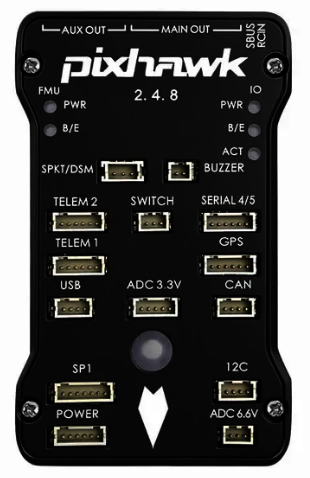
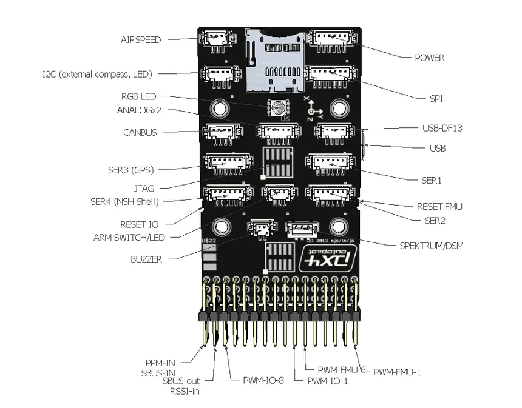
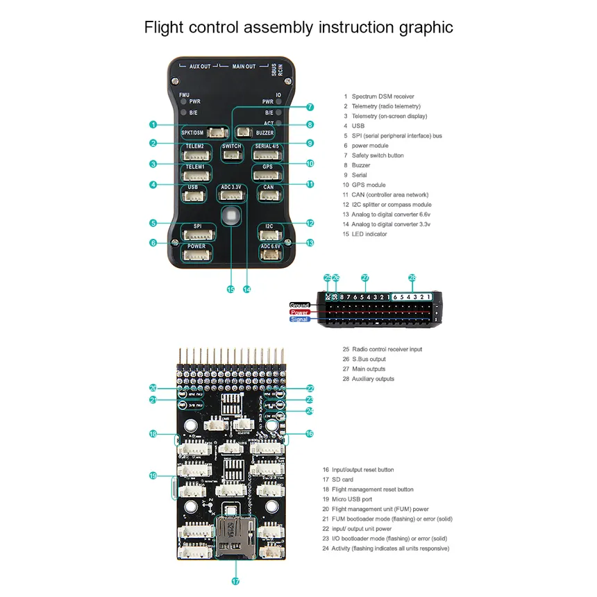
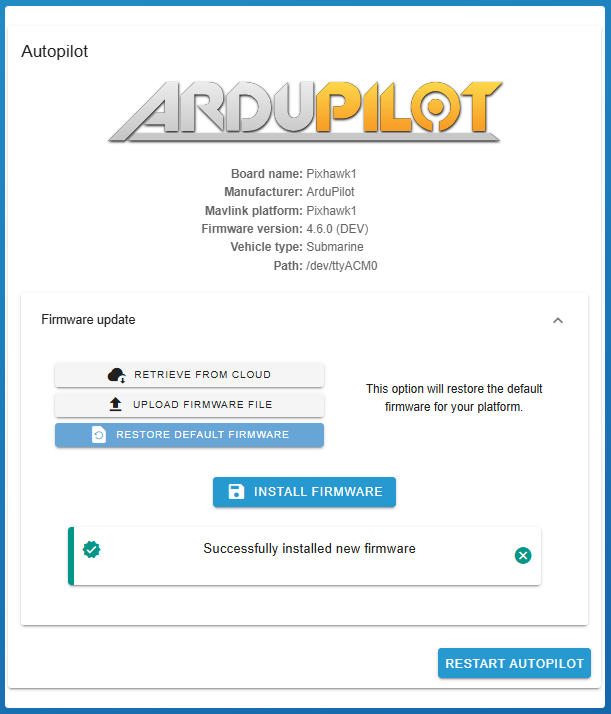
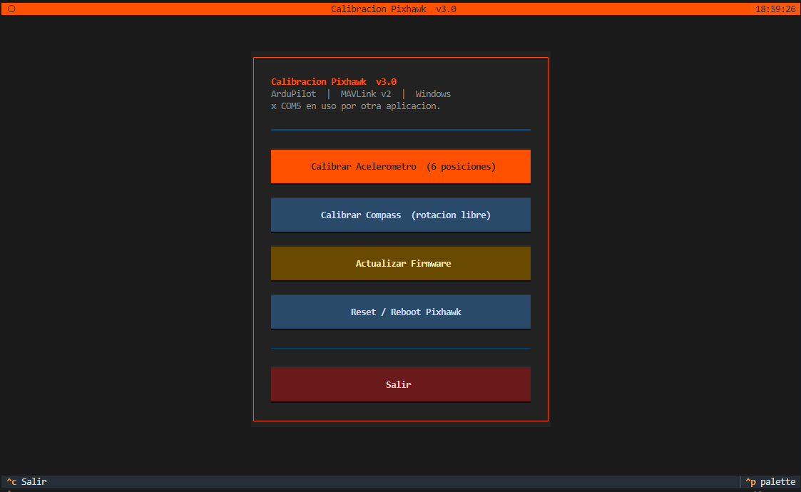
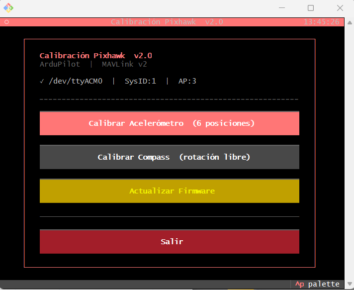
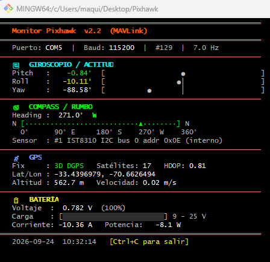
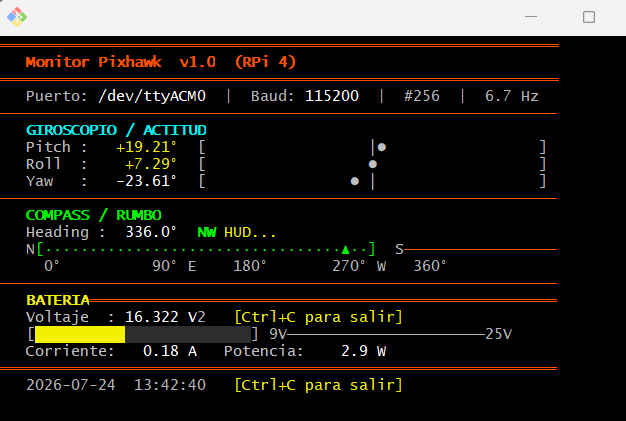
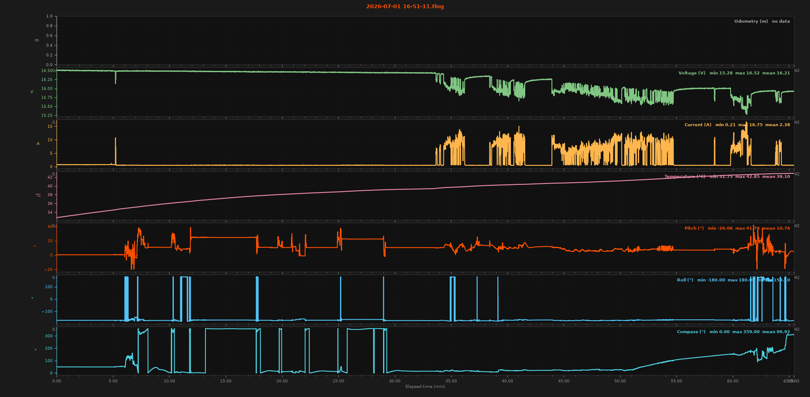

<p align="center"></p>
<h1 align="center"> Pixhawk Setting </h1> 
<h4 align="right">Jul 26</h4>

<p>
  
  
  
</p>

<br>

# Table of contents
- [Table of contents](#table-of-contents)
- [Calibration \&  Upgrade Pixhawk](#calibration---upgrade-pixhawk)
  - [From BlueOS:](#from-blueos)
  - [From QGroundControl:](#from-qgroundcontrol)
  - [From App Python Calibracion Pixhawk](#from-app-python-calibracion-pixhawk)
- [Lectura de IMU (Picth-Roll-Yaw) / Voltaje - corriente / GPS desde Windows](#lectura-de-imu-picth-roll-yaw--voltaje---corriente--gps-desde-windows)
- [Uso](#uso)
- [Lectura de Pixhawk  desde Raspberry pi 4](#lectura-de-pixhawk--desde-raspberry-pi-4)
- [Lectura de Telemetria (file.tlog) provenientes de QGroundControl](#lectura-de-telemetria-filetlog-provenientes-de-qgroundcontrol)
- [Code](#code)

<br>

Configuración de pixhawk Auto-Piloto. Calibration | Upgrade Pixhawk | Lectura de IMU (Picth-Roll-Yaw) / Voltaje / corriente desde Windows / RPi4. versión actual ```Pixhawk FMU 2.4.8```

<p align="center"></p>

<p align="center"></p>

<br>

# Calibration &  Upgrade Pixhawk

## From BlueOS:
Actualizar Firmware desde BlueOS Browser localmente IP http://192.168.2.2/vehicle/autopilot
 
> :memo: **Note:** Para que tome la configuración hay que reiniciarlo (Software||Alimentación)

<br>

## From QGroundControl:
Actualizar Firmware | Calibrar Acelerometro | Calibrar Compass

* Qgroundcontrol/Vehicle Configuraction/Power:
	* Habilitar Battery Monitor para poder medir voltaje y Corriente 
* Qgroundcontrol/Vehicle Configuraction/Sensors:
	* Calibrar Accelerometers (importante)
	* Calibrar Compass (importante)
  
> :memo: **Note:** Para que tome la configuración hay que reiniciarlo (Software||Alimentación)
  
<p align="center"></p>


<br>

## From App Python Calibracion Pixhawk
Actualizar Firmware | Calibrar Acelerometro | Calibrar Compass
Windows
<p align="center"></p>
Raspberry Pi4 / Ubuntu 2x.xx
<p align="center"></p>

> :memo: **Note:** Para que tome la configuración hay que reiniciarlo (Software||Alimentación). 
> Funciona en CMD/PowerShell

```bash
# Instalar dependencia
py -3.13 -m pip install pymavlink pyserial textual

# Ejecutar (auto-detecta el puerto)
python pixhawk_calibrate.py
```


<br>


# Lectura de IMU (Picth-Roll-Yaw) / Voltaje - corriente / GPS desde Windows

<p align="center"></p>

```bash
# Instalar dependencia
pip install pymavlink pyserial

# Ejecutar (auto-detecta el puerto)
python pixhawk_monitor_win.py   # para Windows
python pixhawk_monitor_rpi.py   # para Raspberry
```

# Uso

* Para medir voltaje y corriente se necesita una tierra en comun
* Para medir el horizonte solo se usa el Pich y Roll
*  Funciona en CMD/PowerShell


<br>

# Lectura de Pixhawk  desde Raspberry pi 4

<p align="center"></p>


```bash
# Instalar dependencia
pip install pymavlink pyserial

# Ejecutar (auto-detecta el puerto)
python pixhawk_monitor_win.py   # para Windows
python pixhawk_monitor_rpi.py   # para Raspberry / Ubuntu
```


<br>


# Lectura de Telemetria (file.tlog) provenientes de QGroundControl

Archivos *.tlog ubicados en Documents/QGroundControl/Telemetry. Funciona en CMD/PowerShell

<p align="center"></p>


<br>

<br>


# Code


**pixhawk_calibrate.py**
```Python
#!/usr/bin/env python3
# Calibracion (acelerometro/compass) y actualizacion de firmware ArduPilot
# estable para Pixhawk, con TUI Textual -- Windows 10/11 y Linux / Raspberry Pi.
# @author: Carlos Briceño <carjavi@hotmail.com>
# @date: 24-09-2026
# @copyright: Copyright (c) 2026 www.carjavi.com
# @version: V3.2
# @library:
# - pip install pymavlink pyserial textual
"""
pixhawk_calibrate.py  v3.2
===========================
Calibracion y actualizacion de firmware para Pixhawk/ArduPilot
TUI con Textual -- Windows 10/11 y Linux / Raspberry Pi

Dependencias:
    pip install pymavlink pyserial textual        (Windows)
    pip3 install pymavlink pyserial textual       (Linux / RPi)

Uso Windows:
    python pixhawk_calibrate.py
    python pixhawk_calibrate.py --port COM3
    python pixhawk_calibrate.py --port COM3 --baud 57600
    python pixhawk_calibrate.py --check-firmware   # valida URLs de todos los firmwares

Uso Linux / Raspberry Pi:
    sudo usermod -aG dialout $USER                 # solo la primera vez, luego re-login
    python3 pixhawk_calibrate.py
    python3 pixhawk_calibrate.py --port /dev/ttyACM0
    python3 pixhawk_calibrate.py --check-firmware

Ctrl+C : cierra la aplicacion limpiamente.

Cambios v3.2:
    - Multiplataforma: la actualizacion de firmware (repos corregidos en v3.1) y las
      calibraciones funcionan tambien en Linux / Raspberry Pi.
    - Reinicio a bootloader por MAVLink2 desde el script: la Pixhawk ignoraba el
      paquete MAVLink1 fijo de uploader.py.
    - El bootloader enumera en OTRO puerto (Pixhawk 2.4.8: app COM5, bootloader COM3);
      se detecta al reiniciar y se leen los COM recordados por Windows.
    - Si uploader.py rechaza el firmware, se corta de inmediato y la placa vuelve
      al firmware instalado (antes quedaba retenida en el bootloader).

Cambios v3.1:
    - Firmware: nombre de .apj correcto por vehiculo (ardurover.apj, arducopter.apj...);
      antes se pedia 'ardupilot.apj', que no existe en firmware.ardupilot.org (HTTP 404).
    - Validacion del .apj descargado (magic, board_id, imagen, git hash == stable).
    - Validacion del board_id real del Pixhawk (AUTOPILOT_VERSION) antes de flashear.
    - uploader.py descargado del mismo commit que el firmware estable.
    - Descargas con timeout + reintentos; watchdog real para el flasheo.
"""

import argparse
import base64
import glob
import json
import os
import re
import subprocess
import sys
import tempfile
import threading
import time
import urllib.error
import urllib.request
import zlib
from dataclasses import dataclass
from typing import Optional

# ── Plataforma ────────────────────────────────────────────────────────────────
#: True en Windows; en Linux / Raspberry Pi se usan /dev/tty* y /proc.
IS_WINDOWS = sys.platform == "win32"
#: Comando pip sugerido en los mensajes de error.
PIP_CMD = "pip" if IS_WINDOWS else "pip3"

if IS_WINDOWS:
    # Activar ANSI en consola Windows (necesario para Textual)
    try:
        import ctypes
        k32 = ctypes.windll.kernel32
        for handle in (-10, -11, -12):
            k32.SetConsoleMode(k32.GetStdHandle(handle), 7)
    except Exception:
        pass
elif not sys.platform.startswith("linux"):
    print("\n[ERROR] Plataforma no soportada: solo Windows y Linux / Raspberry Pi.\n")
    sys.exit(1)

# ── Verificar dependencias ────────────────────────────────────────────────────
def _check_dep(import_name: str, pkg: str):
    try:
        __import__(import_name)
    except ImportError:
        print(f"\n[ERROR] Falta '{pkg}':\n        {PIP_CMD} install {pkg}\n")
        sys.exit(1)

_check_dep("textual",   "textual")
_check_dep("pymavlink", "pymavlink")
_check_dep("serial",    "pyserial")

from textual.app import App, ComposeResult                     # noqa: E402
from textual.screen import Screen                              # noqa: E402
from textual.widgets import (                                  # noqa: E402
    Header, Footer, Button, Static, Label,
    RichLog, ProgressBar, Rule, Select,
)
from textual.containers import Vertical, Horizontal, Center, VerticalScroll  # noqa: E402
from textual import on                                         # noqa: E402
from pymavlink import mavutil                                  # noqa: E402


# ── Constantes MAVLink ────────────────────────────────────────────────────────
MAV_CMD_PREFLIGHT_CALIBRATION          = 241
MAV_CMD_ACCELCAL_VEHICLE_POS           = 42429
MAV_CMD_DO_START_MAG_CAL               = 42424
MAV_CMD_DO_CANCEL_MAG_CAL              = 42426
MAV_CMD_REQUEST_AUTOPILOT_CAPABILITIES = 520
MAV_CMD_PREFLIGHT_REBOOT_SHUTDOWN      = 246
MAV_RESULT_ACCEPTED                    = 0

# ── Firmware ArduPilot ────────────────────────────────────────────────────────
#: Servidor oficial de firmwares ArduPilot (mismo que usan Mission Planner / QGC).
FW_BASE = "https://firmware.ardupilot.org"
#: Canal de release. Solo se flashean versiones estables.
FW_CHANNEL = "stable"
#: uploader.py oficial; {ref} = git hash del firmware estable (fallback: master).
UPLOADER_URL_TMPL = ("https://raw.githubusercontent.com/ArduPilot/ardupilot/"
                     "{ref}/Tools/scripts/uploader.py")
#: Timeout (s) por intento de descarga HTTP.
HTTP_TIMEOUT_S = 20
#: Reintentos de descarga ante errores de red / 5xx.
HTTP_RETRIES = 3
#: Tiempo maximo (s) para que uploader.py termine (bootloader + borrado + escritura).
FLASH_TIMEOUT_S = 240
#: Mensajes de uploader.py que indican un error definitivo (no se arregla reintentando).
#: Todos ocurren ANTES de borrar la flash, por lo que el firmware instalado sigue intacto.
UPLOADER_FATAL_PATTERNS = (
    "Firmware not suitable for this board",
    "Firmware image is too large",
)
#: Magic obligatorio del formato .apj de ArduPilot.
APJ_MAGIC = "APJFWv1"

#: Vehiculo -> (directorio en FW_BASE, sufijo del dir. de board, archivo .apj,
#: prefijo APMVERSION esperado). URL: FW_BASE/<dir>/stable/<board><sufijo>/<apj>.
#: El .apj NO se llama 'ardupilot.apj': cada vehiculo tiene su propio nombre.
FIRMWARE_TARGETS = {
    "Copter":         ("Copter",         "",      "arducopter.apj",      "ArduCopter"),
    "Heli":           ("Copter",         "-heli", "arducopter-heli.apj", "ArduCopter"),
    "Plane":          ("Plane",          "",      "arduplane.apj",       "ArduPlane"),
    "Rover":          ("Rover",          "",      "ardurover.apj",       "ArduRover"),
    "Sub":            ("Sub",            "",      "ardusub.apj",         "ArduSub"),
    "AntennaTracker": ("AntennaTracker", "",      "antennatracker.apj",  "AntennaTracker"),
}

VEHICLE_OPTIONS = [
    ("Copter (multirrotor)",      "Copter"),
    ("Copter Heli (helicoptero)", "Heli"),
    ("Plane (ala fija)",          "Plane"),
    ("Rover (terrestre / bote)",  "Rover"),
    ("Sub (submarino)",           "Sub"),
    ("AntennaTracker",            "AntennaTracker"),
]

#: Board -> APJ board_id (verificado contra firmware.ardupilot.org/manifest.json.gz).
#: Varios targets comparten board_id 9 (familia Pixhawk1/FMUv2/v3/CubeBlack).
BOARD_IDS = {
    "fmuv3":          9,
    "Pixhawk1-1M":    9,
    "fmuv2":          9,
    "Pixhawk1":       9,
    "CubeBlack":      9,
    "Pixhawk4":       50,
    "Pixhawk6C":      56,
    "Pixhawk6X":      53,
    "CubeOrange":     140,
    "CubeOrangePlus": 1063,
    "MatekH743":      1013,
}

BOARD_OPTIONS = [
    ("fmuv3 -- Pixhawk 2.4.8 / clones (2MB flash)", "fmuv3"),
    ("Pixhawk1-1M -- Pixhawk 2.4.8 con limite 1MB", "Pixhawk1-1M"),
    ("fmuv2 -- Pixhawk 1 v2 (original 3DR)",        "fmuv2"),
    ("Pixhawk1 -- Pixhawk 1 (mRo / 3DR)",           "Pixhawk1"),
    ("CubeBlack",                                   "CubeBlack"),
    ("Pixhawk4",                                    "Pixhawk4"),
    ("Pixhawk6C",                                   "Pixhawk6C"),
    ("Pixhawk6X",                                   "Pixhawk6X"),
    ("CubeOrange",                                  "CubeOrange"),
    ("CubeOrangePlus",                              "CubeOrangePlus"),
    ("MatekH743",                                   "MatekH743"),
]

#: MAV_TYPE (HEARTBEAT.type) -> clave de FIRMWARE_TARGETS, para preseleccionar vehiculo.
MAV_TYPE_TO_VEHICLE = {
    1: "Plane", 2: "Copter", 3: "Copter", 4: "Heli", 5: "AntennaTracker",
    10: "Rover", 11: "Rover", 12: "Sub", 13: "Copter", 14: "Copter", 15: "Copter",
    19: "Plane", 20: "Plane", 21: "Plane", 22: "Plane", 29: "Copter",
}

#: USB VIDs de autopilotos/bootloaders; el bootloader puede enumerar en otro COM.
AUTOPILOT_USB_VIDS = {0x1209, 0x26AC, 0x2DAE, 0x3162, 0x0483, 0x35A7}


@dataclass
class StableFirmware:
    """Firmware estable resuelto y validado para un vehiculo/board.

    Attributes:
        vehicle: Clave de FIRMWARE_TARGETS (ej. "Rover").
        board: Target de ArduPilot (ej. "fmuv3").
        url: URL del .apj.
        version: Texto APMVERSION (ej. "ArduRover V4.7.1").
        git_hash: Commit completo del release estable.
    """
    vehicle: str
    board: str
    url: str
    version: str
    git_hash: str


def http_get(url: str, timeout: float = HTTP_TIMEOUT_S, retries: int = HTTP_RETRIES,
             progress=None) -> bytes:
    """Descarga una URL con timeout y reintentos (backoff lineal).

    Args:
        url: URL HTTP(S) a descargar.
        timeout: Timeout en segundos por intento.
        retries: Numero de intentos totales.
        progress: Callback opcional ``progress(bytes_leidos, total)``.

    Returns:
        Contenido descargado.

    Raises:
        RuntimeError: Si todos los intentos fallan. Un HTTP 4xx no se reintenta
            (la URL no existe: reintentar no sirve).
    """
    last_err: Exception = RuntimeError("sin intentos")
    for attempt in range(1, retries + 1):
        try:
            req = urllib.request.Request(url, headers={"User-Agent": "pixhawk_calibrate/3.1"})
            with urllib.request.urlopen(req, timeout=timeout) as r:
                total = int(r.headers.get("Content-Length") or 0)
                chunks, read = [], 0
                while True:
                    chunk = r.read(64 * 1024)
                    if not chunk:
                        break
                    chunks.append(chunk)
                    read += len(chunk)
                    if progress:
                        progress(read, total)
                data = b"".join(chunks)
                if total and len(data) != total:
                    raise IOError(f"descarga incompleta ({len(data)}/{total} bytes)")
                return data
        except urllib.error.HTTPError as e:
            if 400 <= e.code < 500:
                raise RuntimeError(f"HTTP {e.code} en {url}") from e
            last_err = e
        except Exception as e:  # red, timeout, descarga incompleta
            last_err = e
        if attempt < retries:
            time.sleep(2 * attempt)
    raise RuntimeError(f"No se pudo descargar {url} tras {retries} intentos: {last_err}")


def resolve_stable_firmware(vehicle: str, board: str) -> StableFirmware:
    """Consulta git-version.txt del canal estable y valida que corresponda al vehiculo.

    Args:
        vehicle: Clave de FIRMWARE_TARGETS.
        board: Target de ArduPilot (clave de BOARD_IDS).

    Returns:
        StableFirmware con URL, version y git hash.

    Raises:
        RuntimeError: Vehiculo/board desconocido, URL inexistente o version inconsistente.

    Example:
        >>> fw = resolve_stable_firmware("Rover", "fmuv3")
        >>> fw.url
        'https://firmware.ardupilot.org/Rover/stable/fmuv3/ardurover.apj'
    """
    if vehicle not in FIRMWARE_TARGETS:
        raise RuntimeError(f"Vehiculo desconocido: {vehicle}")
    if board not in BOARD_IDS:
        raise RuntimeError(f"Board desconocido: {board}")
    fw_dir, board_suffix, apj_name, apm_prefix = FIRMWARE_TARGETS[vehicle]
    base = f"{FW_BASE}/{fw_dir}/{FW_CHANNEL}/{board}{board_suffix}"

    text = http_get(f"{base}/git-version.txt").decode("utf-8", errors="replace")
    m_hash = re.search(r"^commit\s+([0-9a-f]{40})", text, re.MULTILINE)
    m_ver = re.search(r"^APMVERSION:\s*(.+)$", text, re.MULTILINE)
    if not m_hash or not m_ver:
        raise RuntimeError(f"git-version.txt con formato inesperado en {base}")
    version = m_ver.group(1).strip()
    if not version.startswith(apm_prefix):
        raise RuntimeError(f"Version '{version}' no corresponde a {apm_prefix}")
    if re.search(r"(dev|beta|rc)\b", version, re.IGNORECASE):
        raise RuntimeError(f"El canal stable reporta una version no estable: {version}")
    return StableFirmware(vehicle, board, f"{base}/{apj_name}", version, m_hash.group(1))


def validate_apj(data: bytes, fw: StableFirmware) -> dict:
    """Valida un archivo .apj descargado antes de flashearlo.

    Comprueba: JSON valido, magic APJFWv1, board_id del board elegido, imagen
    presente y descomprimible con el tamano declarado, y git hash == release estable.

    Args:
        data: Contenido del .apj.
        fw: Firmware estable esperado.

    Returns:
        Diccionario con los metadatos del .apj (sin la imagen).

    Raises:
        RuntimeError: Si alguna validacion falla.
    """
    try:
        apj = json.loads(data)
    except ValueError as e:
        raise RuntimeError(f".apj no es JSON valido: {e}") from e
    if apj.get("magic") != APJ_MAGIC:
        raise RuntimeError(f".apj con magic invalido: {apj.get('magic')!r}")
    expected_id = BOARD_IDS[fw.board]
    if apj.get("board_id") != expected_id:
        raise RuntimeError(f".apj para board_id {apj.get('board_id')}, se esperaba "
                           f"{expected_id} ({fw.board})")
    try:
        image = zlib.decompress(base64.b64decode(apj["image"]))
    except Exception as e:
        raise RuntimeError(f"Imagen del .apj corrupta: {e}") from e
    if len(image) != apj.get("image_size"):
        raise RuntimeError(f"Tamano de imagen {len(image)} != image_size {apj.get('image_size')}")
    git_id = str(apj.get("git_identity", ""))
    if not git_id or not fw.git_hash.startswith(git_id[:7]):
        raise RuntimeError(f"git_identity {git_id!r} no coincide con el release "
                           f"estable {fw.git_hash[:8]}")
    return {k: v for k, v in apj.items() if k not in ("image", "extf_image")}


def download_uploader(git_hash: str) -> bytes:
    """Descarga uploader.py oficial del mismo commit del firmware (fallback: master).

    Args:
        git_hash: Commit del release estable.

    Returns:
        Codigo fuente de uploader.py.

    Raises:
        RuntimeError: Si no se pudo descargar un uploader.py valido.
    """
    errors = []
    for ref in (git_hash, "master"):
        try:
            src = http_get(UPLOADER_URL_TMPL.format(ref=ref))
            if b"Firmware uploader for the PX autopilot system" not in src:
                raise RuntimeError("contenido inesperado")
            return src
        except Exception as e:
            errors.append(f"{ref[:8]}: {e}")
    raise RuntimeError("uploader.py no disponible (" + "; ".join(errors) + ")")


def boards_for_id(board_id: int) -> list:
    """Devuelve los targets de BOARD_OPTIONS compatibles con un board_id."""
    return [val for _, val in BOARD_OPTIONS if BOARD_IDS[val] == board_id]


#: Linux: nombres estables de udev para autopilotos/bootloaders (uploader.py expande globs).
LINUX_BY_ID_GLOBS = [
    "/dev/serial/by-id/usb-ArduPilot*",
    "/dev/serial/by-id/usb-3D_Robotics*",
    "/dev/serial/by-id/usb-Hex_ProfiCNC*",
    "/dev/serial/by-id/usb-Holybro*",
    "/dev/serial/by-id/usb-mRo*",
    "/dev/serial/by-id/*PX4*",
]


def windows_known_autopilot_ports() -> list:
    """Windows: puertos COM que el registro recuerda para VIDs de autopilotos.

    El bootloader (ej. "PX4 BL FMU v2.x", VID 0x26AC PID 0x0011 en Pixhawk 2.4.8)
    enumera con otro VID/PID que la aplicacion y por eso recibe OTRO numero de COM
    (ej. app COM5, bootloader COM3) que solo existe unos segundos tras el reinicio.
    Windows guarda esa asignacion en HKLM\\SYSTEM\\CurrentControlSet\\Enum\\USB.

    Returns:
        Lista de "COMn" (vacia fuera de Windows o si no hay registros).
    """
    if not IS_WINDOWS:
        return []
    import winreg
    ports = []
    base = r"SYSTEM\CurrentControlSet\Enum\USB"
    try:
        root = winreg.OpenKey(winreg.HKEY_LOCAL_MACHINE, base)
    except OSError:
        return []
    with root:
        for i in range(winreg.QueryInfoKey(root)[0]):
            dev = winreg.EnumKey(root, i)
            m = re.match(r"VID_([0-9A-F]{4})&PID_[0-9A-F]{4}$", dev, re.IGNORECASE)
            if not m or int(m.group(1), 16) not in AUTOPILOT_USB_VIDS:
                continue
            try:
                with winreg.OpenKey(root, dev) as dk:
                    for j in range(winreg.QueryInfoKey(dk)[0]):
                        inst = winreg.EnumKey(dk, j)
                        try:
                            with winreg.OpenKey(dk, inst + r"\Device Parameters") as pk:
                                name = winreg.QueryValueEx(pk, "PortName")[0]
                            if name.upper().startswith("COM") and name not in ports:
                                ports.append(name)
                        except OSError:
                            continue
            except OSError:
                continue
    return ports


def autopilot_ports(primary: str, extra: Optional[list] = None) -> str:
    """Lista de puertos para uploader.py: el puerto actual primero y luego otros
    puertos donde puede aparecer el bootloader (COM5 -> COM3 en Windows,
    /dev/ttyACM0 -> /dev/ttyACM1 en Linux).

    Args:
        primary: Puerto en uso (ej. "COM5" o "/dev/ttyACM0").
        extra: Puertos detectados al reiniciar a bootloader (van primero).

    Returns:
        Lista separada por comas, ej. "COM3,COM5" o "/dev/ttyACM0,/dev/serial/by-id/usb-ArduPilot*".
    """
    ports = list(extra or [])
    if primary not in ports:
        ports.append(primary)
    try:
        import serial.tools.list_ports as lp
        for p in lp.comports():
            if p.vid in AUTOPILOT_USB_VIDS and p.device not in ports:
                ports.append(p.device)
    except Exception:
        pass
    ports += [p for p in windows_known_autopilot_ports() if p not in ports]
    if not IS_WINDOWS:
        # Los globs cubren el bootloader aunque aun no exista al momento de lanzar el uploader
        ports += [g for g in LINUX_BY_ID_GLOBS if g not in ports]
    return ",".join(ports)


def exit_bootloader(ports: list) -> list:
    """Saca la placa del bootloader y arranca el firmware instalado (no escribe flash).

    Envia PROTO_BOOT (0x30) + PROTO_EOC (0x20) del protocolo de bootloader PX4/ArduPilot.
    Se usa cuando el flasheo falla tras reiniciar con param1=3, que deja la placa
    retenida en el bootloader.

    Args:
        ports: Puertos donde se detecto el bootloader.

    Returns:
        Puertos a los que se envio el comando.
    """
    import serial
    sent = []
    for dev in ports:
        try:
            with serial.Serial(dev, 115200, timeout=1, write_timeout=1) as s:
                s.write(b"\x30\x20")
                s.flush()
            sent.append(dev)
        except Exception:
            continue
    return sent


def reboot_to_bootloader(conn, primary: str, timeout: float = 8.0) -> list:
    """Reinicia el Pixhawk al bootloader por MAVLink2 y detecta su puerto.

    uploader.py intenta reiniciar la placa con un paquete MAVLink1 fijo que algunos
    firmwares ignoran (verificado en Pixhawk 2.4.8 con ArduSub 4.5.7); por eso el
    reinicio se hace con la conexion MAVLink ya abierta, igual que Mission Planner/QGC.
    El bootloader de ArduPilot/PX4 solo espera unos segundos, asi que el uploader
    debe lanzarse inmediatamente despues.

    Args:
        conn: Conexion pymavlink abierta (se cierra aqui).
        primary: Puerto de la aplicacion (ej. "COM5").
        timeout: Espera maxima (s) a que aparezca el puerto del bootloader.

    Returns:
        Puertos de autopiloto que aparecieron tras el reinicio (vacio si no se detecto).
    """
    import serial.tools.list_ports as lp

    def _autopilot_devices() -> set:
        return {p.device for p in lp.comports() if p.vid in AUTOPILOT_USB_VIDS}

    conn.mav.command_long_send(
        conn.target_system, 1, MAV_CMD_PREFLIGHT_REBOOT_SHUTDOWN, 0,
        3,  # param1=3: reiniciar y quedarse en el bootloader
        0, 0, 0, 0, 0, 0,
    )
    time.sleep(0.2)
    try:
        conn.close()
    except Exception:
        pass

    deadline = time.time() + 2.0            # esperar que desaparezca la app
    while time.time() < deadline and primary in _autopilot_devices():
        time.sleep(0.05)
    deadline = time.time() + timeout        # esperar que enumere el bootloader
    while time.time() < deadline:
        found = sorted(_autopilot_devices())
        if found:
            return found
        time.sleep(0.05)
    return []


def check_all_firmware_urls() -> bool:
    """Valida (sin hardware) que existan todos los firmwares estables vehiculo x board.

    Descarga git-version.txt de cada combinacion y hace un HEAD al .apj.

    Returns:
        True si todas las combinaciones estan disponibles.
    """
    all_ok = True
    for _, vehicle in VEHICLE_OPTIONS:
        for _, board in BOARD_OPTIONS:
            try:
                fw = resolve_stable_firmware(vehicle, board)
                req = urllib.request.Request(fw.url, method="HEAD")
                with urllib.request.urlopen(req, timeout=HTTP_TIMEOUT_S) as r:
                    size = int(r.headers.get("Content-Length") or 0)
                print(f"  [OK]    {vehicle:15s} {board:15s} {fw.version:24s} "
                      f"{size // 1024:5d} KB  {fw.url}")
            except Exception as e:
                all_ok = False
                print(f"  [FALLO] {vehicle:15s} {board:15s} {e}")
    return all_ok

# ── Posiciones acelerometro ───────────────────────────────────────────────────
ACCEL_POSITIONS = [
    {
        "id": 0, "name": "NIVEL (cara arriba)", "short": "NIVEL",
        "instruction": "Coloque el Pixhawk PLANO con la cara superior hacia arriba.",
        "diagram": (
            "       /\\ NARIZ\n"
            "  +----+----+\n"
            "  | /= [O] =\\ |  <- cara ARRIBA\n"
            "  +----+----+\n"
            "  apoya plano sobre superficie"
        ),
    },
    {
        "id": 1, "name": "IZQUIERDA ABAJO", "short": "IZQ ABAJO",
        "instruction": "Gire 90 grados: lado IZQUIERDO hacia el suelo, nariz al frente.",
        "diagram": (
            "       /\\ NARIZ\n"
            "  +=========+\n"
            "  | [O]      |  lado IZQ al PISO\n"
            "  +=========+\n"
            "  IZQ abajo     DER arriba"
        ),
    },
    {
        "id": 2, "name": "DERECHA ABAJO", "short": "DER ABAJO",
        "instruction": "Gire 90 grados: lado DERECHO hacia el suelo, nariz al frente.",
        "diagram": (
            "       /\\ NARIZ\n"
            "  +=========+\n"
            "  |      [O] |  lado DER al PISO\n"
            "  +=========+\n"
            "  IZQ arriba    DER abajo"
        ),
    },
    {
        "id": 3, "name": "NARIZ ABAJO", "short": "NARIZ abajo",
        "instruction": "Incline hacia adelante: NARIZ apunta al suelo, cola arriba.",
        "diagram": (
            "  COLA arriba\n"
            "  +=========+\n"
            "  |   [O]    |\n"
            "  +=========+\n"
            "  NARIZ abajo"
        ),
    },
    {
        "id": 4, "name": "NARIZ ARRIBA", "short": "NARIZ arriba",
        "instruction": "Incline hacia atras: NARIZ apunta al cielo, cola al suelo.",
        "diagram": (
            "  NARIZ arriba\n"
            "  +=========+\n"
            "  |   [O]    |\n"
            "  +=========+\n"
            "  COLA abajo"
        ),
    },
    {
        "id": 5, "name": "BOCA ABAJO", "short": "INVERTIDO",
        "instruction": "Voltee 180 grados: cara superior mirando al suelo.",
        "diagram": (
            "       /\\ NARIZ\n"
            "  +----+----+\n"
            "  | \\= [O] =/ |  <- cara ABAJO\n"
            "  +----+----+\n"
            "  boca abajo (invertido)"
        ),
    },
]

COMPASS_DIAGRAM = (
    "  Rote el Pixhawk en TODAS las orientaciones:\n"
    "  +==============+\n"
    "  |  +--------+  |   Yaw  : giro horizontal\n"
    "  |  |  [O]   |  |   Pitch: nariz arriba/abajo\n"
    "  |  +--------+  |   Roll : costado izq/der\n"
    "  +==============+\n"
    "  Haga 2-3 rotaciones lentas en cada eje."
)

# ── Deteccion de puerto serie ─────────────────────────────────────────────────
KNOWN_VID_PID = {
    (0x26AC, None), (0x0483, 0x5740), (0x0483, 0x374B),
    (0x27AC, None), (0x1209, 0x5741), (0x0403, 0x6001),
    (0x0403, 0x6015), (0x10C4, 0xEA60), (0x1A86, 0x7523),
    (0x1A86, 0x55D4), (0x2341, None),
}
KNOWN_KEYWORDS = [
    "pixhawk", "ardupilot", "px4", "cube", "holybro",
    "mro", "fmuv", "ftdi", "ch340", "cp210", "stm32",
]

#: Linux: prioridad de puertos tipicos (USB CDC del Pixhawk primero, UART GPIO al final).
LINUX_PORT_PRIORITY = ["/dev/ttyACM0", "/dev/ttyACM1", "/dev/ttyUSB0",
                       "/dev/ttyUSB1", "/dev/serial0", "/dev/ttyAMA0"]


def _port_bonus(device: str) -> int:
    """Puntaje extra por nombre de puerto segun la plataforma."""
    if IS_WINDOWS:
        try:
            return max(0, 5 - int(device[3:]) // 4)
        except ValueError:
            return 0
    try:
        return max(0, 8 - LINUX_PORT_PRIORITY.index(device))
    except ValueError:
        return 0


def _is_candidate_port(device: str) -> bool:
    """COMx en Windows; ttyACM/ttyUSB/ttyAMA/serial0 en Linux (descarta ttyS* virtuales)."""
    if IS_WINDOWS:
        return device.upper().startswith("COM")
    return device.startswith(("/dev/ttyACM", "/dev/ttyUSB", "/dev/ttyAMA", "/dev/serial"))


def detect_port() -> Optional[str]:
    """Devuelve el puerto serie con mayor probabilidad de ser un Pixhawk, o None.

    Puntua por palabras clave del descriptor USB, VID/PID conocidos y nombre del puerto.
    """
    try:
        import serial.tools.list_ports as lp
    except ImportError:
        return None
    best_score, best_port = -1, None
    for p in lp.comports():
        if not _is_candidate_port(p.device):
            continue
        score = 0
        combined = f"{p.description or ''} {p.manufacturer or ''} {p.product or ''}".lower()
        for kw in KNOWN_KEYWORDS:
            if kw in combined:
                score += 10
                break
        if p.vid is not None:
            for kvid, kpid in KNOWN_VID_PID:
                if p.vid == kvid and (kpid is None or p.pid == kpid):
                    score += 20
                    break
        score += _port_bonus(p.device)
        if score > best_score:
            best_score, best_port = score, p.device
    return best_port


#: Programas GCS que suelen tener abierto el puerto del Pixhawk.
PORT_BLOCKERS_WIN = ["MissionPlanner.exe", "QGroundControl.exe", "mavproxy.exe", "ArduPilot.exe"]
PORT_BLOCKERS_LINUX = ["QGroundControl", "mavproxy.py", "MAVProxy", "MissionPlanner"]


def _linux_port_users(port: str) -> list:
    """Linux: (pid, nombre, cmdline) de los procesos con `port` abierto, via /proc/*/fd."""
    target = os.path.realpath(port)
    users = []
    for fd_dir in glob.glob("/proc/[0-9]*/fd"):
        pid = int(fd_dir.split("/")[2])
        if pid == os.getpid():
            continue
        try:
            if not any(os.path.realpath(os.path.join(fd_dir, fd)) == target
                       for fd in os.listdir(fd_dir)):
                continue
            with open(f"/proc/{pid}/comm") as f:
                comm = f.read().strip()
            with open(f"/proc/{pid}/cmdline", "rb") as f:
                cmdline = f.read().replace(b"\0", b" ").decode(errors="replace")
            users.append((pid, comm, cmdline))
        except (PermissionError, FileNotFoundError, ProcessLookupError):
            continue
    return users


def release_serial_port(port: str) -> tuple:
    """Cierra GCS conocidos que bloquean el puerto del Pixhawk.

    Windows: tasklist/taskkill por nombre. Linux: busca los procesos que tienen
    el puerto abierto y termina (SIGTERM) solo los GCS conocidos; el resto se reporta.

    Args:
        port: Puerto serie ("COM5" o "/dev/ttyACM0").

    Returns:
        (cerrados, otros): nombres de procesos cerrados y de procesos desconocidos
        que siguen usando el puerto (ej. ModemManager).
    """
    killed, others = [], []
    if IS_WINDOWS:
        try:
            result = subprocess.run(["tasklist", "/FO", "CSV", "/NH"],
                                    capture_output=True, text=True, timeout=5)
            for line in result.stdout.splitlines():
                name = line.split(",")[0].strip('"')
                if any(b.lower() == name.lower() for b in PORT_BLOCKERS_WIN):
                    subprocess.run(["taskkill", "/F", "/IM", name],
                                   capture_output=True, timeout=5)
                    killed.append(name)
        except Exception:
            pass
        return killed, others

    import signal
    for pid, comm, cmdline in _linux_port_users(port):
        if any(b.lower() in f"{comm} {cmdline}".lower() for b in PORT_BLOCKERS_LINUX):
            try:
                os.kill(pid, signal.SIGTERM)
                killed.append(f"{comm} ({pid})")
            except OSError:
                others.append(f"{comm} ({pid})")
        else:
            others.append(f"{comm} ({pid})")
    return killed, others


def serial_help() -> str:
    """Texto de ayuda para problemas de acceso al puerto segun la plataforma."""
    if IS_WINDOWS:
        return ("Cierre Mission Planner, QGroundControl, MAVProxy o Arduino IDE\n"
                "y verifique el driver en Administrador de dispositivos.")
    return ("Agregue su usuario al grupo dialout y vuelva a iniciar sesion:\n"
            "  sudo usermod -aG dialout $USER\n"
            "Cierre QGroundControl / MAVProxy. Si existe ModemManager:\n"
            "  sudo systemctl stop ModemManager")


# ── CSS ───────────────────────────────────────────────────────────────────────
APP_CSS = """
Screen { background: #1a1a1a; }
Header { background: #FF5100; color: white; height: 1; }
Footer { height: 1; }

/* Menu */
#menu_wrap { align: center middle; height: 100%; }
.menu_box {
    width: 60; height: auto;
    border: solid #FF5100;
    padding: 1 3; background: #222222;
}
.menu_title { text-align: center; color: #FF5100; text-style: bold; }
.menu_sub   { text-align: center; color: #555555; }
.menu_conn  { text-align: center; color: #888888; margin-bottom: 1; }

/* Botones */
Button           { width: 100%; margin-top: 1; }
Button.primary   { background: #FF5100; color: white; }
Button.secondary { background: #2a4a6a; color: #ccddee; }
Button.confirm   { background: #1a6a2a; color: white; }
Button.danger    { background: #6a1a1a; color: #ffcccc; }
Button.warning   { background: #6a4a00; color: #ffeeaa; }
/* En la barra de botones, dividir ancho equitativamente */
.btn_bar Button  { width: 1fr; margin-top: 0; }

/* Cal screens -- VerticalScroll debe ser 1fr para que btn_bar quede visible */
AccelCalScreen VerticalScroll,
CompassCalScreen VerticalScroll,
FirmwareScreen VerticalScroll { height: 1fr; }
.cal_scroll { padding: 0 1; }
.cal_title { color: #FF5100; text-style: bold; }
.pos_label { color: #FF5100; text-style: bold; text-align: right; }

.diagram_box {
    border: solid #444444; background: #111111;
    padding: 0 1; height: 7;
}
.instruction_box {
    border: solid #333333; background: #1a1a1a;
    padding: 0 1; height: 4; color: #dddddd;
}
RichLog {
    height: 5; border: solid #2a2a2a; background: #111111;
}
ProgressBar { margin: 0; }
.btn_bar { height: 3; dock: bottom; }

/* Firmware */
.fw_info {
    border: solid #444444; background: #111111;
    padding: 0 1; height: 5;
}
.sel_row { height: 3; margin-bottom: 1; }
Select { width: 1fr; }
"""


class CalScroll(VerticalScroll):
    """VerticalScroll con height:1fr forzado para que los botones siempre sean visibles."""
    DEFAULT_CSS = "CalScroll { height: 1fr; padding: 0 1; }"


# ─────────────────────────────────────────────────────────────────────────────
# Menu Principal
# ─────────────────────────────────────────────────────────────────────────────
class MainMenuScreen(Screen):
    BINDINGS = [
        ("escape", "app.exit", "Salir"),
        ("ctrl+c", "app.exit", "Salir"),
    ]

    def compose(self) -> ComposeResult:
        yield Header(show_clock=True)
        with Center(id="menu_wrap"):
            with Vertical(classes="menu_box"):
                yield Label("Calibracion Pixhawk  v3.0", classes="menu_title")
                yield Label(f"ArduPilot  |  MAVLink v2  |  {'Windows' if IS_WINDOWS else 'Linux'}", classes="menu_sub")
                yield Label("Buscando Pixhawk...", id="conn_label", classes="menu_conn")
                yield Rule(line_style="heavy")
                yield Button("  Calibrar Acelerometro  (6 posiciones)", id="btn_accel",   classes="primary")
                yield Button("  Calibrar Compass  (rotacion libre)",    id="btn_compass", classes="secondary")
                yield Button("  Actualizar Firmware",                   id="btn_fw",      classes="warning")
                yield Button("  Reset / Reboot Pixhawk",                id="btn_reset",   classes="secondary")
                yield Rule()
                yield Button("  Salir  [Esc]",                          id="btn_exit",    classes="danger")
        yield Footer()

    def set_conn_label(self, text: str):
        try:
            self.query_one("#conn_label", Label).update(text)
        except Exception:
            pass

    def _need_conn(self) -> bool:
        if self.app.mavconn is None:
            self.app.notify("Pixhawk no conectado. Verifique el cable USB.", severity="error")
            return False
        return True

    @on(Button.Pressed, "#btn_accel")
    def go_accel(self):
        if self._need_conn():
            self.app.push_screen(AccelCalScreen())

    @on(Button.Pressed, "#btn_compass")
    def go_compass(self):
        if self._need_conn():
            self.app.push_screen(CompassCalScreen())

    @on(Button.Pressed, "#btn_fw")
    def go_firmware(self):
        self.app.push_screen(FirmwareScreen())

    @on(Button.Pressed, "#btn_reset")
    def do_reset(self):
        if self._need_conn():
            self.app.reboot_pixhawk()

    @on(Button.Pressed, "#btn_exit")
    def do_exit(self):
        self.app.exit()


# ─────────────────────────────────────────────────────────────────────────────
# Calibracion Acelerometro
# ─────────────────────────────────────────────────────────────────────────────
class AccelCalScreen(Screen):
    BINDINGS = [
        ("escape", "cancel_or_back", "Cancelar"),
        ("ctrl+c", "app.exit",       "Salir"),
        ("enter",  "confirm_pos",    "Confirmar"),
    ]
    _cal_active = False

    def compose(self) -> ComposeResult:
        yield Header(show_clock=True)
        with CalScroll():
            with Horizontal():
                yield Label("CALIBRACION ACELEROMETRO -- 6 POSICIONES", classes="cal_title")
                yield Label("Posicion: --", id="pos_label", classes="pos_label")
            yield Static(id="diagram", classes="diagram_box")
            yield Static(
                "Presione [INICIAR] para comenzar.",
                id="instruction", classes="instruction_box",
            )
            yield Label("Progreso:")
            yield ProgressBar(total=6, show_eta=False, id="accel_bar")
            yield RichLog(id="accel_log", highlight=True, markup=True)
        with Horizontal(classes="btn_bar"):
            yield Button("INICIAR",           id="btn_start",   classes="primary")
            yield Button("CONFIRMAR [Enter]", id="btn_confirm", classes="confirm",  disabled=True)
            yield Button("CANCELAR  [Esc]",   id="btn_cancel",  classes="danger")
        yield Footer()

    def on_mount(self):
        self._confirm_evt = threading.Event()
        self._cancel_evt  = threading.Event()
        self.query_one("#diagram", Static).update("Esperando inicio...")


    # ── helpers UI (llamados siempre desde hilo principal) ─────
    def _log(self, msg: str, style: str = ""):
        ts = time.strftime("%H:%M:%S")
        self.query_one("#accel_log", RichLog).write(
            f"[{ts}] [{style}]{msg}[/{style}]" if style else f"[{ts}] {msg}"
        )

    def _ui_diagram(self, idx: Optional[int]):
        self.query_one("#diagram", Static).update(
            ACCEL_POSITIONS[idx]["diagram"] if idx is not None else "Esperando inicio..."
        )

    def _ui_instruction(self, text: str):
        self.query_one("#instruction", Static).update(text)

    def _ui_pos_label(self, text: str):
        self.query_one("#pos_label", Label).update(text)

    def _ui_confirm_btn(self, enabled: bool):
        self.query_one("#btn_confirm", Button).disabled = not enabled

    def _ui_start_btn(self, enabled: bool):
        self.query_one("#btn_start", Button).disabled = not enabled

    def _ui_advance_bar(self):
        self.query_one("#accel_bar", ProgressBar).advance(1)

    def _ui_reset_bar(self):
        self.query_one("#accel_bar", ProgressBar).update(progress=0)

    # ── acciones ───────────────────────────────────────────────
    @on(Button.Pressed, "#btn_start")
    def start_cal(self):
        self._cal_active = True
        self._cancel_evt.clear()
        self._confirm_evt.clear()
        threading.Thread(target=self._run_accel_cal, daemon=True).start()

    @on(Button.Pressed, "#btn_confirm")
    def btn_confirm(self):
        self._confirm_evt.set()

    @on(Button.Pressed, "#btn_cancel")
    def btn_cancel(self):
        self._do_cancel()

    def action_cancel_or_back(self):
        self._do_cancel()

    def action_confirm_pos(self):
        if not self.query_one("#btn_confirm", Button).disabled:
            self._confirm_evt.set()

    def _do_cancel(self):
        if self._cal_active:
            self._cancel_evt.set()
            self._confirm_evt.set()   # desbloquea .wait() si el hilo espera
        else:
            self.app.pop_screen()

    # ── logica MAVLink en hilo separado ────────────────────────
    def _run_accel_cal(self):
        conn = self.app.mavconn
        self.app.call_from_thread(self._ui_start_btn, False)
        self.app.call_from_thread(self._log, "Iniciando calibracion de acelerometro...")

        conn.mav.command_long_send(
            conn.target_system, conn.target_component,
            MAV_CMD_PREFLIGHT_CALIBRATION, 0,
            1, 0, 0, 0, 0, 0, 0,
        )
        ack = conn.recv_match(type="COMMAND_ACK", blocking=True, timeout=6)
        if ack is None or ack.result != MAV_RESULT_ACCEPTED:
            self.app.call_from_thread(self._log,
                f"Rechazado (result={ack.result if ack else 'TIMEOUT'}). Armado?", "bold red")
            self.app.call_from_thread(self._finish_accel, False)
            return

        self.app.call_from_thread(self._log, "Calibracion aceptada.", "green")

        for idx, pos in enumerate(ACCEL_POSITIONS):
            if self._cancel_evt.is_set():
                break

            self.app.call_from_thread(self._ui_diagram,      idx)
            self.app.call_from_thread(self._ui_instruction,  pos["instruction"])
            self.app.call_from_thread(self._ui_pos_label,    f"Pos {idx+1}/6  {pos['name']}")
            self.app.call_from_thread(self._log,             f">> Posicion {idx+1}/6: {pos['name']}")
            self.app.call_from_thread(self._ui_confirm_btn,  True)

            self._confirm_evt.clear()
            self._confirm_evt.wait()          # espera Enter/boton o cancelacion
            self.app.call_from_thread(self._ui_confirm_btn, False)

            if self._cancel_evt.is_set():
                break

            self.app.call_from_thread(self._log, f"Capturando {pos['short']}...", "yellow")
            conn.mav.command_long_send(
                conn.target_system, conn.target_component,
                MAV_CMD_ACCELCAL_VEHICLE_POS, 0,
                float(pos["id"]), 0, 0, 0, 0, 0, 0,
            )

            deadline = time.time() + 15
            while time.time() < deadline and not self._cancel_evt.is_set():
                msg = conn.recv_match(type=["STATUSTEXT"], blocking=True, timeout=0.3)
                if msg:
                    text = msg.text.strip()
                    self.app.call_from_thread(self._log, f"  {text}", "cyan")
                    tl = text.lower()
                    if any(kw in tl for kw in ["place", "level", "left", "right", "nose", "back", "done"]):
                        break
                    if "fail" in tl or "error" in tl:
                        self._cancel_evt.set()
                        break

            if not self._cancel_evt.is_set():
                self.app.call_from_thread(self._ui_advance_bar)
                self.app.call_from_thread(self._log, f"  [ok] {pos['short']} capturado.", "green")

        if self._cancel_evt.is_set():
            conn.mav.command_long_send(
                conn.target_system, conn.target_component,
                MAV_CMD_PREFLIGHT_CALIBRATION, 0, 0, 0, 0, 0, 0, 0, 0,
            )
            self.app.call_from_thread(self._log, "Cancelado.", "yellow")
            self.app.call_from_thread(self._finish_accel, False)
            return

        self.app.call_from_thread(self._ui_instruction, "Procesando datos -- espere...")
        success = False
        deadline = time.time() + 25
        while time.time() < deadline:
            msg = conn.recv_match(type="STATUSTEXT", blocking=True, timeout=0.3)
            if msg:
                text = msg.text.strip()
                self.app.call_from_thread(self._log, f"  {text}", "cyan")
                if "success" in text.lower() or "complete" in text.lower():
                    success = True
                    break
                if "fail" in text.lower():
                    break

        self.app.call_from_thread(self._finish_accel, success)

    def _finish_accel(self, success: bool):
        self._cal_active = False
        self._ui_start_btn(True)
        self._ui_confirm_btn(False)
        if success:
            self._ui_pos_label("[ok] COMPLETADO -- reiniciando...")
            self._log("Calibracion OK. Enviando reboot...", "green")
            self.app.reboot_pixhawk()
            self._ui_instruction("[ok] Acelerometro calibrado. Pixhawk reiniciado. [CANCELAR] para volver.")
            self._ui_pos_label("[ok] COMPLETADO")
        else:
            self._ui_instruction("[x] Cancelado o fallido. [INICIAR] para reintentar.")
            self._ui_pos_label("[x] CANCELADO")
            self._ui_reset_bar()
            self._ui_diagram(None)


# ─────────────────────────────────────────────────────────────────────────────
# Calibracion Compass
# ─────────────────────────────────────────────────────────────────────────────
class CompassCalScreen(Screen):
    BINDINGS = [
        ("escape", "cancel_or_back", "Cancelar"),
        ("ctrl+c", "app.exit",       "Salir"),
    ]
    _cal_active = False

    def compose(self) -> ComposeResult:
        yield Header(show_clock=True)
        with CalScroll():
            yield Label("CALIBRACION DE COMPASS -- ROTACION LIBRE", classes="cal_title")
            yield Static(COMPASS_DIAGRAM, id="compass_diagram", classes="diagram_box")
            yield Static(
                "Presione [INICIAR] para comenzar.\n"
                "Rote el Pixhawk en todas las orientaciones.",
                id="compass_instr", classes="instruction_box",
            )
            yield Label("Progreso:")
            yield ProgressBar(total=100, show_eta=False, id="compass_bar")
            yield RichLog(id="compass_log", highlight=True, markup=True)
        with Horizontal(classes="btn_bar"):
            yield Button("INICIAR",         id="btn_cmp_start",  classes="primary")
            yield Button("CANCELAR  [Esc]", id="btn_cmp_cancel", classes="danger")
        yield Footer()

    def on_mount(self):
        self._cancel_evt = threading.Event()


    def _log(self, msg: str, style: str = ""):
        ts = time.strftime("%H:%M:%S")
        self.query_one("#compass_log", RichLog).write(
            f"[{ts}] [{style}]{msg}[/{style}]" if style else f"[{ts}] {msg}"
        )

    def _ui_instr(self, text: str):
        self.query_one("#compass_instr", Static).update(text)

    def _ui_progress(self, pct: int):
        self.query_one("#compass_bar", ProgressBar).update(progress=pct)

    def _ui_start_btn(self, enabled: bool):
        self.query_one("#btn_cmp_start", Button).disabled = not enabled

    @on(Button.Pressed, "#btn_cmp_start")
    def start_compass(self):
        self._cal_active = True
        self._cancel_evt.clear()
        self._ui_progress(0)
        threading.Thread(target=self._run_compass_cal, daemon=True).start()

    @on(Button.Pressed, "#btn_cmp_cancel")
    def cancel_btn(self):
        self._do_cancel()

    def action_cancel_or_back(self):
        self._do_cancel()

    def _do_cancel(self):
        if self._cal_active:
            self._cancel_evt.set()
        else:
            self.app.pop_screen()

    def _run_compass_cal(self):
        conn = self.app.mavconn
        self.app.call_from_thread(self._ui_start_btn, False)
        self.app.call_from_thread(self._log, "Enviando comando calibracion compass...")

        conn.mav.command_long_send(
            conn.target_system, conn.target_component,
            MAV_CMD_DO_START_MAG_CAL, 0,
            0, 1, 1, 0, 0, 0, 0,
        )
        ack = conn.recv_match(type="COMMAND_ACK", blocking=True, timeout=5)
        accepted = ack is not None and ack.result == MAV_RESULT_ACCEPTED

        if not accepted:
            self.app.call_from_thread(self._log,
                f"DO_START_MAG_CAL result={ack.result if ack else 'TIMEOUT'}, probando PREFLIGHT...",
                "yellow")
            conn.mav.command_long_send(
                conn.target_system, conn.target_component,
                MAV_CMD_PREFLIGHT_CALIBRATION, 0,
                0, 1, 0, 0, 0, 0, 0,
            )
            ack2 = conn.recv_match(type="COMMAND_ACK", blocking=True, timeout=5)
            accepted = ack2 is not None and ack2.result == MAV_RESULT_ACCEPTED
            if not accepted:
                self.app.call_from_thread(self._log, "No se pudo iniciar. Verifique conexion.", "bold red")
                self.app.call_from_thread(self._finish_compass, False, 0.0)
                return

        self.app.call_from_thread(self._log, "Calibracion iniciada.", "green")
        self.app.call_from_thread(self._ui_instr,
            "GIRANDO -- Rote en todas las orientaciones:\n"
            "  Yaw: rotaciones horizontales | Pitch: nariz up/down | Roll: costados")

        last_pct = -1
        deadline = time.time() + 180
        while time.time() < deadline and not self._cancel_evt.is_set():
            msg = conn.recv_match(
                type=["MAG_CAL_PROGRESS", "MAG_CAL_REPORT", "STATUSTEXT"],
                blocking=True, timeout=0.4,
            )
            if msg is None:
                continue
            mt = msg.get_type()
            if mt == "MAG_CAL_PROGRESS":
                pct = int(getattr(msg, "completion_pct", 0))
                if pct != last_pct:
                    last_pct = pct
                    self.app.call_from_thread(self._ui_progress, pct)
                    self.app.call_from_thread(self._log, f"Compass: {pct}%")
            elif mt == "MAG_CAL_REPORT":
                success = getattr(msg, "cal_status", 1) == 0
                fitness = float(getattr(msg, "fitness", 0.0))
                self.app.call_from_thread(self._finish_compass, success, fitness)
                return
            elif mt == "STATUSTEXT":
                self.app.call_from_thread(self._log, f"  {msg.text.strip()}", "cyan")

        if self._cancel_evt.is_set():
            conn.mav.command_long_send(
                conn.target_system, conn.target_component,
                MAV_CMD_DO_CANCEL_MAG_CAL, 0, 0, 0, 0, 0, 0, 0, 0,
            )
            self.app.call_from_thread(self._log, "Cancelado.", "yellow")
        else:
            self.app.call_from_thread(self._log, "Timeout (3 min). No completado.", "bold red")

        self.app.call_from_thread(self._finish_compass, False, 0.0)

    def _finish_compass(self, success: bool, fitness: float):
        self._cal_active = False
        self._ui_start_btn(True)
        if success:
            self._ui_progress(100)
            self._log("Calibracion OK. Enviando reboot...", "green")
            self.app.reboot_pixhawk()
            self._ui_instr(
                f"[ok] Compass calibrado. Fitness: {fitness:.4f} (menor = mejor)\n"
                "Pixhawk reiniciado. [CANCELAR] para volver."
            )
            self.app.notify(f"Compass calibrado. Fitness={fitness:.4f}", severity="information")
        else:
            self._ui_instr("[x] Cancelado o fallido. [INICIAR] para reintentar.")


# ─────────────────────────────────────────────────────────────────────────────
# Actualizacion Firmware
# ─────────────────────────────────────────────────────────────────────────────
class FirmwareScreen(Screen):
    """Pantalla de actualizacion de firmware ArduPilot estable.

    Flujo: detectar board_id/vehiculo del Pixhawk -> VERIFICAR (resuelve la
    version estable del vehiculo/board elegido) -> DESCARGAR Y FLASHEAR (descarga,
    valida el .apj contra el board y el release, y lo sube con uploader.py).
    """
    BINDINGS = [
        ("escape", "go_back", "Volver"),
        ("ctrl+c", "app.exit", "Salir"),
    ]
    _busy = False
    #: board_id reportado por el Pixhawk conectado (None = desconocido).
    _hw_board_id: Optional[int] = None
    #: Firmware resuelto por el ultimo VERIFICAR; se invalida al cambiar la seleccion.
    _resolved: Optional[StableFirmware] = None

    def compose(self) -> ComposeResult:
        yield Header(show_clock=True)
        with CalScroll():
            yield Label("ACTUALIZACION DE FIRMWARE ARDUPILOT (STABLE)", classes="cal_title")
            yield Static("Version actual: --\nBoard: --",
                         id="fw_current", classes="fw_info")
            with Horizontal(classes="sel_row"):
                yield Select(
                    [(lbl, val) for lbl, val in VEHICLE_OPTIONS],
                    prompt="Vehiculo", id="sel_vehicle", value="Copter",
                    allow_blank=False,
                )
                yield Select(
                    [(lbl, val) for lbl, val in BOARD_OPTIONS],
                    prompt="Board", id="sel_board", value="fmuv3",
                    allow_blank=False,
                )
            yield Static("Ultima version: --", id="fw_latest", classes="fw_info")
            yield ProgressBar(total=100, show_eta=False, id="fw_bar")
            yield RichLog(id="fw_log", highlight=True, markup=True)
        with Horizontal(classes="btn_bar"):
            yield Button("VERIFICAR VERSION",    id="btn_fw_check", classes="secondary")
            yield Button("DESCARGAR Y FLASHEAR", id="btn_fw_flash", classes="primary", disabled=True)
            yield Button("VOLVER  [Esc]",        id="btn_fw_back",  classes="danger")
        yield Footer()

    def on_mount(self):
        if self.app.mavconn is not None:
            threading.Thread(target=self._detect_version, daemon=True).start()

    def _log(self, msg: str, style: str = ""):
        ts = time.strftime("%H:%M:%S")
        self.query_one("#fw_log", RichLog).write(
            f"[{ts}] [{style}]{msg}[/{style}]" if style else f"[{ts}] {msg}"
        )

    def _ui_current(self, text: str):
        self.query_one("#fw_current", Static).update(text)

    def _ui_latest(self, text: str):
        self.query_one("#fw_latest", Static).update(text)

    def _ui_progress(self, pct: int):
        self.query_one("#fw_bar", ProgressBar).update(progress=pct)

    def _ui_flash_btn(self, enabled: bool):
        self.query_one("#btn_fw_flash", Button).disabled = not enabled

    def _ui_check_btn(self, enabled: bool):
        self.query_one("#btn_fw_check", Button).disabled = not enabled

    def _ui_select(self, sel_id: str, value: str):
        self.query_one(sel_id, Select).value = value

    def _selection(self) -> tuple:
        """Devuelve (vehiculo, board) seleccionados. Llamar desde el hilo de UI."""
        vehicle = self.query_one("#sel_vehicle", Select).value
        board = self.query_one("#sel_board", Select).value
        vehicle = vehicle if vehicle in FIRMWARE_TARGETS else "Copter"
        board = board if board in BOARD_IDS else "fmuv3"
        return vehicle, board

    @on(Select.Changed)
    def _selection_changed(self, _event: Select.Changed):
        """Cambiar vehiculo/board invalida la verificacion previa."""
        self._resolved = None
        self._ui_flash_btn(False)
        self._ui_latest("Ultima version: --  (pulse VERIFICAR VERSION)")

    def _detect_version(self):
        """Lee AUTOPILOT_VERSION (version + board_id) y preselecciona board/vehiculo."""
        conn = self.app.mavconn
        self.app.call_from_thread(self._log, "Leyendo version firmware actual...")
        try:
            conn.mav.command_long_send(
                conn.target_system, conn.target_component,
                MAV_CMD_REQUEST_AUTOPILOT_CAPABILITIES, 0,
                1, 0, 0, 0, 0, 0, 0,
            )
            msg = conn.recv_match(type="AUTOPILOT_VERSION", blocking=True, timeout=5)
        except Exception as e:
            self.app.call_from_thread(self._log, f"Error leyendo version: {e}", "yellow")
            msg = None
        if not msg:
            self.app.call_from_thread(self._ui_current,
                "No se pudo leer la version.\nVerifique manualmente el board elegido.")
            return

        v = msg.flight_sw_version
        major, minor, patch = (v >> 24) & 0xFF, (v >> 16) & 0xFF, (v >> 8) & 0xFF
        vt = {0: "dev", 64: "alpha", 128: "beta", 192: "rc", 255: "stable"}.get(v & 0xFF, "?")
        gh = bytes(msg.flight_custom_version[:8]).decode("ascii", errors="replace").strip("\x00")
        # ArduPilot envia board_version = APJ_BOARD_ID << 16 (GCS_Common.cpp).
        board_id = (msg.board_version >> 16) & 0xFFFF
        compatible = boards_for_id(board_id) if board_id else []
        self._hw_board_id = board_id or None
        self.app.call_from_thread(self._ui_current,
            f"Version actual:  v{major}.{minor}.{patch} ({vt})   Git: {gh}\n"
            f"Board ID:        {board_id or '?'}   "
            f"Targets compatibles: {', '.join(compatible) or 'desconocido'}")
        self.app.call_from_thread(self._log,
            f"Firmware: v{major}.{minor}.{patch}  board_id={board_id}", "cyan")

        if compatible:
            self.app.call_from_thread(self._preselect_board, compatible)
        hb = conn.messages.get("HEARTBEAT") if hasattr(conn, "messages") else None
        vehicle = MAV_TYPE_TO_VEHICLE.get(getattr(hb, "type", None))
        if vehicle:
            self.app.call_from_thread(self._ui_select, "#sel_vehicle", vehicle)
            self.app.call_from_thread(self._log, f"Vehiculo detectado: {vehicle}", "cyan")

    def _preselect_board(self, compatible: list):
        """Si el board elegido no es compatible con el hardware, elige el primero que si."""
        _, board = self._selection()
        if board not in compatible:
            self._ui_select("#sel_board", compatible[0])
            self._log(f"Board ajustado a {compatible[0]} segun el hardware.", "yellow")

    @on(Button.Pressed, "#btn_fw_check")
    def check_latest(self):
        if self._busy:
            return
        self._busy = True
        self._ui_flash_btn(False)
        vehicle, board = self._selection()
        threading.Thread(target=self._do_check, args=(vehicle, board), daemon=True).start()

    def _hw_mismatch(self, board: str) -> Optional[str]:
        """Mensaje de error si el board elegido no coincide con el hardware, o None."""
        if self._hw_board_id is None or BOARD_IDS[board] == self._hw_board_id:
            return None
        return (f"El Pixhawk reporta board_id {self._hw_board_id} pero '{board}' es "
                f"board_id {BOARD_IDS[board]}. Compatibles: "
                f"{', '.join(boards_for_id(self._hw_board_id)) or 'ninguno de la lista'}")

    def _do_check(self, vehicle: str, board: str):
        self.app.call_from_thread(self._log, f"Consultando {vehicle}/{FW_CHANNEL}/{board}...")
        try:
            mismatch = self._hw_mismatch(board)
            if mismatch:
                raise RuntimeError(mismatch)
            fw = resolve_stable_firmware(vehicle, board)
        except Exception as e:
            self.app.call_from_thread(self._log, f"Error: {e}", "bold red")
            self.app.call_from_thread(self._ui_latest, f"Ultima version: ERROR\n  {e}")
            self._busy = False
            return

        self._resolved = fw
        self.app.call_from_thread(self._ui_latest,
            f"Ultima version estable ({vehicle}/{board}):\n  {fw.version}  "
            f"(git {fw.git_hash[:8]})\n  URL: {fw.url}")
        self.app.call_from_thread(self._log, f"Disponible: {fw.version}", "green")
        self.app.call_from_thread(self._ui_flash_btn, True)
        self._busy = False

    @on(Button.Pressed, "#btn_fw_flash")
    def flash_fw(self):
        if self._busy or self._resolved is None:
            return
        self._busy = True
        self._ui_flash_btn(False)
        self._ui_check_btn(False)
        threading.Thread(target=self._do_flash, args=(self._resolved,), daemon=True).start()

    def _fail(self, msg: str):
        """Registra un error y termina el flasheo como fallido (hilo worker)."""
        self.app.call_from_thread(self._log, msg, "bold red")
        self.app.call_from_thread(self._finish_flash, False)

    def _do_flash(self, fw: StableFirmware):
        port = self.app._port or self.app._detected_port
        if not port:
            self._fail("No hay puerto serie detectado.")
            return
        mismatch = self._hw_mismatch(fw.board)
        if mismatch:
            self._fail(mismatch)
            return

        fw_path = os.path.join(tempfile.gettempdir(), f"ardupilot_{fw.vehicle}_{fw.board}.apj")
        up_path = os.path.join(tempfile.gettempdir(), "ardupilot_uploader.py")

        # 1. uploader.py del mismo commit que el firmware
        self.app.call_from_thread(self._log, "Descargando uploader.py oficial...")
        self.app.call_from_thread(self._ui_progress, 5)
        try:
            with open(up_path, "wb") as f:
                f.write(download_uploader(fw.git_hash))
        except Exception as e:
            self._fail(f"Error: {e}")
            return

        # 2. Firmware + validacion
        self.app.call_from_thread(self._log, f"Descargando {fw.url} ...")
        try:
            def _progress(read, total):
                if total > 0:
                    self.app.call_from_thread(self._ui_progress,
                        min(55, 10 + int(45 * read / total)))
            data = http_get(fw.url, progress=_progress)
            meta = validate_apj(data, fw)
            with open(fw_path, "wb") as f:
                f.write(data)
        except Exception as e:
            self._fail(f"Error: {e}")
            return
        self.app.call_from_thread(self._log,
            f"Firmware valido: {fw.version}  board_id={meta['board_id']}  "
            f"git={meta['git_identity']}  imagen={meta['image_size'] // 1024} KB", "green")
        self.app.call_from_thread(self._ui_progress, 60)

        # 3. Liberar puerto: cerrar otros GCS y reiniciar a bootloader por MAVLink2
        killed, others = release_serial_port(port)
        if killed:
            self.app.call_from_thread(self._log,
                f"Procesos cerrados: {', '.join(killed)}", "yellow")
        if others:
            self.app.call_from_thread(self._log,
                f"Aviso: {port} tambien abierto por {', '.join(others)}", "bold yellow")

        bl_ports = []
        conn, self.app.mavconn = self.app.mavconn, None
        if conn is not None:
            self.app.call_from_thread(self._log, "Reiniciando Pixhawk en modo bootloader...")
            try:
                bl_ports = reboot_to_bootloader(conn, port)
            except Exception as e:
                self.app.call_from_thread(self._log, f"Reinicio MAVLink fallo: {e}", "yellow")
            if bl_ports:
                self.app.call_from_thread(self._log,
                    f"Bootloader detectado en {', '.join(bl_ports)}", "cyan")
        else:
            self.app.call_from_thread(self._log,
                "Sin conexion MAVLink: uploader.py intentara reiniciar la placa.", "yellow")

        # 4. Flasheo (uploader.py tambien verifica board_id contra el bootloader)
        ports = autopilot_ports(port, bl_ports)
        self.app.call_from_thread(self._ui_progress, 65)
        self.app.call_from_thread(self._log,
            f"Flasheando via {ports}... (no desconecte el USB)", "yellow")

        output = []
        try:
            proc = subprocess.Popen(
                [sys.executable, "-u", up_path, "--port", ports, fw_path],
                stdout=subprocess.PIPE, stderr=subprocess.STDOUT,
                text=True, bufsize=1,
            )
        except Exception as e:
            self._fail(f"Error: {e}")
            return

        # Watchdog: readline() bloquea si uploader.py queda buscando el bootloader,
        # por eso el timeout se aplica matando el proceso desde otro hilo.
        timed_out = threading.Event()
        def _kill():
            timed_out.set()
            proc.kill()
        watchdog = threading.Timer(FLASH_TIMEOUT_S, _kill)
        watchdog.start()
        fatal = False
        try:
            for line in iter(proc.stdout.readline, ""):
                line = line.strip()
                if line:
                    output.append(line)
                    self.app.call_from_thread(self._log, line, "cyan")
                    # uploader.py reintenta en bucle ante errores definitivos (board
                    # incorrecto, imagen grande): cortar en vez de esperar el watchdog.
                    if any(p in line for p in UPLOADER_FATAL_PATTERNS):
                        fatal = True
                        proc.kill()
                        break
            proc.wait()
        finally:
            watchdog.cancel()

        if timed_out.is_set() or fatal or proc.returncode != 0:
            if timed_out.is_set():
                self.app.call_from_thread(self._log,
                    f"Timeout ({FLASH_TIMEOUT_S} s): no se encontro el bootloader. "
                    "Desconecte y reconecte el USB y reintente.", "bold red")
            else:
                self._log_flash_hint("\n".join(output), fw)
            # La placa pudo quedar retenida en el bootloader: volver al firmware instalado
            sent = exit_bootloader(bl_ports)
            if sent:
                self.app.call_from_thread(self._log,
                    f"Pixhawk devuelto al firmware instalado ({', '.join(sent)}).", "yellow")
            self.app.call_from_thread(self._finish_flash, False)
            return
        self.app.call_from_thread(self._ui_progress, 100)
        self.app.call_from_thread(self._finish_flash, True)

    def _log_flash_hint(self, output: str, fw: StableFirmware):
        """Traduce errores conocidos de uploader.py a una accion concreta."""
        low = output.lower()
        if "too large" in low and BOARD_IDS[fw.board] == 9:
            hint = ("El chip tiene el limite de 1MB (errata STM32F427 rev.3). "
                    "Elija el board 'Pixhawk1-1M' y reintente.")
        elif "not suitable for this board" in low:
            hint = "El bootloader rechazo el firmware: el board elegido no coincide con el hardware."
        elif "access is denied" in low or "acceso denegado" in low or "permission" in low:
            hint = "Sin acceso al puerto serie. " + serial_help().replace("\n", " ")
        elif "modemmanager" in low or "brltty" in low:
            hint = ("ModemManager/brltty interfiere con el bootloader: "
                    "sudo systemctl stop ModemManager y reintente.")
        else:
            hint = "Revise el log de uploader.py arriba."
        self.app.call_from_thread(self._log, hint, "bold yellow")

    def _finish_flash(self, success: bool):
        """Cierra el flasheo (hilo de UI). uploader.py ya reinicia el Pixhawk al terminar.

        Si la conexion MAVLink se cerro para flashear (exito o fallo), reconecta en 8 s.
        """
        self._busy = False
        self._ui_check_btn(True)
        if success:
            self._log("[ok] Firmware actualizado. Reconectando en 8 s...", "bold green")
            self.app.notify("Firmware actualizado. Pixhawk reiniciando...", severity="information")
        else:
            self._log("[x] Flasheo fallido.", "bold red")
            self._ui_flash_btn(self._resolved is not None)
        if self.app.mavconn is None:
            def _reconnect():
                time.sleep(8)
                self.app._connect_mavlink()
            threading.Thread(target=_reconnect, daemon=True).start()

    @on(Button.Pressed, "#btn_fw_back")
    def go_back_btn(self):
        if not self._busy:
            self.app.pop_screen()

    def action_go_back(self):
        if not self._busy:
            self.app.pop_screen()


# ─────────────────────────────────────────────────────────────────────────────
# App Principal
# ─────────────────────────────────────────────────────────────────────────────
class PixhawkCalApp(App):
    TITLE = "Calibracion Pixhawk  v3.2"
    CSS   = APP_CSS
    BINDINGS = [("ctrl+c", "app.exit", "Salir")]

    def __init__(self, port: Optional[str], baud: int):
        super().__init__()
        self._port          = port
        self._baud          = baud
        self._detected_port: Optional[str] = None
        self.mavconn: Optional[mavutil.mavfile] = None

    def on_mount(self):
        self.push_screen(MainMenuScreen())
        threading.Thread(target=self._connect_mavlink, daemon=True).start()

    def reboot_pixhawk(self):
        """Envia MAV_CMD_PREFLIGHT_REBOOT_SHUTDOWN para reiniciar el Pixhawk."""
        conn = self.mavconn
        if conn is None:
            return
        try:
            conn.mav.command_long_send(
                conn.target_system, conn.target_component,
                MAV_CMD_PREFLIGHT_REBOOT_SHUTDOWN,
                0,
                1,   # param1=1 reboot autopilot
                0, 0, 0, 0, 0, 0,
            )
            self.notify("Pixhawk reiniciando...", severity="information")
        except Exception as exc:
            self.notify(f"Error al reiniciar: {exc}", severity="warning")

    def on_exit(self):
        """Limpieza al cerrar: terminar conexion MAVLink."""
        if self.mavconn:
            try:
                self.mavconn.close()
            except Exception:
                pass

    def _connect_mavlink(self):
        def _lbl(text: str):
            if isinstance(self.screen, MainMenuScreen):
                self.screen.set_conn_label(text)

        self.app.call_from_thread(_lbl, "Buscando Pixhawk en puertos serie...")

        port = self._port or detect_port()
        self._detected_port = port

        if port is None:
            self.app.call_from_thread(_lbl, "x No se encontro puerto serie con Pixhawk.")
            self.app.call_from_thread(self.notify,
                "No se encontro Pixhawk.\nVerifique el cable USB.\n" + serial_help(),
                title="Sin dispositivo", severity="error")
            return

        self.app.call_from_thread(_lbl, f"Conectando a {port} @ {self._baud} baud...")
        try:
            conn = mavutil.mavlink_connection(
                port, baud=self._baud,
                autoreconnect=True,
                source_system=255, source_component=190,
            )
            hb = conn.wait_heartbeat(timeout=15)
            if hb is None:
                self.app.call_from_thread(_lbl, f"x Sin heartbeat en {port}. Baud incorrecto?")
                return

            conn.mav.request_data_stream_send(
                conn.target_system, conn.target_component,
                mavutil.mavlink.MAV_DATA_STREAM_ALL, 4, 1,
            )
            self.mavconn = conn
            self._detected_port = port
            self.app.call_from_thread(_lbl,
                f"[ok] {port}  SysID:{conn.target_system}  AP:{hb.autopilot}")
            self.app.call_from_thread(self.notify,
                f"Pixhawk conectado en {port}",
                title="Conectado", severity="information")

        except PermissionError:
            self.app.call_from_thread(_lbl, f"x {port}: sin acceso (en uso o sin permisos).")
            self.app.call_from_thread(self.notify,
                f"{port} esta bloqueado.\n" + serial_help(),
                title="Puerto ocupado", severity="error")
        except Exception as exc:
            msg = str(exc).lower()
            # Linux: pyserial reporta permisos como "could not open port ...: [Errno 13]",
            # por eso se evalua antes que el caso "could not open" (puerto inexistente).
            if ("access is denied" in msg or "acceso denegado" in msg
                    or "permission denied" in msg or "errno 13" in msg):
                self.app.call_from_thread(_lbl, f"x {port}: acceso denegado.")
                self.app.call_from_thread(self.notify,
                    f"Acceso denegado a {port}.\n" + serial_help(),
                    title="Acceso denegado", severity="error")
            elif "could not open" in msg or "no such file" in msg:
                self.app.call_from_thread(_lbl, f"x {port} no encontrado.")
                self.app.call_from_thread(self.notify,
                    f"Puerto {port} no existe.\n"
                    + ("Verifique Administrador de dispositivos." if IS_WINDOWS
                       else "Verifique con: ls -l /dev/ttyACM* /dev/ttyUSB*"),
                    title="Puerto no encontrado", severity="error")
            else:
                self.app.call_from_thread(_lbl, f"x Error: {exc}")
                self.app.call_from_thread(self.notify,
                    str(exc), title="Error de conexion", severity="error")


# ─────────────────────────────────────────────────────────────────────────────
# Test de botones (headless)
# ─────────────────────────────────────────────────────────────────────────────
async def _run_button_tests():
    """Prueba todos los botones usando el piloto de Textual (sin hardware)."""
    import unittest.mock as mock

    # Mock de mavutil para no necesitar puerto real
    mock_conn = mock.MagicMock()
    mock_conn.target_system = 1
    mock_conn.target_component = 0
    mock_conn.mav = mock.MagicMock()
    mock_hb = mock.MagicMock()
    mock_hb.autopilot = 3
    mock_conn.wait_heartbeat.return_value = mock_hb

    app = PixhawkCalApp(port="COM_TEST", baud=115200)
    app.mavconn = mock_conn   # inyectar conexion mock

    results = {}

    P = 1.0   # pausa entre acciones (pop_screen necesita tick de event loop)

    async with app.run_test(headless=True, size=(120, 40)) as pilot:
        await pilot.pause(P)

        # 1. Boton Acelerometro -> AccelCalScreen
        try:
            await pilot.click("#btn_accel")
            await pilot.pause(P)
            results["btn_accel -> AccelCalScreen"] = isinstance(app.screen, AccelCalScreen)
        except Exception as e:
            results["btn_accel -> AccelCalScreen"] = f"ERROR: {e}"

        # 2. Boton CANCELAR -> vuelve al menu
        try:
            await pilot.click("#btn_cancel")
            await pilot.pause(P)
            results["btn_cancel -> MainMenuScreen"] = isinstance(app.screen, MainMenuScreen)
        except Exception as e:
            results["btn_cancel -> MainMenuScreen"] = f"ERROR: {e}"

        # 3. Boton Compass -> CompassCalScreen
        try:
            await pilot.click("#btn_compass")
            await pilot.pause(P)
            results["btn_compass -> CompassCalScreen"] = isinstance(app.screen, CompassCalScreen)
        except Exception as e:
            results["btn_compass -> CompassCalScreen"] = f"ERROR: {e}"

        # 4. ESC en CompassCalScreen -> vuelve al menu
        try:
            await pilot.press("escape")
            await pilot.pause(P)
            results["ESC compass -> MainMenuScreen"] = isinstance(app.screen, MainMenuScreen)
        except Exception as e:
            results["ESC compass -> MainMenuScreen"] = f"ERROR: {e}"

        # 5. Boton Firmware -> FirmwareScreen
        try:
            await pilot.click("#btn_fw")
            await pilot.pause(P)
            results["btn_fw -> FirmwareScreen"] = isinstance(app.screen, FirmwareScreen)
        except Exception as e:
            results["btn_fw -> FirmwareScreen"] = f"ERROR: {e}"

        # 6. ESC en FirmwareScreen -> vuelve al menu
        try:
            await pilot.press("escape")
            await pilot.pause(P)
            results["ESC firmware -> MainMenuScreen"] = isinstance(app.screen, MainMenuScreen)
        except Exception as e:
            results["ESC firmware -> MainMenuScreen"] = f"ERROR: {e}"

        # 7. Boton RESET -> llama reboot_pixhawk (verifica que no lanza excepcion y manda el comando)
        try:
            cmd_calls_before = mock_conn.mav.command_long_send.call_count
            await pilot.click("#btn_reset")
            await pilot.pause(P)
            called = mock_conn.mav.command_long_send.call_count > cmd_calls_before
            # Verificar que el argumento del ultimo comando fue MAV_CMD_PREFLIGHT_REBOOT_SHUTDOWN (246)
            if called:
                last_call_args = mock_conn.mav.command_long_send.call_args[0]
                cmd_id = last_call_args[2]
                results["btn_reset -> MAV_CMD_PREFLIGHT_REBOOT_SHUTDOWN"] = (
                    cmd_id == MAV_CMD_PREFLIGHT_REBOOT_SHUTDOWN
                )
            else:
                results["btn_reset -> MAV_CMD_PREFLIGHT_REBOOT_SHUTDOWN"] = "NO SE LLAMO command_long_send"
        except Exception as e:
            results["btn_reset -> MAV_CMD_PREFLIGHT_REBOOT_SHUTDOWN"] = f"ERROR: {e}"

        # 8. Boton SALIR cierra la app
        try:
            await pilot.click("#btn_exit")
            await pilot.pause(P)
            results["btn_exit -> app cerrada"] = "OK"
        except Exception as e:
            results["btn_exit -> app cerrada"] = f"ERROR: {e}"

    return results


# ─────────────────────────────────────────────────────────────────────────────
# Entry point
# ─────────────────────────────────────────────────────────────────────────────
def main():
    parser = argparse.ArgumentParser(
        description="Calibracion y actualizacion de firmware Pixhawk -- Windows / Linux"
    )
    parser.add_argument("--port", "-p", default=None,
                        help="Puerto serie (ej: COM3 o /dev/ttyACM0). Omitir para auto-detectar.")
    parser.add_argument("--baud", "-b", type=int, default=115200,
                        help="Baud rate (default: 115200)")
    parser.add_argument("--test-buttons", action="store_true",
                        help="Ejecutar prueba automatica de botones (headless)")
    parser.add_argument("--check-firmware", action="store_true",
                        help="Validar URLs de todos los firmwares estables (sin hardware)")
    args = parser.parse_args()

    if args.check_firmware:
        print(f"Validando firmwares {FW_CHANNEL} en {FW_BASE} ...")
        ok = check_all_firmware_urls()
        print("\nTodos los firmwares disponibles" if ok else "\nHAY FALLOS -- revisar arriba")
        sys.exit(0 if ok else 1)

    if args.test_buttons:
        import asyncio
        print("Ejecutando prueba de botones...")
        results = asyncio.run(_run_button_tests())
        print("\n=== RESULTADO PRUEBA DE BOTONES ===")
        all_ok = True
        for test, result in results.items():
            ok = result is True or result == "OK"
            status = "[OK]" if ok else "[FALLO]"
            print(f"  {status}  {test}: {result}")
            if not ok:
                all_ok = False
        print(f"\n{'Todos los botones OK' if all_ok else 'HAY FALLOS -- revisar arriba'}")
        return

    PixhawkCalApp(port=args.port, baud=args.baud).run()


if __name__ == "__main__":
    main()


```

<br>

<br>


**pixhawk_monitor_win.py**
```Python
#!/usr/bin/env python3
# Monitor de telemetria Pixhawk via MAVLink/USB: actitud, compass, GPS y bateria.
# @author: Carlos Briceño <carjavi@hotmail.com>
# @date: 24-09-2026
# @copyright: Copyright (c) 2026 www.carjavi.com
# @version: V2.2
# @library:
# - pip install pymavlink pyserial
"""
pixhawk_monitor.py  v2.2
========================
Monitor de telemetría Pixhawk via MAVLink/USB

Captura y muestra en loop infinito:
  • Giroscopio : Pitch / Roll / Yaw  (grados)
  • Compass    : Heading (N/E/S/W + grados) y origen (interno / GPS externo)
  • GPS        : Fix, satélites, lat/lon, altitud, HDOP, velocidad
  • Voltaje    : Voltios
  • Corriente  : Amperes

Dependencias:
    pip install pymavlink pyserial

Uso:
    python pixhawk_monitor.py                      # auto-detecta puerto


Install:
    pip install pymavlink pyserial
"""

import argparse
import glob
import math
import sys
import time

# ──────────────────────────────────────────────
# Forzar salida UTF-8 (Git Bash/MinTTY no usa la consola
# nativa de Windows y cae a cp1252, rompiendo los caracteres
# especiales de este script)
# ──────────────────────────────────────────────
for _stream in (sys.stdout, sys.stderr):
    try:
        _stream.reconfigure(encoding="utf-8", errors="replace")
    except Exception:
        pass

# ──────────────────────────────────────────────
# Verificar dependencias antes de continuar
# ──────────────────────────────────────────────
def check_dependencies():
    missing = []
    try:
        from pymavlink import mavutil  # noqa: F401
    except ImportError:
        missing.append("pymavlink")
    try:
        import serial  # noqa: F401
    except ImportError:
        missing.append("pyserial")

    if missing:
        print("\n[ERROR] Faltan dependencias:")
        for pkg in missing:
            print(f"        pip install {pkg}")
        print("\nInstale todo de una vez:")
        print("        pip install pymavlink pyserial\n")
        sys.exit(1)

check_dependencies()
from pymavlink import mavutil  # noqa: E402

# ──────────────────────────────────────────────
# Colores ANSI (Windows 10+ los soporta)
# ──────────────────────────────────────────────
def _enable_windows_ansi():
    """Activa secuencias ANSI en la consola de Windows."""
    if sys.platform.startswith("win"):
        try:
            import ctypes
            kernel32 = ctypes.windll.kernel32
            # ENABLE_VIRTUAL_TERMINAL_PROCESSING = 0x0004
            kernel32.SetConsoleMode(kernel32.GetStdHandle(-11), 7)
        except Exception:
            pass

_enable_windows_ansi()

USE_COLOR = True  # Windows 10+ soporta ANSI en cmd/PowerShell/Terminal
C_RESET  = "\033[0m"
C_BOLD   = "\033[1m"
C_ORANGE = "\033[38;2;255;81;0m"    # #FF5100 Maquintel
C_GRAY   = "\033[38;2;180;180;180m"
C_CYAN   = "\033[96m"
C_GREEN  = "\033[92m"
C_YELLOW = "\033[93m"
C_RED    = "\033[91m"
C_WHITE  = "\033[97m"
C_BLUE   = "\033[94m"

# ──────────────────────────────────────────────
# Helpers
# ──────────────────────────────────────────────

def heading_to_cardinal(deg: float) -> str:
    """Convierte grados a punto cardinal (8 rumbos)."""
    deg = deg % 360
    idx = int((deg + 22.5) / 45) % 8
    return ["N", "NE", "E", "SE", "S", "SW", "W", "NW"][idx]


def rad_to_deg(rad: float) -> float:
    return math.degrees(rad)


#: GPS_RAW_INT.fix_type -> texto. 0 = ArduPilot no detecta ningun GPS en el UART.
GPS_FIX_NAMES = {
    0: "SIN GPS (no detectado)", 1: "sin fix (buscando satelites)", 2: "2D",
    3: "3D", 4: "3D DGPS", 5: "RTK float", 6: "RTK fixed", 7: "estatico", 8: "PPP",
}

#: Tipos de compass (AP_Compass_Backend::DevTypes) habituales en Pixhawk y GPS.
COMPASS_DEVTYPES = {
    0x01: "HMC5883_OLD", 0x02: "LSM303D", 0x04: "AK8963", 0x05: "BMM150",
    0x06: "LSM9DS1", 0x07: "HMC5883", 0x08: "LIS3MDL", 0x09: "AK09916",
    0x0A: "IST8310", 0x0B: "ICM20948", 0x0C: "MMC3416", 0x0D: "QMC5883L",
    0x0E: "MAG3110", 0x10: "IST8308", 0x11: "RM3100", 0x12: "RM3100",
    0x13: "MMC5883", 0x14: "AK09918", 0x15: "AK09915", 0x16: "QMC5883P",
}

#: Bus I2C interno en Pixhawk1 / 2.4.8 (fmuv2/fmuv3: I2C_ORDER I2C2 I2C1 -> bus 0 = interno).
INTERNAL_I2C_BUS = 0


def decode_compass_dev_id(dev_id: int) -> str:
    """Decodifica un COMPASS_DEV_ID de ArduPilot a texto legible.

    Formato (AP_HAL::Device): bits 0-2 bus_type, 3-7 bus, 8-15 address, 16-23 devtype.

    Args:
        dev_id: Valor del parametro COMPASS_DEV_IDn.

    Returns:
        Descripcion del sensor y si es interno o externo.

    Example:
        >>> decode_compass_dev_id(658945)
        'IST8310 I2C bus 0 addr 0x0E (interno)'
    """
    bus_type = dev_id & 0x07
    bus      = (dev_id >> 3) & 0x1F
    address  = (dev_id >> 8) & 0xFF
    devtype  = (dev_id >> 16) & 0xFF
    name     = COMPASS_DEVTYPES.get(devtype, f"devtype 0x{devtype:02X}")
    if bus_type == 1:
        where = "interno" if bus == INTERNAL_I2C_BUS else "externo/GPS"
        return f"{name} I2C bus {bus} addr 0x{address:02X} ({where})"
    if bus_type == 2:
        return f"{name} SPI (interno)"
    if bus_type == 3:
        return f"{name} DroneCAN (externo)"
    return f"{name} bus_type {bus_type}"


# ──────────────────────────────────────────────
# Detección automática de puerto (Windows mejorado)
# ──────────────────────────────────────────────

# VIDs/PIDs conocidos de controladores Pixhawk/ArduPilot
KNOWN_VID_PID = {
    (0x26AC, None),   # 3DR / ArduPilot genérico
    (0x0483, 0x5740), # STM32 Virtual COM (Pixhawk 4, Cube, etc.)
    (0x0483, 0x374B), # STM32 STLink
    (0x27AC, None),   # Holybro
    (0x1209, 0x5741), # mRo
    (0x0403, 0x6001), # FTDI FT232 (cables telemetría)
    (0x0403, 0x6015), # FTDI FT230X
    (0x10C4, 0xEA60), # Silicon Labs CP210x
    (0x1A86, 0x7523), # CH340 (clones)
    (0x1A86, 0x55D4), # CH9102
    (0x2341, None),   # Arduino (a veces usado como bridge)
}

KNOWN_KEYWORDS = [
    "pixhawk", "ardupilot", "px4", "cube", "holybro",
    "mro", "fmuv", "autopilot", "mavlink",
    "ftdi", "ft232", "ft230",
    "ch340", "ch9102",
    "cp210", "silicon labs",
    "stm32", "virtual com",
]

BAUD_RATES = [115200, 57600, 921600, 460800]  # más comunes primero


def scan_serial_ports() -> list[dict]:
    """
    Escanea todos los puertos serie disponibles y devuelve lista ordenada
    por probabilidad de ser un Pixhawk.
    """
    try:
        import serial.tools.list_ports as lp
    except ImportError:
        return []

    results = []
    for p in lp.comports():
        score    = 0
        desc     = (p.description or "").lower()
        mfr      = (p.manufacturer or "").lower()
        prod     = (p.product or "").lower()
        combined = f"{desc} {mfr} {prod}"

        # Puntaje por keyword en descripción
        for kw in KNOWN_KEYWORDS:
            if kw in combined:
                score += 10
                break

        # Puntaje por VID/PID conocido
        vid = p.vid
        pid = p.pid
        if vid is not None:
            for (kvid, kpid) in KNOWN_VID_PID:
                if vid == kvid and (kpid is None or pid == kpid):
                    score += 20
                    break

        # Puntaje base por ser un puerto COM numerado (Windows)
        if sys.platform.startswith("win") and p.device.upper().startswith("COM"):
            try:
                num = int(p.device[3:])
                if 3 <= num <= 30:
                    score += 1
            except ValueError:
                pass

        results.append({
            "device":      p.device,
            "description": p.description or "Sin descripción",
            "vid":         f"0x{vid:04X}" if vid else "—",
            "pid":         f"0x{pid:04X}" if pid else "—",
            "score":       score,
        })

    # Ordenar: primero los de mayor puntaje, luego por nombre de puerto
    results.sort(key=lambda x: (-x["score"], x["device"]))
    return results


def show_port_menu(ports: list[dict]) -> str:
    """Muestra menú interactivo para seleccionar puerto si hay varios."""
    print(f"\n{C_ORANGE}{C_BOLD}  Puertos serie detectados:{C_RESET}")
    print(f"  {'#':<4} {'Puerto':<10} {'Descripción':<40} {'VID':<8} {'PID':<8} Score")
    print(f"  {'─'*4} {'─'*10} {'─'*40} {'─'*8} {'─'*8} {'─'*5}")

    for i, p in enumerate(ports):
        marker = f"{C_GREEN}★{C_RESET}" if p["score"] >= 10 else " "
        print(
            f"  {marker}{i+1:<3} {C_WHITE}{p['device']:<10}{C_RESET} "
            f"{p['description']:<40} {p['vid']:<8} {p['pid']:<8} {p['score']}"
        )

    print(f"\n  {C_GREEN}★{C_RESET} = probable Pixhawk/autopiloto")

    if ports[0]["score"] >= 10:
        # Hay un candidato claro — usar automáticamente con cuenta regresiva
        best = ports[0]
        print(
            f"\n{C_ORANGE}[AUTO]{C_RESET} Seleccionando {C_WHITE}{best['device']}{C_RESET} "
            f"({best['description']}) en 3 segundos..."
        )
        print(f"       Presione {C_YELLOW}Enter{C_RESET} para confirmar o ingrese otro número: ", end="", flush=True)

        import select
        msvcrt = None
        if sys.platform.startswith("win"):
            try:
                import msvcrt as _msvcrt
                msvcrt = _msvcrt
            except ImportError:
                pass

        chosen = None
        deadline = time.time() + 3.0

        if sys.platform.startswith("win"):
            while time.time() < deadline:
                if msvcrt.kbhit():
                    key = msvcrt.getwchar()
                    if key in ("\r", "\n"):
                        chosen = best["device"]
                        break
                    elif key.isdigit():
                        num = int(key)
                        if 1 <= num <= len(ports):
                            chosen = ports[num - 1]["device"]
                            break
                time.sleep(0.05)
        else:
            r, _, _ = select.select([sys.stdin], [], [], 3.0)
            if r:
                line = sys.stdin.readline().strip()
                if line.isdigit() and 1 <= int(line) <= len(ports):
                    chosen = ports[int(line) - 1]["device"]

        if chosen is None:
            chosen = best["device"]
        print(f"\n  → Usando: {C_WHITE}{chosen}{C_RESET}")
        return chosen

    else:
        # Ningún candidato claro — pedir selección manual
        while True:
            try:
                raw = input(f"\n  Ingrese número de puerto [1-{len(ports)}]: ").strip()
                num = int(raw)
                if 1 <= num <= len(ports):
                    return ports[num - 1]["device"]
            except (ValueError, KeyboardInterrupt):
                pass
            print(f"  {C_RED}Número inválido, intente nuevamente.{C_RESET}")


def detect_port_auto() -> tuple[str, int]:
    """
    Devuelve (puerto, baud) detectados automáticamente.
    Si no encuentra nada, muestra error y sale.
    """
    ports = scan_serial_ports()

    if not ports:
        print(f"\n{C_RED}[ERROR]{C_RESET} No se encontró ningún puerto serie en el sistema.")
        print("\n  Verifique que el Pixhawk esté conectado por USB y que el")
        print("  driver esté instalado (STM32 VCP, CP210x, CH340, o FTDI).\n")
        sys.exit(1)

    if len(ports) == 1:
        port = ports[0]["device"]
        print(
            f"\n{C_ORANGE}[AUTO]{C_RESET} Un solo puerto encontrado: "
            f"{C_WHITE}{port}{C_RESET} ({ports[0]['description']})"
        )
    else:
        port = show_port_menu(ports)

    return port, BAUD_RATES[0]  # intentar 115200 primero


# ──────────────────────────────────────────────
# Visualización en pantalla
# ──────────────────────────────────────────────

#: Ancho de las lineas separadoras.
SCREEN_W = 62
#: Separador rojo entre secciones (una sola linea entre dos secciones).
SEP      = f"{C_RED}{'─' * SCREEN_W}{C_RESET}"
#: Separador rojo de inicio y fin de pantalla.
SEP_EDGE = f"{C_RED}{'═' * SCREEN_W}{C_RESET}"
#: Borrar hasta el final de la linea: elimina restos del cuadro anterior.
EOL      = "\033[K"


def _section(lines: list, height: int) -> list:
    """Rellena una seccion con lineas vacias hasta `height` para que el alto sea fijo.

    Con alto fijo, las secciones de abajo no se desplazan cuando cambia el
    contenido (ej. GPS sin fix -> con fix), evitando restos en pantalla.
    """
    return lines + [""] * (height - len(lines))


def _angle_bar(val: float, rng: float = 180) -> str:
    """Barra horizontal con marcador ● centrada en 0 (│)."""
    half = 18
    norm = max(-1.0, min(1.0, val / rng))
    bar  = [" "] * (half * 2 + 1)
    bar[half] = "│"
    bar[max(0, min(len(bar) - 1, int(norm * half) + half))] = "●"
    return "".join(bar)


def _deg_color(v: float) -> str:
    """Verde < 5°, amarillo < 20°, rojo el resto."""
    return C_GREEN if abs(v) < 5 else (C_YELLOW if abs(v) < 20 else C_RED)


def build_frame(state: dict, port: str, baud: int, loop: int, fps: float) -> list:
    """Construye todas las lineas de un cuadro del monitor.

    Cada seccion tiene alto fijo y va separada por una unica linea roja.

    Args:
        state: Ultimos valores recibidos (actitud, rumbo, GPS, bateria).
        port: Puerto serie en uso.
        baud: Baud rate.
        loop: Numero de cuadro.
        fps: Frecuencia de refresco suavizada.

    Returns:
        Lista de lineas (con codigos ANSI) listas para imprimir.
    """
    out = [
        SEP_EDGE,
        f"{C_ORANGE}{C_BOLD}   Monitor Pixhawk  v2.2  (MAVLink){C_RESET}",
        SEP_EDGE,
        f"{C_GRAY}   Puerto: {C_WHITE}{port}{C_GRAY}  |  Baud: {C_WHITE}{baud}"
        f"{C_GRAY}  |  #{loop}  |  {fps:.1f} Hz{C_RESET}",
        SEP,
    ]

    # ── Giroscopio / Actitud ─────────────────────────────────────
    pitch, roll, yaw = state.get("pitch"), state.get("roll"), state.get("yaw")
    sec = [f"{C_CYAN}{C_BOLD}   🔄  GIROSCOPIO / ACTITUD{C_RESET}"]
    if pitch is not None:
        sec += [
            f"   Pitch   : {_deg_color(pitch)}{pitch:+8.2f}°{C_RESET}  [{_angle_bar(pitch)}]",
            f"   Roll    : {_deg_color(roll)}{roll:+8.2f}°{C_RESET}  [{_angle_bar(roll)}]",
            f"   Yaw     : {C_WHITE}{yaw:+8.2f}°{C_RESET}  [{_angle_bar(yaw)}]",
        ]
    else:
        sec.append(f"   {C_YELLOW}Esperando mensaje ATTITUDE...{C_RESET}")
    out += _section(sec, 4) + [SEP]

    # ── Compass / Heading ────────────────────────────────────────
    hdg = state.get("heading")
    sec = [f"{C_GREEN}{C_BOLD}   🧭  COMPASS / RUMBO{C_RESET}"]
    if hdg is not None:
        bar = ["·"] * 36
        bar[int((hdg / 360) * 36) % 36] = "▲"
        sec += [
            f"   Heading : {C_WHITE}{hdg:6.1f}°  {C_GREEN}{C_BOLD}"
            f"{heading_to_cardinal(hdg)}{C_RESET}",
            f"   N {C_GREEN}[{''.join(bar)}]{C_RESET} N",
            f"   {C_GRAY}  0°      90° E     180° S    270° W    360°{C_RESET}",
        ]
    else:
        sec.append(f"   {C_YELLOW}Esperando mensaje VFR_HUD...{C_RESET}")
    sec = _section(sec, 4)
    sec += [f"   {C_GRAY}Sensor  : {desc}{C_RESET}" for desc in state.get("compasses", [])]
    out += sec + [SEP]

    # ── GPS ──────────────────────────────────────────────────────
    gps = state.get("gps")
    sec = [f"{C_BLUE}{C_BOLD}   📡  GPS{C_RESET}"]
    if gps is not None:
        fix   = gps["fix"]
        f_col = C_GREEN if fix >= 3 else (C_YELLOW if fix >= 1 else C_RED)
        sec.append(f"   Fix     : {f_col}{GPS_FIX_NAMES.get(fix, fix)}{C_RESET}"
                   f"   Satélites: {C_WHITE}{gps['sats']}{C_RESET}"
                   f"   HDOP: {C_WHITE}{gps['hdop']}{C_RESET}")
        if fix >= 2:
            sec += [
                f"   Lat/Lon : {C_WHITE}{gps['lat']:.7f}, {gps['lon']:.7f}{C_RESET}",
                f"   Altitud : {C_WHITE}{gps['alt']:.1f} m{C_RESET}"
                f"   Velocidad: {C_WHITE}{gps['speed']:.2f} m/s{C_RESET}",
            ]
        elif fix == 1:
            sec.append(f"   {C_YELLOW}Coloque el GPS con vista al cielo (1-3 min).{C_RESET}")
        else:
            sec.append(f"   {C_RED}Revise cableado TX/RX, GPS_TYPE=1 y SERIAL3_PROTOCOL=5.{C_RESET}")
    else:
        sec.append(f"   {C_YELLOW}Esperando mensaje GPS_RAW_INT...{C_RESET}")
    sec = _section(sec, 4)
    if state.get("gps_info"):
        sec.append(f"   {C_GRAY}{state['gps_info']}{C_RESET}")
    out += sec + [SEP]

    # ── Batería ──────────────────────────────────────────────────
    volts, amps = state.get("voltage"), state.get("current")
    pct = state.get("battery_pct", -1)
    sec = [f"{C_YELLOW}{C_BOLD}   🔋  BATERÍA{C_RESET}"]
    if volts is not None:
        # Rango típico LiPo 3S–6S: 9.0 V vacía → 25.2 V llena
        v_norm   = max(0.0, min(1.0, (volts - 9.0) / (25.2 - 9.0)))
        v_filled = int(v_norm * 24)
        v_color  = C_GREEN if v_norm > 0.5 else (C_YELLOW if v_norm > 0.25 else C_RED)
        v_bar    = v_color + "█" * v_filled + C_GRAY + "░" * (24 - v_filled) + C_RESET
        pct_str  = f"  ({pct}%)" if pct >= 0 else ""
        amps_str = (f"{C_WHITE}{amps:6.2f} A{C_RESET}   Potencia: "
                    f"{C_WHITE}{volts * amps:6.1f} W{C_RESET}"
                    if amps is not None else f"{C_YELLOW}sin datos{C_RESET}")
        sec += [
            f"   Voltaje  : {C_WHITE}{volts:6.3f} V{C_RESET}{pct_str}",
            f"   Carga    : [{v_bar}] {C_GRAY}9 - 25 V{C_RESET}",
            f"   Corriente: {amps_str}",
        ]
    else:
        sec.append(f"   {C_YELLOW}Esperando SYS_STATUS / BATTERY_STATUS...{C_RESET}")
    out += _section(sec, 4)

    out += [
        SEP_EDGE,
        f"{C_GRAY}   {time.strftime('%Y-%m-%d  %H:%M:%S')}   "
        f"{C_YELLOW}[Ctrl+C para salir]{C_RESET}",
    ]
    return out


def print_data(state: dict, port: str, baud: int, loop: int, fps: float):
    """Redibuja el cuadro en una sola escritura: cursor al origen, cada linea
    terminada en EOL (borra restos) y borrado del resto de pantalla al final."""
    frame = build_frame(state, port, baud, loop, fps)
    sys.stdout.write("\033[H" + "\n".join(line + EOL for line in frame) + "\n\033[J")
    sys.stdout.flush()


# ──────────────────────────────────────────────
# Conexión MAVLink
# ──────────────────────────────────────────────

def connect(port: str, baud: int) -> mavutil.mavfile:
    print(f"\n{C_ORANGE}[MAQUINTEL]{C_RESET} Conectando a {C_WHITE}{port}{C_RESET} @ {C_WHITE}{baud}{C_RESET} baud...")

    conn = mavutil.mavlink_connection(
        port,
        baud=baud,
        autoreconnect=True,
        source_system=255,    # GCS system id
        source_component=190,
    )

    print(f"{C_GRAY}   Esperando heartbeat del autopiloto...{C_RESET}", end="", flush=True)
    hb = conn.wait_heartbeat(timeout=15)
    if hb is None:
        print(f" {C_RED}TIMEOUT{C_RESET}")
        print(f"\n{C_RED}[ERROR]{C_RESET} No se recibió heartbeat.")
        print("   Verifique conexión USB y que el Pixhawk esté encendido.")
        sys.exit(1)

    sys_id  = conn.target_system
    comp_id = conn.target_component
    ap_type = hb.autopilot
    print(f" {C_GREEN}OK{C_RESET}  SysID:{sys_id}  CompID:{comp_id}  AP:{ap_type}")

    # Solicitar streams MAVLink (ArduPilot + PX4)
    conn.mav.request_data_stream_send(
        sys_id, comp_id,
        mavutil.mavlink.MAV_DATA_STREAM_ALL, 10, 1
    )
    for msg_id in [
        mavutil.mavlink.MAVLINK_MSG_ID_ATTITUDE,        # 30
        mavutil.mavlink.MAVLINK_MSG_ID_VFR_HUD,         # 74
        mavutil.mavlink.MAVLINK_MSG_ID_SYS_STATUS,      # 1
        mavutil.mavlink.MAVLINK_MSG_ID_BATTERY_STATUS,  # 147
        mavutil.mavlink.MAVLINK_MSG_ID_GPS_RAW_INT,     # 24
    ]:
        try:
            conn.mav.command_long_send(
                sys_id, comp_id,
                mavutil.mavlink.MAV_CMD_SET_MESSAGE_INTERVAL,
                0, msg_id, 100_000, 0, 0, 0, 0, 0  # 100 ms = 10 Hz
            )
        except Exception:
            pass

    time.sleep(0.5)
    return conn


def read_compass_ids(conn: mavutil.mavfile, timeout: float = 4.0) -> list:
    """Lee COMPASS_DEV_ID/2/3 y los devuelve decodificados (interno vs GPS externo).

    Args:
        conn: Conexion MAVLink activa.
        timeout: Tiempo maximo de espera en segundos.

    Returns:
        Lista de descripciones, una por compass detectado (vacia si no hay respuesta).
    """
    names = ["COMPASS_DEV_ID", "COMPASS_DEV_ID2", "COMPASS_DEV_ID3"]
    for n in names:
        conn.mav.param_request_read_send(conn.target_system, conn.target_component,
                                         n.encode(), -1)
    values, deadline = {}, time.time() + timeout
    while len(values) < len(names) and time.time() < deadline:
        p = conn.recv_match(type="PARAM_VALUE", blocking=True, timeout=0.5)
        if p and p.param_id in names:
            values[p.param_id] = int(p.param_value)
    return [f"#{i + 1} {decode_compass_dev_id(values[n])}"
            for i, n in enumerate(names) if values.get(n)]


# ──────────────────────────────────────────────
# Loop principal
# ──────────────────────────────────────────────

def run(conn: mavutil.mavfile, port: str, baud: int):
    state = {
        "pitch":       None,
        "roll":        None,
        "yaw":         None,
        "heading":     None,
        "voltage":     None,
        "current":     None,
        "battery_pct": -1,
        "gps":         None,
        "gps_info":    "",
        "compasses":   read_compass_ids(conn),
    }

    loop       = 0
    last_print = 0.0
    last_loop  = time.monotonic()
    fps_smooth = 0.0
    REFRESH    = 1.0 / 8  # 8 refresco/s

    print(f"\n{C_GREEN}   Recibiendo datos — Ctrl+C para salir{C_RESET}\n")
    time.sleep(0.3)

    # Limpieza única antes de empezar a refrescar en el mismo lugar
    print("\033[2J\033[H", end="")

    while True:
        msg = conn.recv_match(
            type=["ATTITUDE", "VFR_HUD", "SYS_STATUS", "BATTERY_STATUS",
                  "GPS_RAW_INT", "STATUSTEXT"],
            blocking=True,
            timeout=0.05,
        )

        if msg is not None:
            mt = msg.get_type()

            if mt == "ATTITUDE":
                state["pitch"] = rad_to_deg(msg.pitch)
                state["roll"]  = rad_to_deg(msg.roll)
                state["yaw"]   = rad_to_deg(msg.yaw)

            elif mt == "VFR_HUD":
                state["heading"] = float(msg.heading)

            elif mt == "SYS_STATUS":
                v = msg.voltage_battery
                i = msg.current_battery
                r = msg.battery_remaining
                if v > 0:
                    state["voltage"]  = v / 1000.0
                if i >= 0:
                    state["current"]  = i / 100.0
                if r >= 0:
                    state["battery_pct"] = r

            elif mt == "GPS_RAW_INT":
                state["gps"] = {
                    "fix":   msg.fix_type,
                    "sats":  msg.satellites_visible if msg.satellites_visible != 255 else 0,
                    "lat":   msg.lat / 1e7,
                    "lon":   msg.lon / 1e7,
                    "alt":   msg.alt / 1000.0,
                    "hdop":  f"{msg.eph / 100:.2f}" if msg.eph != 65535 else "—",
                    "speed": msg.vel / 100.0 if msg.vel != 65535 else 0.0,
                }

            elif mt == "STATUSTEXT":
                # Mensajes del driver GPS; solo aparecen al arrancar el Pixhawk
                if "GPS 1: detected" in msg.text or "u-blox 1 HW" in msg.text:
                    state["gps_info"] = msg.text.strip()

            elif mt == "BATTERY_STATUS":
                voltages = [v for v in msg.voltages if v != 65535]
                if voltages:
                    state["voltage"] = sum(voltages) / 1000.0
                if msg.current_battery != -1:
                    state["current"] = msg.current_battery / 100.0
                if msg.battery_remaining != -1:
                    state["battery_pct"] = msg.battery_remaining

        now = time.monotonic()
        if now - last_print >= REFRESH:
            dt         = now - last_loop
            fps_smooth = 0.8 * fps_smooth + 0.2 * (1.0 / dt if dt > 0 else 0)
            last_loop  = now
            last_print = now
            loop      += 1
            print_data(state, port, baud, loop, fps_smooth)


# ──────────────────────────────────────────────
# Entry point
# ──────────────────────────────────────────────

def main():
    parser = argparse.ArgumentParser(
        description="Maquintel SpA — Monitor Pixhawk (giroscopio, compass, batería)"
    )
    parser.add_argument(
        "--port", "-p",
        help="Puerto serie (ej: COM3, /dev/ttyACM0). Omitir para auto-detectar.",
        default=None,
    )
    parser.add_argument(
        "--baud", "-b",
        type=int,
        default=None,
        help="Baud rate (default: 115200). ArduPilot USB suele ser 115200.",
    )
    args = parser.parse_args()

    # ── Resolución de puerto ─────────────────────────────────────
    if args.port:
        port = args.port
        baud = args.baud or 115200
    else:
        port, baud = detect_port_auto()
        if args.baud:
            baud = args.baud

    # ── Conexión y loop ──────────────────────────────────────────
    try:
        conn = connect(port, baud)
        run(conn, port, baud)
    except KeyboardInterrupt:
        print(f"\n\n{C_ORANGE}[MAQUINTEL]{C_RESET} Monitor detenido. ¡Hasta pronto!\n")
        sys.exit(0)
    except Exception as exc:
        print(f"\n{C_RED}[ERROR]{C_RESET} {exc}")
        print("\n  Verifique:")
        print("  1. El Pixhawk está conectado por USB")
        print("  2. Ningún otro programa usa el puerto (Mission Planner, QGC, etc.)")
        print("  3. El driver USB está instalado:")
        print("     STM32 VCP  → https://www.st.com/en/development-tools/stsw-stm32102.html")
        print("     CP210x     → https://www.silabs.com/developers/usb-to-uart-bridge-vcp-drivers")
        print("     CH340      → buscar 'CH340 driver Windows'")
        sys.exit(1)


if __name__ == "__main__":
    main()

```


<br>

<br>


**pixhawk_monitor_rpi.py**

```Python
#!/usr/bin/env python3
# Monitor de telemetria Pixhawk via MAVLink/USB para Raspberry Pi / Linux:
# actitud, compass, GPS y bateria.
# @author: Carlos Briceño <carjavi@hotmail.com>
# @date: 24-09-2026
# @copyright: Copyright (c) 2026 www.carjavi.com
# @version: V1.1
# @library:
# - pip3 install pymavlink pyserial
"""
pixhawk_monitor_rpi.py  v1.1
=============================
Monitor de telemetría Pixhawk via MAVLink/USB — Raspberry Pi 4

Captura y muestra en loop infinito:
  • Giroscopio : Pitch / Roll / Yaw  (grados)
  • Compass    : Heading (N/E/S/W + grados) y origen (interno / GPS externo)
  • GPS        : Fix, satélites, lat/lon, altitud, HDOP, velocidad
  • Voltaje    : Voltios
  • Corriente  : Amperes

Dependencias:
    pip install pymavlink pyserial

Uso:
    # Instalar dependencias
    pip3 install pymavlink pyserial

    # Dar permisos al puerto (solo primera vez)
    sudo usermod -aG dialout $USER
    # (cerrar sesión y volver a entrar)

    # Ejecutar
    python3 pixhawk_monitor_rpi.py

    # O especificando puerto
    python3 pixhawk_monitor_rpi.py --port /dev/ttyACM0
    python3 pixhawk_monitor_rpi.py                   # auto-detecta puerto
    python3 pixhawk_monitor_rpi.py --port /dev/ttyACM0
    python3 pixhawk_monitor_rpi.py --port /dev/ttyUSB0 --baud 57600
"""

import argparse
import math
import select
import sys
import time

# ──────────────────────────────────────────────
# Forzar salida UTF-8 (algunas imágenes Raspberry Pi OS
# headless usan locale C/ASCII, lo que rompe los caracteres
# especiales de este script)
# ──────────────────────────────────────────────
for _stream in (sys.stdout, sys.stderr):
    try:
        _stream.reconfigure(encoding="utf-8", errors="replace")
    except Exception:
        pass


# ──────────────────────────────────────────────
# Verificar dependencias antes de continuar
# ──────────────────────────────────────────────
def check_dependencies():
    missing = []
    try:
        from pymavlink import mavutil  # noqa: F401
    except ImportError:
        missing.append("pymavlink")
    try:
        import serial  # noqa: F401
    except ImportError:
        missing.append("pyserial")

    if missing:
        print("\n[ERROR] Faltan dependencias:")
        for pkg in missing:
            print(f"        pip install {pkg}")
        print("\nInstale todo de una vez:")
        print("        pip install pymavlink pyserial\n")
        sys.exit(1)


check_dependencies()
from pymavlink import mavutil  # noqa: E402


# ──────────────────────────────────────────────
# Colores ANSI
# ──────────────────────────────────────────────
C_RESET  = "\033[0m"
C_BOLD   = "\033[1m"
C_ORANGE = "\033[38;2;255;81;0m"    # #FF5100 Maquintel
C_GRAY   = "\033[38;2;180;180;180m"
C_CYAN   = "\033[96m"
C_GREEN  = "\033[92m"
C_YELLOW = "\033[93m"
C_RED    = "\033[91m"
C_WHITE  = "\033[97m"
C_BLUE   = "\033[94m"


# ──────────────────────────────────────────────
# Helpers
# ──────────────────────────────────────────────

def heading_to_cardinal(deg: float) -> str:
    deg = deg % 360
    idx = int((deg + 22.5) / 45) % 8
    return ["N", "NE", "E", "SE", "S", "SW", "W", "NW"][idx]


def rad_to_deg(rad: float) -> float:
    return math.degrees(rad)


#: GPS_RAW_INT.fix_type -> texto. 0 = ArduPilot no detecta ningun GPS en el UART.
GPS_FIX_NAMES = {
    0: "SIN GPS (no detectado)", 1: "sin fix (buscando satelites)", 2: "2D",
    3: "3D", 4: "3D DGPS", 5: "RTK float", 6: "RTK fixed", 7: "estatico", 8: "PPP",
}

#: Tipos de compass (AP_Compass_Backend::DevTypes) habituales en Pixhawk y GPS.
COMPASS_DEVTYPES = {
    0x01: "HMC5883_OLD", 0x02: "LSM303D", 0x04: "AK8963", 0x05: "BMM150",
    0x06: "LSM9DS1", 0x07: "HMC5883", 0x08: "LIS3MDL", 0x09: "AK09916",
    0x0A: "IST8310", 0x0B: "ICM20948", 0x0C: "MMC3416", 0x0D: "QMC5883L",
    0x0E: "MAG3110", 0x10: "IST8308", 0x11: "RM3100", 0x12: "RM3100",
    0x13: "MMC5883", 0x14: "AK09918", 0x15: "AK09915", 0x16: "QMC5883P",
}

#: Bus I2C interno en Pixhawk1 / 2.4.8 (fmuv2/fmuv3: I2C_ORDER I2C2 I2C1 -> bus 0 = interno).
INTERNAL_I2C_BUS = 0


def decode_compass_dev_id(dev_id: int) -> str:
    """Decodifica un COMPASS_DEV_ID de ArduPilot a texto legible.

    Formato (AP_HAL::Device): bits 0-2 bus_type, 3-7 bus, 8-15 address, 16-23 devtype.

    Args:
        dev_id: Valor del parametro COMPASS_DEV_IDn.

    Returns:
        Descripcion del sensor y si es interno o externo.

    Example:
        >>> decode_compass_dev_id(658945)
        'IST8310 I2C bus 0 addr 0x0E (interno)'
    """
    bus_type = dev_id & 0x07
    bus      = (dev_id >> 3) & 0x1F
    address  = (dev_id >> 8) & 0xFF
    devtype  = (dev_id >> 16) & 0xFF
    name     = COMPASS_DEVTYPES.get(devtype, f"devtype 0x{devtype:02X}")
    if bus_type == 1:
        where = "interno" if bus == INTERNAL_I2C_BUS else "externo/GPS"
        return f"{name} I2C bus {bus} addr 0x{address:02X} ({where})"
    if bus_type == 2:
        return f"{name} SPI (interno)"
    if bus_type == 3:
        return f"{name} DroneCAN (externo)"
    return f"{name} bus_type {bus_type}"


# ──────────────────────────────────────────────
# Detección automática de puerto (Linux / RPi)
# ──────────────────────────────────────────────

KNOWN_VID_PID = {
    (0x26AC, None),   # 3DR / ArduPilot genérico
    (0x0483, 0x5740), # STM32 Virtual COM (Pixhawk 4, Cube, etc.)
    (0x0483, 0x374B), # STM32 STLink
    (0x27AC, None),   # Holybro
    (0x1209, 0x5741), # mRo
    (0x0403, 0x6001), # FTDI FT232 (cables telemetría)
    (0x0403, 0x6015), # FTDI FT230X
    (0x10C4, 0xEA60), # Silicon Labs CP210x
    (0x1A86, 0x7523), # CH340 (clones)
    (0x1A86, 0x55D4), # CH9102
    (0x2341, None),   # Arduino (a veces usado como bridge)
}

KNOWN_KEYWORDS = [
    "pixhawk", "ardupilot", "px4", "cube", "holybro",
    "mro", "fmuv", "autopilot", "mavlink",
    "ftdi", "ft232", "ft230",
    "ch340", "ch9102",
    "cp210", "silicon labs",
    "stm32", "virtual com",
]

# En RPi los puertos más comunes para Pixhawk
RPI_PORT_PRIORITY = [
    "/dev/ttyACM0",   # USB CDC (Pixhawk conectado por USB)
    "/dev/ttyACM1",
    "/dev/ttyUSB0",   # FTDI / CP210x / CH340
    "/dev/ttyUSB1",
    "/dev/serial0",   # UART GPIO (TX/RX en pines 8/10)
    "/dev/ttyAMA0",   # UART primario RPi (si serial0 no aplica)
]

BAUD_RATES = [115200, 57600, 921600, 460800]


def scan_serial_ports() -> list[dict]:
    try:
        import serial.tools.list_ports as lp
    except ImportError:
        return []

    results = []
    for p in lp.comports():
        score    = 0
        desc     = (p.description or "").lower()
        mfr      = (p.manufacturer or "").lower()
        prod     = (p.product or "").lower()
        combined = f"{desc} {mfr} {prod}"

        for kw in KNOWN_KEYWORDS:
            if kw in combined:
                score += 10
                break

        vid = p.vid
        pid = p.pid
        if vid is not None:
            for (kvid, kpid) in KNOWN_VID_PID:
                if vid == kvid and (kpid is None or pid == kpid):
                    score += 20
                    break

        # Puntaje por posición en lista de prioridad RPi
        try:
            idx = RPI_PORT_PRIORITY.index(p.device)
            score += max(0, 8 - idx)  # ACM0 = +8, ACM1 = +7, etc.
        except ValueError:
            pass

        results.append({
            "device":      p.device,
            "description": p.description or "Sin descripción",
            "vid":         f"0x{vid:04X}" if vid else "—",
            "pid":         f"0x{pid:04X}" if pid else "—",
            "score":       score,
        })

    results.sort(key=lambda x: (-x["score"], x["device"]))
    return results


def show_port_menu(ports: list[dict]) -> str:
    print(f"\n{C_ORANGE}{C_BOLD}  Puertos serie detectados:{C_RESET}")
    print(f"  {'#':<4} {'Puerto':<18} {'Descripción':<35} {'VID':<8} {'PID':<8} Score")
    print(f"  {'─'*4} {'─'*18} {'─'*35} {'─'*8} {'─'*8} {'─'*5}")

    for i, p in enumerate(ports):
        marker = f"{C_GREEN}★{C_RESET}" if p["score"] >= 10 else " "
        print(
            f"  {marker}{i+1:<3} {C_WHITE}{p['device']:<18}{C_RESET} "
            f"{p['description']:<35} {p['vid']:<8} {p['pid']:<8} {p['score']}"
        )

    print(f"\n  {C_GREEN}★{C_RESET} = probable Pixhawk/autopiloto")

    if ports[0]["score"] >= 10:
        best = ports[0]
        print(
            f"\n{C_ORANGE}[AUTO]{C_RESET} Seleccionando {C_WHITE}{best['device']}{C_RESET} "
            f"({best['description']}) en 3 segundos..."
        )
        print(
            f"       Presione {C_YELLOW}Enter{C_RESET} para confirmar "
            f"o ingrese otro número: ",
            end="", flush=True,
        )

        chosen = None
        r, _, _ = select.select([sys.stdin], [], [], 3.0)
        if r:
            line = sys.stdin.readline().strip()
            if line.isdigit() and 1 <= int(line) <= len(ports):
                chosen = ports[int(line) - 1]["device"]
            elif line == "":
                chosen = best["device"]

        if chosen is None:
            chosen = best["device"]
        print(f"\n  → Usando: {C_WHITE}{chosen}{C_RESET}")
        return chosen

    else:
        while True:
            try:
                raw = input(f"\n  Ingrese número de puerto [1-{len(ports)}]: ").strip()
                num = int(raw)
                if 1 <= num <= len(ports):
                    return ports[num - 1]["device"]
            except (ValueError, KeyboardInterrupt):
                pass
            print(f"  {C_RED}Número inválido, intente nuevamente.{C_RESET}")


def detect_port_auto() -> tuple[str, int]:
    ports = scan_serial_ports()

    if not ports:
        print(f"\n{C_RED}[ERROR]{C_RESET} No se encontró ningún puerto serie.")
        print("\n  Verifique que el Pixhawk esté conectado y que su usuario")
        print("  tenga permisos sobre el puerto:")
        print(f"      {C_YELLOW}sudo usermod -aG dialout $USER{C_RESET}  (luego cerrar sesión)")
        print(f"      {C_YELLOW}ls -l /dev/ttyACM* /dev/ttyUSB*{C_RESET}\n")
        sys.exit(1)

    if len(ports) == 1:
        port = ports[0]["device"]
        print(
            f"\n{C_ORANGE}[AUTO]{C_RESET} Un solo puerto encontrado: "
            f"{C_WHITE}{port}{C_RESET} ({ports[0]['description']})"
        )
    else:
        port = show_port_menu(ports)

    return port, BAUD_RATES[0]


# ──────────────────────────────────────────────
# Visualización en pantalla
# ──────────────────────────────────────────────

#: Ancho de las lineas separadoras.
SCREEN_W = 62
#: Separador rojo entre secciones (una sola linea entre dos secciones).
SEP      = f"{C_RED}{'─' * SCREEN_W}{C_RESET}"
#: Separador rojo de inicio y fin de pantalla.
SEP_EDGE = f"{C_RED}{'═' * SCREEN_W}{C_RESET}"
#: Borrar hasta el final de la linea: elimina restos del cuadro anterior.
EOL      = "\033[K"


def _section(lines: list, height: int) -> list:
    """Rellena una seccion con lineas vacias hasta `height` para que el alto sea fijo.

    Con alto fijo, las secciones de abajo no se desplazan cuando cambia el
    contenido (ej. GPS sin fix -> con fix), evitando restos en pantalla.
    """
    return lines + [""] * (height - len(lines))


def _angle_bar(val: float, rng: float = 180) -> str:
    """Barra horizontal con marcador ● centrada en 0 (│)."""
    half = 18
    norm = max(-1.0, min(1.0, val / rng))
    bar  = [" "] * (half * 2 + 1)
    bar[half] = "│"
    bar[max(0, min(len(bar) - 1, int(norm * half) + half))] = "●"
    return "".join(bar)


def _deg_color(v: float) -> str:
    """Verde < 5°, amarillo < 20°, rojo el resto."""
    return C_GREEN if abs(v) < 5 else (C_YELLOW if abs(v) < 20 else C_RED)


def build_frame(state: dict, port: str, baud: int, loop: int, fps: float) -> list:
    """Construye todas las lineas de un cuadro del monitor.

    Cada seccion tiene alto fijo y va separada por una unica linea roja.

    Args:
        state: Ultimos valores recibidos (actitud, rumbo, GPS, bateria).
        port: Puerto serie en uso.
        baud: Baud rate.
        loop: Numero de cuadro.
        fps: Frecuencia de refresco suavizada.

    Returns:
        Lista de lineas (con codigos ANSI) listas para imprimir.
    """
    out = [
        SEP_EDGE,
        f"{C_ORANGE}{C_BOLD}   Monitor Pixhawk  v1.1  (RPi / Linux){C_RESET}",
        SEP_EDGE,
        f"{C_GRAY}   Puerto: {C_WHITE}{port}{C_GRAY}  |  Baud: {C_WHITE}{baud}"
        f"{C_GRAY}  |  #{loop}  |  {fps:.1f} Hz{C_RESET}",
        SEP,
    ]

    # ── Giroscopio / Actitud ─────────────────────────────────────
    pitch, roll, yaw = state.get("pitch"), state.get("roll"), state.get("yaw")
    sec = [f"{C_CYAN}{C_BOLD}   GIROSCOPIO / ACTITUD{C_RESET}"]
    if pitch is not None:
        sec += [
            f"   Pitch   : {_deg_color(pitch)}{pitch:+8.2f}°{C_RESET}  [{_angle_bar(pitch)}]",
            f"   Roll    : {_deg_color(roll)}{roll:+8.2f}°{C_RESET}  [{_angle_bar(roll)}]",
            f"   Yaw     : {C_WHITE}{yaw:+8.2f}°{C_RESET}  [{_angle_bar(yaw)}]",
        ]
    else:
        sec.append(f"   {C_YELLOW}Esperando mensaje ATTITUDE...{C_RESET}")
    out += _section(sec, 4) + [SEP]

    # ── Compass / Heading ────────────────────────────────────────
    hdg = state.get("heading")
    sec = [f"{C_GREEN}{C_BOLD}   COMPASS / RUMBO{C_RESET}"]
    if hdg is not None:
        bar = ["·"] * 36
        bar[int((hdg / 360) * 36) % 36] = "▲"
        sec += [
            f"   Heading : {C_WHITE}{hdg:6.1f}°  {C_GREEN}{C_BOLD}"
            f"{heading_to_cardinal(hdg)}{C_RESET}",
            f"   N {C_GREEN}[{''.join(bar)}]{C_RESET} N",
            f"   {C_GRAY}  0°      90° E     180° S    270° W    360°{C_RESET}",
        ]
    else:
        sec.append(f"   {C_YELLOW}Esperando mensaje VFR_HUD...{C_RESET}")
    sec = _section(sec, 4)
    sec += [f"   {C_GRAY}Sensor  : {desc}{C_RESET}" for desc in state.get("compasses", [])]
    out += sec + [SEP]

    # ── GPS ──────────────────────────────────────────────────────
    gps = state.get("gps")
    sec = [f"{C_BLUE}{C_BOLD}   GPS{C_RESET}"]
    if gps is not None:
        fix   = gps["fix"]
        f_col = C_GREEN if fix >= 3 else (C_YELLOW if fix >= 1 else C_RED)
        sec.append(f"   Fix     : {f_col}{GPS_FIX_NAMES.get(fix, fix)}{C_RESET}"
                   f"   Satélites: {C_WHITE}{gps['sats']}{C_RESET}"
                   f"   HDOP: {C_WHITE}{gps['hdop']}{C_RESET}")
        if fix >= 2:
            sec += [
                f"   Lat/Lon : {C_WHITE}{gps['lat']:.7f}, {gps['lon']:.7f}{C_RESET}",
                f"   Altitud : {C_WHITE}{gps['alt']:.1f} m{C_RESET}"
                f"   Velocidad: {C_WHITE}{gps['speed']:.2f} m/s{C_RESET}",
            ]
        elif fix == 1:
            sec.append(f"   {C_YELLOW}Coloque el GPS con vista al cielo (1-3 min).{C_RESET}")
        else:
            sec.append(f"   {C_RED}Revise cableado TX/RX, GPS_TYPE=1 y SERIAL3_PROTOCOL=5.{C_RESET}")
    else:
        sec.append(f"   {C_YELLOW}Esperando mensaje GPS_RAW_INT...{C_RESET}")
    sec = _section(sec, 4)
    if state.get("gps_info"):
        sec.append(f"   {C_GRAY}{state['gps_info']}{C_RESET}")
    out += sec + [SEP]

    # ── Batería ──────────────────────────────────────────────────
    volts, amps = state.get("voltage"), state.get("current")
    pct = state.get("battery_pct", -1)
    sec = [f"{C_YELLOW}{C_BOLD}   BATERIA{C_RESET}"]
    if volts is not None:
        # Rango típico LiPo 3S–6S: 9.0 V vacía → 25.2 V llena
        v_norm   = max(0.0, min(1.0, (volts - 9.0) / (25.2 - 9.0)))
        v_filled = int(v_norm * 24)
        v_color  = C_GREEN if v_norm > 0.5 else (C_YELLOW if v_norm > 0.25 else C_RED)
        v_bar    = v_color + "█" * v_filled + C_GRAY + "░" * (24 - v_filled) + C_RESET
        pct_str  = f"  ({pct}%)" if pct >= 0 else ""
        amps_str = (f"{C_WHITE}{amps:6.2f} A{C_RESET}   Potencia: "
                    f"{C_WHITE}{volts * amps:6.1f} W{C_RESET}"
                    if amps is not None else f"{C_YELLOW}sin datos{C_RESET}")
        sec += [
            f"   Voltaje  : {C_WHITE}{volts:6.3f} V{C_RESET}{pct_str}",
            f"   Carga    : [{v_bar}] {C_GRAY}9 - 25 V{C_RESET}",
            f"   Corriente: {amps_str}",
        ]
    else:
        sec.append(f"   {C_YELLOW}Esperando SYS_STATUS / BATTERY_STATUS...{C_RESET}")
    out += _section(sec, 4)

    out += [
        SEP_EDGE,
        f"{C_GRAY}   {time.strftime('%Y-%m-%d  %H:%M:%S')}   "
        f"{C_YELLOW}[Ctrl+C para salir]{C_RESET}",
    ]
    return out


def print_data(state: dict, port: str, baud: int, loop: int, fps: float):
    """Redibuja el cuadro en una sola escritura: cursor al origen, cada linea
    terminada en EOL (borra restos) y borrado del resto de pantalla al final."""
    frame = build_frame(state, port, baud, loop, fps)
    sys.stdout.write("\033[H" + "\n".join(line + EOL for line in frame) + "\n\033[J")
    sys.stdout.flush()


# ──────────────────────────────────────────────
# Conexión MAVLink
# ──────────────────────────────────────────────

def connect(port: str, baud: int) -> mavutil.mavfile:
    print(f"\n{C_ORANGE}[MAQUINTEL]{C_RESET} Conectando a {C_WHITE}{port}{C_RESET} @ {C_WHITE}{baud}{C_RESET} baud...")

    conn = mavutil.mavlink_connection(
        port,
        baud=baud,
        autoreconnect=True,
        source_system=255,
        source_component=190,
    )

    print(f"{C_GRAY}   Esperando heartbeat del autopiloto...{C_RESET}", end="", flush=True)
    hb = conn.wait_heartbeat(timeout=15)
    if hb is None:
        print(f" {C_RED}TIMEOUT{C_RESET}")
        print(f"\n{C_RED}[ERROR]{C_RESET} No se recibió heartbeat.")
        print("   Verifique conexión USB y que el Pixhawk esté encendido.")
        sys.exit(1)

    sys_id  = conn.target_system
    comp_id = conn.target_component
    ap_type = hb.autopilot
    print(f" {C_GREEN}OK{C_RESET}  SysID:{sys_id}  CompID:{comp_id}  AP:{ap_type}")

    conn.mav.request_data_stream_send(
        sys_id, comp_id,
        mavutil.mavlink.MAV_DATA_STREAM_ALL, 10, 1
    )
    for msg_id in [
        mavutil.mavlink.MAVLINK_MSG_ID_ATTITUDE,
        mavutil.mavlink.MAVLINK_MSG_ID_VFR_HUD,
        mavutil.mavlink.MAVLINK_MSG_ID_SYS_STATUS,
        mavutil.mavlink.MAVLINK_MSG_ID_BATTERY_STATUS,
        mavutil.mavlink.MAVLINK_MSG_ID_GPS_RAW_INT,
    ]:
        try:
            conn.mav.command_long_send(
                sys_id, comp_id,
                mavutil.mavlink.MAV_CMD_SET_MESSAGE_INTERVAL,
                0, msg_id, 100_000, 0, 0, 0, 0, 0
            )
        except Exception:
            pass

    time.sleep(0.5)
    return conn


def read_compass_ids(conn: mavutil.mavfile, timeout: float = 4.0) -> list:
    """Lee COMPASS_DEV_ID/2/3 y los devuelve decodificados (interno vs GPS externo).

    Args:
        conn: Conexion MAVLink activa.
        timeout: Tiempo maximo de espera en segundos.

    Returns:
        Lista de descripciones, una por compass detectado (vacia si no hay respuesta).
    """
    names = ["COMPASS_DEV_ID", "COMPASS_DEV_ID2", "COMPASS_DEV_ID3"]
    for n in names:
        conn.mav.param_request_read_send(conn.target_system, conn.target_component,
                                         n.encode(), -1)
    values, deadline = {}, time.time() + timeout
    while len(values) < len(names) and time.time() < deadline:
        p = conn.recv_match(type="PARAM_VALUE", blocking=True, timeout=0.5)
        if p and p.param_id in names:
            values[p.param_id] = int(p.param_value)
    return [f"#{i + 1} {decode_compass_dev_id(values[n])}"
            for i, n in enumerate(names) if values.get(n)]


# ──────────────────────────────────────────────
# Loop principal
# ──────────────────────────────────────────────

def run(conn: mavutil.mavfile, port: str, baud: int):
    state = {
        "pitch":       None,
        "roll":        None,
        "yaw":         None,
        "heading":     None,
        "voltage":     None,
        "current":     None,
        "battery_pct": -1,
        "gps":         None,
        "gps_info":    "",
        "compasses":   read_compass_ids(conn),
    }

    loop       = 0
    last_print = 0.0
    last_loop  = time.monotonic()
    fps_smooth = 0.0
    REFRESH    = 1.0 / 8

    print(f"\n{C_GREEN}   Recibiendo datos — Ctrl+C para salir{C_RESET}\n")
    time.sleep(0.3)

    # Limpieza única antes de empezar a refrescar en el mismo lugar
    print("\033[2J\033[H", end="")

    while True:
        msg = conn.recv_match(
            type=["ATTITUDE", "VFR_HUD", "SYS_STATUS", "BATTERY_STATUS",
                  "GPS_RAW_INT", "STATUSTEXT"],
            blocking=True,
            timeout=0.05,
        )

        if msg is not None:
            mt = msg.get_type()

            if mt == "ATTITUDE":
                state["pitch"] = rad_to_deg(msg.pitch)
                state["roll"]  = rad_to_deg(msg.roll)
                state["yaw"]   = rad_to_deg(msg.yaw)

            elif mt == "VFR_HUD":
                state["heading"] = float(msg.heading)

            elif mt == "SYS_STATUS":
                v = msg.voltage_battery
                i = msg.current_battery
                r = msg.battery_remaining
                if v > 0:
                    state["voltage"] = v / 1000.0
                if i >= 0:
                    state["current"] = i / 100.0
                if r >= 0:
                    state["battery_pct"] = r

            elif mt == "GPS_RAW_INT":
                state["gps"] = {
                    "fix":   msg.fix_type,
                    "sats":  msg.satellites_visible if msg.satellites_visible != 255 else 0,
                    "lat":   msg.lat / 1e7,
                    "lon":   msg.lon / 1e7,
                    "alt":   msg.alt / 1000.0,
                    "hdop":  f"{msg.eph / 100:.2f}" if msg.eph != 65535 else "—",
                    "speed": msg.vel / 100.0 if msg.vel != 65535 else 0.0,
                }

            elif mt == "STATUSTEXT":
                # Mensajes del driver GPS; solo aparecen al arrancar el Pixhawk
                if "GPS 1: detected" in msg.text or "u-blox 1 HW" in msg.text:
                    state["gps_info"] = msg.text.strip()

            elif mt == "BATTERY_STATUS":
                voltages = [v for v in msg.voltages if v != 65535]
                if voltages:
                    state["voltage"] = sum(voltages) / 1000.0
                if msg.current_battery != -1:
                    state["current"] = msg.current_battery / 100.0
                if msg.battery_remaining != -1:
                    state["battery_pct"] = msg.battery_remaining

        now = time.monotonic()
        if now - last_print >= REFRESH:
            dt         = now - last_loop
            fps_smooth = 0.8 * fps_smooth + 0.2 * (1.0 / dt if dt > 0 else 0)
            last_loop  = now
            last_print = now
            loop      += 1
            print_data(state, port, baud, loop, fps_smooth)


# ──────────────────────────────────────────────
# Entry point
# ──────────────────────────────────────────────

def main():
    parser = argparse.ArgumentParser(
        description="Maquintel SpA — Monitor Pixhawk (giroscopio, compass, GPS, batería) para Linux / RPi"
    )
    parser.add_argument(
        "--port", "-p",
        help="Puerto serie (ej: /dev/ttyACM0, /dev/ttyUSB0). Omitir para auto-detectar.",
        default=None,
    )
    parser.add_argument(
        "--baud", "-b",
        type=int,
        default=None,
        help="Baud rate (default: 115200).",
    )
    args = parser.parse_args()

    if args.port:
        port = args.port
        baud = args.baud or 115200
    else:
        port, baud = detect_port_auto()
        if args.baud:
            baud = args.baud

    try:
        conn = connect(port, baud)
        run(conn, port, baud)
    except KeyboardInterrupt:
        print(f"\n\n{C_ORANGE}[MAQUINTEL]{C_RESET} Monitor detenido. ¡Hasta pronto!\n")
        sys.exit(0)
    except PermissionError:
        print(f"\n{C_RED}[ERROR]{C_RESET} Sin permisos para acceder a {port}.")
        print(f"\n  Solución: agregue su usuario al grupo 'dialout':")
        print(f"      {C_YELLOW}sudo usermod -aG dialout $USER{C_RESET}")
        print("  Luego cierre sesión y vuelva a iniciar.\n")
        sys.exit(1)
    except Exception as exc:
        print(f"\n{C_RED}[ERROR]{C_RESET} {exc}")
        print("\n  Verifique:")
        print("  1. El Pixhawk está conectado por USB")
        print("  2. Ningún otro programa usa el puerto (Mission Planner, QGC, etc.)")
        print("  3. El usuario tiene permisos: sudo usermod -aG dialout $USER")
        print("  4. El puerto correcto: ls /dev/ttyACM* /dev/ttyUSB*")
        sys.exit(1)


if __name__ == "__main__":
    main()


```


<br>

<br>

**log_viewer.py**
```Python
#!/usr/bin/env python3
"""
log_viewer.py  v5.1
====================
Interactive ArduPilot telemetry viewer

Supported formats:  .tlog (MAVLink binary)  |  .csv (QGroundControl export)

Graphs (top to bottom):
  Odometry (m) | Voltage (V) | Current (A) | Temperature (°C)
  Pitch (°)    | Roll (°)    | Compass (°)

Controls:
  - Toolbar buttons  : Open File, Export CSV, Exit, Zoom, Pan, Home, Save
  - Vertical cursor  : always visible; drag with left-click, or use arrow keys
  - ← / →            : move cursor left / right (5 s steps)
  - Home / End       : jump to start / end of log
  - Ctrl+C           : close the application
  - X-axis           : elapsed time 0 → end, ticks every 5 min on every graph

Dependencies:
    pip install matplotlib pandas pymavlink
"""

import math
import os
import sys
import zoneinfo
from datetime import datetime

TZ_CHILE = zoneinfo.ZoneInfo("America/Santiago")

# ── Dependency check ──────────────────────────────────────────────────────────
def _need(pkg, import_as=None):
    try:
        __import__(import_as or pkg)
    except ImportError:
        print(f"\n[ERROR] Missing '{pkg}':\n        pip install {pkg}\n")
        sys.exit(1)

_need("pandas")
_need("matplotlib")
_need("pymavlink", "pymavlink")

import tkinter as tk
from tkinter import filedialog, messagebox

import numpy as np
import pandas as pd
import matplotlib
matplotlib.use("TkAgg")           # explicit backend so toolbar subclass works
import matplotlib.pyplot as plt
import matplotlib.dates as mdates
import matplotlib.gridspec as gridspec
import matplotlib.ticker as ticker
from matplotlib.backend_bases import NavigationToolbar2
from matplotlib.backends.backend_tkagg import (
    FigureCanvasTkAgg, NavigationToolbar2Tk,
)

matplotlib.rcParams.update({
    "figure.facecolor":  "#1a1a1a",
    "axes.facecolor":    "#111111",
    "axes.edgecolor":    "#333333",
    "axes.labelcolor":   "#aaaaaa",
    "xtick.color":       "#888888",
    "ytick.color":       "#888888",
    "text.color":        "#cccccc",
    "grid.color":        "#252525",
    "grid.linestyle":    "--",
    "grid.linewidth":    0.6,
    "lines.linewidth":   1.5,
    "font.size":         8,
})

SCRIPT_DIR = os.path.dirname(os.path.abspath(__file__))

# ── Graph definitions (order = display order) ─────────────────────────────────
GRAPHS = [
    {"label": "Odometry",    "unit": "m",  "col": "odometry",    "color": "#aaaaaa"},
    {"label": "Voltage",     "unit": "V",  "col": "voltage",     "color": "#81c784"},
    {"label": "Current",     "unit": "A",  "col": "current",     "color": "#ffb74d"},
    {"label": "Temperature", "unit": "°C", "col": "temperature", "color": "#f48fb1"},
    {"label": "Pitch",       "unit": "°",  "col": "pitch",       "color": "#FF5100"},
    {"label": "Roll",        "unit": "°",  "col": "roll",        "color": "#4fc3f7"},
    {"label": "Compass",     "unit": "°",  "col": "heading",     "color": "#4dd0e1"},
]
N = len(GRAPHS)

ARROW_STEP_MIN = 5 / 60      # 5 seconds per arrow key press (in minutes)


# ── Data parsing ──────────────────────────────────────────────────────────────

def _build_df(records: dict) -> pd.DataFrame:
    """Merge per-column time-series lists into a single DataFrame."""
    frames = {}
    for col, rows in records.items():
        if not rows:
            continue
        s = pd.DataFrame(rows, columns=["ts", col])
        s["ts"] = pd.to_datetime(s["ts"], unit="s", utc=True).dt.tz_localize(None)
        s = s.sort_values("ts").groupby("ts")[col].mean()
        frames[col] = s

    if not frames:
        return pd.DataFrame()

    df = pd.concat(frames.values(), axis=1, keys=frames.keys())
    df = df.sort_index().interpolate(method="time", limit_direction="both")
    return df


_JOY_DEADZONE   = 80    # x/y/r neutral=0, range -1000..1000
_JOY_MIN_SECS   = 5.0   # minimum continuous movement duration to count as real
_PRE_MOVE_SECS  = 60    # seconds of data to keep before first joystick movement


def parse_tlog(path: str) -> pd.DataFrame:
    from pymavlink import mavutil
    mlog = mavutil.mavlink_connection(path, dialect="ardupilotmega")

    rec        = {g["col"]: [] for g in GRAPHS}
    joy_events = []   # (timestamp, moving: bool)

    while True:
        msg = mlog.recv_match(blocking=False)
        if msg is None:
            break
        t  = msg._timestamp
        mt = msg.get_type()

        if mt == "ATTITUDE":
            rec["pitch"].append((t, math.degrees(msg.pitch)))
            rec["roll"].append((t,  math.degrees(msg.roll)))

        elif mt == "VFR_HUD":
            rec["heading"].append((t, float(msg.heading)))

        elif mt == "SYS_STATUS":
            if msg.voltage_battery > 0:
                rec["voltage"].append((t, msg.voltage_battery / 1000.0))
            if msg.current_battery >= 0:
                rec["current"].append((t, msg.current_battery / 100.0))

        elif mt in ("SCALED_IMU", "SCALED_IMU2", "RAW_IMU"):
            temp = getattr(msg, "temperature", 0)
            if temp and temp != 0:
                rec["temperature"].append((t, temp / 100.0))

        elif mt == "MANUAL_CONTROL":
            moving = (abs(msg.x) > _JOY_DEADZONE or
                      abs(msg.y) > _JOY_DEADZONE or
                      abs(msg.r) > _JOY_DEADZONE)
            joy_events.append((t, moving))

    # Find first joystick segment >= 3 s (ignores accidental bumps)
    GAP = 2.0
    first_move_ts = None
    seg_start = seg_end = None
    for ts, moving in joy_events:
        if moving:
            if seg_start is None:
                seg_start = ts
            seg_end = ts
        else:
            if seg_start is not None and (ts - seg_end) > GAP:
                if (seg_end - seg_start) >= _JOY_MIN_SECS:
                    first_move_ts = seg_start
                    break
                seg_start = seg_end = None
    # Handle segment still open at end of log
    if first_move_ts is None and seg_start is not None and (seg_end - seg_start) >= _JOY_MIN_SECS:
        first_move_ts = seg_start

    df = _build_df(rec)

    if df.empty:
        return df

    if first_move_ts is None:
        reason = "sin MANUAL_CONTROL" if not joy_events else "todos los segmentos de movimiento < 5s"
        print(f"  Sin deteccion de movimiento ({reason})")
        print(f"  Mostrando log completo")
        return df

    # Trim: keep data from (first valid move - 1 min) onward
    cut = pd.Timestamp(first_move_ts - _PRE_MOVE_SECS, unit="s", tz="UTC").tz_localize(None)
    df  = df[df.index >= cut]
    import zoneinfo as _zi, datetime as _dt
    _tz  = _zi.ZoneInfo("America/Santiago")
    _fmt = lambda ts: _dt.datetime.fromtimestamp(ts, _dt.timezone.utc).astimezone(_tz).strftime("%a %d-%m-%Y %H:%M:%S")
    print(f"  Primer movimiento valido (>=3s) : {_fmt(first_move_ts)} (hora Chile)")
    print(f"  Grafica desde                   : {_fmt(first_move_ts - _PRE_MOVE_SECS)} (1 min antes)")
    return df


def parse_csv(path: str) -> pd.DataFrame:
    df_raw = pd.read_csv(
        path,
        parse_dates=["Timestamp"],
        na_values=["--.--", "--:--:--", ""],
        low_memory=False,
    )
    mapping = {
        "pitch":                "pitch",
        "roll":                 "roll",
        "battery0.voltage":     "voltage",
        "battery0.current":     "current",
        "imuTemp":              "temperature",
        "heading":              "heading",
    }
    keep = {src: dst for src, dst in mapping.items() if src in df_raw.columns}
    df = df_raw[["Timestamp"] + list(keep)].copy()
    df = df.rename(columns={"Timestamp": "ts", **keep})
    df["ts"] = pd.to_datetime(df["ts"])
    df = df.sort_values("ts").set_index("ts")
    for col in df.columns:
        df[col] = pd.to_numeric(df[col], errors="coerce")
    return df


def load_file(path: str) -> pd.DataFrame:
    ext = os.path.splitext(path)[1].lower()
    if ext == ".tlog":
        return parse_tlog(path)
    if ext == ".csv":
        return parse_csv(path)
    raise ValueError(f"Unsupported format: {ext}")


def pick_file(initial_dir: str) -> str:
    root = tk.Tk()
    root.withdraw()
    root.attributes("-topmost", True)
    path = filedialog.askopenfilename(
        title="Open telemetry file",
        initialdir=initial_dir,
        filetypes=[
            ("ArduPilot telemetry", "*.tlog *.csv"),
            ("MAVLink tlog", "*.tlog"),
            ("CSV QGroundControl", "*.csv"),
            ("All files", "*.*"),
        ],
    )
    root.destroy()
    return path


# ── Custom toolbar with Open / Export buttons ─────────────────────────────────

class AppToolbar(NavigationToolbar2Tk):
    """Extends the standard matplotlib toolbar with app-specific buttons."""

    toolitems = list(NavigationToolbar2Tk.toolitems)  # copy

    def __init__(self, canvas, window, viewer):
        self._viewer = viewer
        super().__init__(canvas, window)
        # Hide matplotlib's internal coordinate-message label (shows as black box)
        if hasattr(self, "_message_label"):
            self._message_label.pack_forget()
        # Extra buttons
        self._add_separator()
        self._btn_open   = self._add_app_btn("Open File",  self._on_open,          "#3a3a3a")
        self._btn_export = self._add_app_btn("Export CSV", self._on_export,        "#3a3a3a")
        self._btn_exit   = self._add_app_btn("Exit",       self._viewer._do_exit,  "#5a1a1a")
        # Persistent status label — never cleared by matplotlib
        self._status_lbl = tk.Label(
            self, text="",
            bg="#1a1a1a", fg="#cccccc",
            font=("Segoe UI", 12),
            anchor="e",
        )
        self._status_lbl.pack(side=tk.RIGHT, fill=tk.X, expand=True, padx=12)

    def set_message(self, msg):
        """Override: silence matplotlib's own coordinate messages."""
        pass   # we manage the status label ourselves

    def set_status(self, text: str):
        """Update the persistent dial status label."""
        self._status_lbl.config(text=text)

    def _add_separator(self):
        sep = tk.Frame(self, width=2, bg="#444444")
        sep.pack(side=tk.LEFT, padx=4, fill=tk.Y, pady=4)

    def _add_app_btn(self, label: str, command, bg: str) -> tk.Button:
        btn = tk.Button(
            self, text=label, command=command,
            bg=bg, fg="#cccccc",
            activebackground="#FF5100", activeforeground="white",
            relief=tk.FLAT, padx=8, pady=2,
            font=("Segoe UI", 8),
            cursor="hand2",
        )
        btn.pack(side=tk.LEFT, padx=2)
        return btn

    def _on_open(self):
        path = pick_file(os.path.dirname(self._viewer.path))
        if path:
            self._viewer.load_and_redraw(path)

    def _on_export(self):
        if self._viewer.df is None or self._viewer.df.empty:
            messagebox.showwarning("Export CSV", "No data loaded.")
            return
        base = os.path.splitext(self._viewer.path)[0] + "_export.csv"
        root = tk.Tk(); root.withdraw(); root.attributes("-topmost", True)
        dest = filedialog.asksaveasfilename(
            title="Save CSV",
            initialfile=os.path.basename(base),
            initialdir=os.path.dirname(base),
            defaultextension=".csv",
            filetypes=[("CSV", "*.csv")],
        )
        root.destroy()
        if not dest:
            return
        try:
            df = self._viewer.df.copy()
            df.index.name = "Timestamp"
            df.to_csv(dest)
            messagebox.showinfo("Export CSV", f"Saved:\n{dest}")
        except Exception as exc:
            messagebox.showerror("Export CSV", str(exc))


# ── Main viewer ───────────────────────────────────────────────────────────────

class LogViewer:
    def __init__(self, path: str):
        self.path    = path
        self.df      = None
        self._vlines = []      # vertical cursor lines (one per subplot)

        # Build Tkinter root + canvas
        self.root = tk.Tk()
        self.root.title("ArduPilot Log Viewer")
        self.root.configure(bg="#1a1a1a")
        self.root.geometry("1400x820")

        # Ctrl+C to exit
        self.root.bind("<Control-c>", lambda _e: self._do_exit())
        self.root.protocol("WM_DELETE_WINDOW", self._do_exit)

        self.fig = plt.figure(figsize=(14, 9))
        self.fig.patch.set_facecolor("#1a1a1a")

        self.canvas = FigureCanvasTkAgg(self.fig, master=self.root)
        self.canvas.get_tk_widget().pack(side=tk.TOP, fill=tk.BOTH, expand=True)

        self.toolbar = AppToolbar(self.canvas, self.root, self)
        self.toolbar.update()
        self.toolbar.pack(side=tk.TOP, fill=tk.X)

        self._cursor_pos = 0.0   # current dial position in elapsed minutes
        self._dragging   = False

        self._build_axes()
        self.load_and_redraw(path)

        self.canvas.mpl_connect("motion_notify_event",  self._on_mouse_move)
        self.canvas.mpl_connect("button_press_event",   self._on_button_press)
        self.canvas.mpl_connect("button_release_event", self._on_button_release)
        self.canvas.mpl_connect("key_press_event",      self._on_key_press)

        # Keep keyboard focus on canvas; reclaim it if a toolbar button steals it
        widget = self.canvas.get_tk_widget()
        widget.focus_set()
        widget.bind("<Enter>", lambda _e: widget.focus_set())
        self.root.bind("<Left>",  lambda _e: self._move_cursor(self._cursor_pos - ARROW_STEP_MIN))
        self.root.bind("<Right>", lambda _e: self._move_cursor(self._cursor_pos + ARROW_STEP_MIN))
        self.root.bind("<Home>",  lambda _e: self._move_cursor(0.0))
        self.root.bind("<End>",   lambda _e: self._move_cursor(self._total_min()))
        self.root.mainloop()

    def _do_exit(self):
        plt.close("all")
        self.root.quit()
        self.root.destroy()

    # ── Axes layout ───────────────────────────────────────────────────────────
    def _build_axes(self):
        gs = gridspec.GridSpec(
            N, 1, figure=self.fig,
            left=0.07, right=0.98,
            top=0.96,  bottom=0.055,
            hspace=0.06,
        )
        self.axes = []
        for i in range(N):
            kwargs = {"sharex": self.axes[0]} if i > 0 else {}
            ax = self.fig.add_subplot(gs[i], **kwargs)
            ax.grid(True, alpha=0.35)
            ax.set_facecolor("#111111")
            for sp in ax.spines.values():
                sp.set_color("#333333")
            # Hide intermediate x-tick labels
            if i < N - 1:
                plt.setp(ax.get_xticklabels(), visible=False)
            self.axes.append(ax)

        # Vertical cursor lines — start visible at x=0
        for ax in self.axes:
            vl = ax.axvline(x=0, color="#ffffff", linewidth=0.9,
                            linestyle="--", alpha=0.65, visible=True)
            self._vlines.append(vl)

    # ── Load & draw ───────────────────────────────────────────────────────────
    def load_and_redraw(self, path: str):
        print(f"Loading: {os.path.basename(path)} ...")
        try:
            df = load_file(path)
        except Exception as exc:
            messagebox.showerror("Load error", str(exc))
            return

        self.path = path
        self.df   = df
        self.fig.suptitle(
            os.path.basename(path),
            color="#FF5100", fontsize=9, fontweight="bold", y=0.99,
        )

        # Elapsed-time origin (seconds)
        if not df.empty:
            self._t0 = df.index[0]
        else:
            self._t0 = pd.Timestamp("now")

        self._cursor_pos = 0.0   # reset dial to T=0 on every new file
        self._draw_all()
        self._move_cursor(0.0)   # populate status bar immediately at T=0

    # ── Draw all subplots ─────────────────────────────────────────────────────
    def _draw_all(self):
        for i, g in enumerate(GRAPHS):
            ax  = self.axes[i]
            col = g["col"]

            ax.cla()
            ax.set_facecolor("#111111")
            ax.grid(True, alpha=0.35)
            for sp in ax.spines.values():
                sp.set_color("#333333")
            ax.spines["left"].set_color(g["color"])

            # Re-create vertical cursor line after cla() — always visible
            vl = ax.axvline(x=self._cursor_pos, color="#ffffff", linewidth=0.9,
                            linestyle="--", alpha=0.65, visible=True)
            self._vlines[i] = vl

            # ── Plot data ──────────────────────────────────────────────────
            has_data = (
                self.df is not None
                and not self.df.empty
                and col in self.df.columns
                and self.df[col].notna().any()
            )
            if has_data:
                s = self.df[col].dropna()
                elapsed_min = (s.index - self._t0).total_seconds() / 60.0
                ax.plot(elapsed_min, s.values, color=g["color"],
                        linewidth=1.5, solid_capstyle="round")
                ax.set_ylim(
                    s.min() - 0.05 * max(abs(s.max() - s.min()), 1e-6),
                    s.max() + 0.05 * max(abs(s.max() - s.min()), 1e-6),
                )
                stats = f"min {s.min():.2f}  max {s.max():.2f}  mean {s.mean():.2f}"
            else:
                stats = "no data"

            ax.set_ylabel(g["unit"], fontsize=7.5, color=g["color"],
                          labelpad=16, rotation=0, va="center")
            ax.tick_params(axis="y", labelsize=6.5, colors=g["color"])
            ax.tick_params(axis="x", labelsize=7)

            # ── Graph title — top-right corner, non-interactive ────────────
            ax.text(
                0.995, 0.93,
                f"{g['label']} ({g['unit']})   {stats}",
                transform=ax.transAxes,
                ha="right", va="top",
                fontsize=7.5, color=g["color"], fontweight="bold",
            )

        # ── X-axis: elapsed minutes, 5-min grid ───────────────────────────
        self._setup_xaxis()
        self.canvas.draw_idle()

    def _setup_xaxis(self):
        """X-axis in elapsed minutes, major grid every 5 min + final value tick."""
        if self.df is None or self.df.empty:
            return

        total_min = (self.df.index[-1] - self._t0).total_seconds() / 60.0

        # Build tick positions: 0, 5, 10 … last-multiple-of-5, + final if different
        import numpy as _np
        last_5 = int(total_min // 5) * 5
        major_ticks = list(range(0, last_5 + 1, 5))
        if abs(total_min - last_5) > 0.1:          # final tick only if distinct
            major_ticks.append(round(total_min, 2))

        for i, ax in enumerate(self.axes):
            ax.set_xlim(0, max(total_min, 0.1))
            ax.xaxis.set_major_locator(ticker.FixedLocator(major_ticks))
            ax.xaxis.set_minor_locator(ticker.MultipleLocator(1))
            plt.setp(ax.get_xticklabels(), visible=True)
            if i == N - 1:
                ax.set_xlabel("Elapsed time (min)", fontsize=7.5,
                              color="#888888", labelpad=2)
            else:
                ax.set_xlabel("")

    # ── Vertical cursor ───────────────────────────────────────────────────────
    def _total_min(self) -> float:
        if self.df is None or self.df.empty:
            return 0.0
        return (self.df.index[-1] - self._t0).total_seconds() / 60.0

    def _move_cursor(self, x_min: float):
        """Clamp, update all vlines, refresh status."""
        x_min = max(0.0, min(x_min, self._total_min()))
        self._cursor_pos = x_min
        for vl in self._vlines:
            vl.set_xdata([x_min, x_min])
            vl.set_visible(True)
        self._update_status(x_min)
        self.canvas.draw_idle()

    def _on_mouse_move(self, event):
        if not self._dragging:
            return
        if event.inaxes is None or event.inaxes not in self.axes:
            return
        self._move_cursor(event.xdata)

    def _on_button_press(self, event):
        if event.button == 1 and event.inaxes in self.axes:
            self._dragging = True
            self._move_cursor(event.xdata)

    def _on_button_release(self, event):
        if event.button == 1:
            self._dragging = False

    def _on_key_press(self, event):
        if event.key == "left":
            self._move_cursor(self._cursor_pos - ARROW_STEP_MIN)
        elif event.key == "right":
            self._move_cursor(self._cursor_pos + ARROW_STEP_MIN)
        elif event.key == "home":
            self._move_cursor(0.0)
        elif event.key == "end":
            self._move_cursor(self._total_min())

    def _update_status(self, elapsed_min: float):
        if self.df is None or self.df.empty:
            return
        t_cursor = self._t0 + pd.Timedelta(minutes=elapsed_min)
        idx = self.df.index.get_indexer([t_cursor], method="nearest")[0]
        if idx < 0:
            return
        row = self.df.iloc[idx]

        # Chile local time (America/Santiago, auto DST)
        t_chile  = t_cursor.tz_localize("UTC").astimezone(TZ_CHILE)
        date_str = t_chile.strftime("%a  %d-%m-%Y  %H:%M:%S")

        # Elapsed as T: HH:MM:SS
        total_secs  = int(elapsed_min * 60)
        h           = total_secs // 3600
        m           = (total_secs % 3600) // 60
        s           = total_secs % 60
        elapsed_str = f"T: {h:02d}:{m:02d}:{s:02d}"

        parts = [f"{date_str}   {elapsed_str}"]
        for g in GRAPHS:
            col = g["col"]
            if col in row.index and pd.notna(row[col]):
                parts.append(f"{g['label']}: {row[col]:.2f} {g['unit']}")
        self.toolbar.set_status("   |   ".join(parts))


# ── Entry point ───────────────────────────────────────────────────────────────
def main():
    path = pick_file(SCRIPT_DIR)
    if not path:
        print("No file selected. Exiting.")
        sys.exit(0)
    LogViewer(path)


if __name__ == "__main__":
    main()


```

<br>

<br>

---

<div>
  <p>
     Copyright &nbsp;&copy; 2023 Instinto Digital <a href="https://carjavi.github.io/" title="carjavi.github">carjavi</a>
  </p>
</div>

<p align="center">
    <a href="https://instintodigital.net/" target="_blank"></a>
</p>


